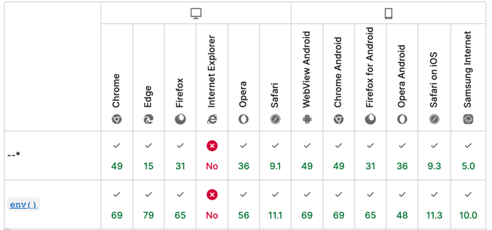
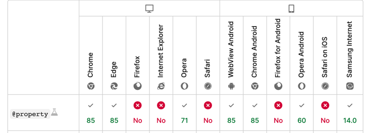

## CSS 自定义属性

## 前言
在现代浏览器中, 我们会经常看到这样的属性:
```css
element {
  --main-bg-color: brown;
}
```
这里我们就来介绍一下他, 并提供一些相关的说明

## 简介

> 自定义属性（有时候也被称作CSS变量或者级联变量）是由CSS作者定义的，它包含的值可以在整个文档中重复使用。由自定义属性标记设定值（比如： --main-color: black;），由var() 函数来获取值（比如： color: var(--main-color);）


## 声明

声明一个自定义属性，属性名需要以两个减号（--）开始，属性值则可以是任何有效的CSS值。
如前言中的 `--main-bg-color` 属性


**通常**的最佳实践是定义在根伪类 `:root` 下，这样就可以在HTML文档的任何地方访问到它了：

```css
/*:root 选择器匹配文档根元素。*/
/*在 HTML 中，根元素始终是 html 元素。*/
/*也就是说：root 表示的是根元素*/

:root {
  --main-bg-color: brown;
}
```

> 注意：自定义属性名是大小写敏感的，--my-color 和 --My-color 会被认为是两个不同的自定义属性。  
>  同时不能包含$，[，^，(，%等字符，普通字符局限在只要是“数字[0-9]”“字母[a-zA-Z]”“下划线_”和“短横线-”这些组合，但是可以是中文，日文或者韩文，例如


```css
body {
  --深蓝: #369;
  background-color: var(--深蓝);
}
```

## 使用

```css
element {
  background-color: var(--main-bg-color);
}
```

这些自定义属性，仅当需要的时候才会计算，而并不会按其他规则进行保存。比如，你不能为元素设置一个属性，然后让它从兄弟或旁支子孙规则上获取值。属性仅用于匹配当前选择器及其子孙，这和通常的CSS是一样的。


### 默认值

用 var() 函数可以定义多个备用值(fallback value)，当给定值未定义时将会用备用值替换。


```css
/*如果提供了第二个参数，则表示备用值，当自定义属性值无效时生效。第二个参数可以嵌套，但是不能继续平铺展开下去了，例如：*/
.two {
  color: var(--my-var, red); /* Red if --my-var is not defined */
}

.three {
    background-color: var(--my-var, var(--my-background, pink)); /* pink if --my-var and --my-background are not defined */
}

.three {
    background-color: var(--my-var, --my-background, pink); /* Invalid: "--my-background, pink" */
}
```

第二个例子展示了如何处理一个以上的 fallback。**该技术可能会导致性能问题**，因为它花了更多的时间在处理这些变量上。

### 在 js 中操作

在 JavaScript 中获取或者修改 CSS  变量和操作普通 CSS 属性是一样的：

```js
// 获取一个 Dom 节点上的 CSS 变量
element.style.getPropertyValue("--my-var");

// 获取任意 Dom 节点上的 CSS 变量
getComputedStyle(element).getPropertyValue("--my-var");

// 修改一个 Dom 节点上的 CSS 变量
element.style.setProperty("--my-var", jsVar + 4);
```

### CSS变量的空格尾随特性

```css
body {
  --size: 20;   
  font-size: var(--size)px;
}
```
此处`font-size:var(--size)px`等同于`font-size:20 px`，注意，`20`后面有个空格，所以，这里的`font-size`使用的是`<body>`元素默认的大小。

## 使用场景

简单的实现一种进度条:


外面有一层背景层，然后里面有进度条，还有进度值。

在过去，会使用两层div元素，然后JS去改变里面有颜色条条的宽度，同时设置进度值。


```html
<label>图片1：</label>
<div class="bar" style="--percent: 60;"></div>
<label>图片2：</label>
<div class="bar" style="--percent: 40;"></div>
<label>图片3：</label>
<div class="bar" style="--percent: 20;"></div>
```

```css
.bar {
    height: 20px; width: 300px;
    background-color: #f5f5f5;
}
.bar::before {
    display: block;
    counter-reset: progress var(--percent);
    content: counter(progress) '%\2002';
    width: calc(1% * var(--percent));
    color: #fff;
    background-color: #2486ff;
    text-align: right;
    white-space: nowrap;
    overflow: hidden;
}

```

可以看到，我们只需要一层div标签，DOM层级简单了，然后，需要修改的HTML变化项仅仅是一个--percent自定义属性而已。


更多场景可参考此文章: https://www.zhangxinxu.com/wordpress/2020/07/css-var-improve-components/

## 扩展

现在我们可以通过 `@property` 来扩展, CSS 变量的功能:

他的语法:
```css
@property --property-name {
  syntax: '<color>';
  inherits: false;
  initial-value: #c0ffee;
}
```

@property 规则中 syntax 和 inherits 描述符是必需的; 如果其中任何一项缺失, 整条规则都将失效并且会被忽略。 initial-value 描述符仅在syntax描述符为通用syntax定义时是可选的，否则initial-value也是必需的——如果此时该描述符缺失,整条规则都将失效且被忽略。

当然我们也可以使用 js 来创建:

```js
window.CSS.registerProperty({
  name: '--my-color',
  syntax: '<color>',
  inherits: false,
  initialValue: '#c0ffee',
});
```

他的作用, 很多情况是为了实现了一些以往无法简单实现的动画效果

详细可以参考此文章, 里面举了几个例子: https://juejin.cn/post/6951201528543707150


## 兼容性

目前 css 变量的兼容是最低 Chrome49:


在 CSS 中我们也可以进行兼容性处理:
```css
.selector: {}
@supports ( (--a: 0)) {
  /* supported */ 
    .selector: {}
}
@supports ( not (--a: 0)) {
  /* not supported */
    .selector: {}
}
```

在 js 中也可以进行对应判断

```js
const isSupported =
    window.CSS &&
    window.CSS.supports &&
    window.CSS.supports('--a', 0);

```


而 `@property` 还只是一个实验中的属性, 他的兼容要求是十分高的:




### polyfill

https://github.com/jhildenbiddle/css-vars-ponyfill  

使用此兼容直接可以达到的兼容:

[](https://camo.githubusercontent.com/fe6757016c6b1b5034f1fe291a84398d784e62f71a29b3bec29c936324ce08d9/68747470733a2f2f6a68696c64656e626964646c652e6769746875622e696f2f6373732d766172732d706f6e7966696c6c2f6173736574732f696d672f6368726f6d652e737667) Chrome 19+

[](https://camo.githubusercontent.com/096ff9eb91e64f05658b929ea84e463078cb0eea07aecf8a3eaf12f78bb3e5f2/68747470733a2f2f6a68696c64656e626964646c652e6769746875622e696f2f6373732d766172732d706f6e7966696c6c2f6173736574732f696d672f656467652e737667) Edge 12+

[](https://camo.githubusercontent.com/ab580f13347596e6d101be99b1347313cfa2b71db767bc9ae211577cc1c120e7/68747470733a2f2f6a68696c64656e626964646c652e6769746875622e696f2f6373732d766172732d706f6e7966696c6c2f6173736574732f696d672f66697265666f782e737667) Firefox 6+

[](https://camo.githubusercontent.com/12a468ea86edf5b5ff117efe4e5e76f7fabebc218daef9915cdeb10530d6bb5a/68747470733a2f2f6a68696c64656e626964646c652e6769746875622e696f2f6373732d766172732d706f6e7966696c6c2f6173736574732f696d672f69652e737667) IE 9+

[](https://camo.githubusercontent.com/fbcdbf0e01fadd88c81f03b0422bd93f25a757664789eed05ede4b0c81cbca6d/68747470733a2f2f6a68696c64656e626964646c652e6769746875622e696f2f6373732d766172732d706f6e7966696c6c2f6173736574732f696d672f7361666172692e737667) Safari 6+


## 目前的情况

### less/sass

在大多数的项目中, 是使用 less/sass/scss 的, 但是在这几种 css 预处理工具中已经有了变量的功能, 如果再加上 CSS 原生变量, 会显得很冗余

对于这些, 原生 css 变量可以替代原有的变量, 其他的仍旧使用这些预处理器中的功能

### css in js

在 root 中定义完毕基础 CSS 后, 就可以在 js 中使用了, 在这种框架有他是有一定发挥空间的

### 原子css

现在常用的一种原子化 CSS 框架: tailwindcss

在这种框架中, 内部就广泛使用CSS变量, 所以如果你能使用 Tailwind, 你就能使用 CSS变量

## 总结

CSS 变量这一功能, 现在的浏览器支持度已经足够了, 同时针对现有的 CSS 多种预处理器, 有了一定的适配度, 如果有使用的打算, 可以尝试引入了

当然如果你想等一个比较全面的解决方案也是没问题的

## 引用

- https://developer.mozilla.org/zh-CN/docs/Web/CSS/Using_CSS_custom_properties
- https://www.zhangxinxu.com/wordpress/2016/11/css-css3-variables-var/
- https://juejin.cn/post/6937530846471520287
- https://www.zhangxinxu.com/wordpress/2020/07/css-var-improve-components/
- https://developer.mozilla.org/zh-CN/docs/Web/CSS/@property#browser_compatibility
