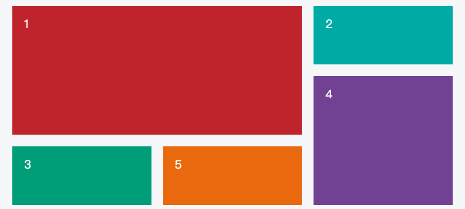

网格布局（Grid）是最强大的 CSS 布局方案。

## 特点:

它将网页划分成一个个网格，可以任意组合不同的网格，做出各种各样的布局。以前，只能通过复杂的 CSS 框架达到的效果，现在浏览器内置了。



Flex 布局是轴线布局，只能指定"项目"针对轴线的位置，可以看作是一维布局。Grid 布局则是将容器划分成"行"和"列"，产生单元格，然后指定"项目所在"的单元格，可以看作是二维布局。Grid 布局远比 Flex 布局强大。


> 注意，设为网格布局以后，容器子元素（项目）的float、display: inline-block、display: table-cell、vertical-align和column-*等设置都将失效。
>
>

## display

display 可以使用 : `display: inline-grid;` 和 `display: grid`

就是行内元素和块元素的区别

## grid-template-columns 属性，grid-template-rows 属性

在容器上定义属性:

```css
.container {
    display: grid;
    grid-template-columns: 100px 100px 100px;
    grid-template-rows: 100px 100px 100px;
}
```

上面两个属性的意思是: 定义一个三行三列的网格，列宽和行高都是100px

> 不一定是固定长度, 也可以是百分比: `grid-template-columns: 33.33% 33.33% 33.33%;`

### repeat

重复写同样的值非常麻烦，尤其网格很多时。这时，可以使用repeat()函数，简化重复的值。上面的代码用repeat()改写如下。

```css
.container {
    display: grid;
    grid-template-columns: repeat(3, 33.33%);
    grid-template-rows: repeat(3, 33.33%);
}
```

repeat()接受两个参数，第一个参数是重复的次数（上例是3），第二个参数是所要重复的值。

repeat()重复某种模式也是可以的:

```css
grid-template-columns:
repeat

(
2
,
100
px

20
px

80
px

)
;
```

### auto-fill

有时，单元格的大小是固定的，但是容器的大小不确定。如果希望每一行（或每一列）容纳尽可能多的单元格，这时可以使用auto-fill关键字表示自动填充

```css
.container {
    display: grid;
    grid-template-columns: repeat(auto-fill, 100px);
}
```

上面代码表示每列宽度100px，然后自动填充，直到容器不能放置更多的列。

### fr 关键字

为了方便表示比例关系，网格布局提供了fr关键字（fraction 的缩写，意为"片段"）。如果两列的宽度分别为1fr和2fr，就表示后者是前者的两倍。 类似于 flex 的 `flex-grow`

```css

.container {
    display: grid;
    grid-template-columns: 1fr 1fr;
}
```

fr可以与绝对长度的单位结合使用，这时会非常方便:

```css
.container {
    display: grid;
    grid-template-columns: 150px 1fr 2fr;
}
```

### minmax

minmax()函数产生一个长度范围，表示长度就在这个范围之中。它接受两个参数，分别为最小值和最大值。

```css
grid-template-columns:

1
fr

1
fr
minmax

(
100
px,

1
fr

)
;
```

上面代码中，minmax(100px, 1fr)表示列宽不小于100px，不大于1fr。

### auto

```css
grid-template-columns:

100
px auto

100
px

;
```

上面代码中，第二列的宽度，基本上等于该列单元格的最大宽度，除非单元格内容设置了min-width，且这个值大于最大宽度。

### 网格线的名称

grid-template-columns属性和grid-template-rows属性里面，还可以使用方括号，指定每一根网格线的名字，方便以后的引用。

```css

.container {
    display: grid;
    grid-template-columns: [c1] 100px [c2] 100px [c3] auto [c4];
    grid-template-rows: [r1] 100px [r2] 100px [r3] auto [r4];
}
```

`grid-template-columns`属性对于网页布局非常有用。两栏式布局只需要一行代码。

 ```css

.wrapper {
    display: grid;
    grid-template-columns: 70% 30%;
}

 ```

上面代码将左边栏设为70%，右边栏设为30%。

## grid-row-gap 属性，grid-column-gap 属性，grid-gap 属性

grid-row-gap属性设置行与行的间隔（行间距），grid-column-gap属性设置列与列的间隔（列间距）。

```css
.container {
    grid-row-gap: 20px;
    grid-column-gap: 20px;
}
```

`grid-gap`属性是`grid-column-gap`和`grid-row-gap`的合并简写形式，语法如下。

 ```
grid-gap:  <grid-row-gap> < grid-column-gap >
 ```

因此，上面一段 CSS 代码等同于下面的代码。

```css

.container {
    grid-gap: 20px 20px;
}

/* 这两者等同*/

.container {
    grid-gap: 20px;
}

```

## grid-template-areas

网格布局允许指定"区域"（area），一个区域由单个或多个单元格组成。grid-template-areas属性用于定义区域。

```css
.container {
    display: grid;
    grid-template-columns: 100px 100px 100px;
    grid-template-rows: 100px 100px 100px;
    grid-template-areas: 'a b c'
                       'd e f'
                       'g h i';
}
```

上面代码先划分出9个单元格，然后将其定名为a到i的九个区域，分别对应这九个单元格。

多个单元格合并成一个区域的写法如下。

```

grid-template-areas: "header header header"
                     "main main sidebar"
                     "footer footer footer";
```

上面代码中，顶部是页眉区域header，底部是页脚区域footer，中间部分则为main和sidebar。

如果某些区域不需要利用，则使用"点"（.）表示。

``` 
grid-template-areas: 'a . c'
                     'd . f'
                     'g . i';
```

## grid-auto-flow

划分网格以后，容器的子元素会按照顺序，自动放置在每一个网格。默认的放置顺序是"先行后列"，即先填满第一行，再开始放入第二行

这个顺序由`grid-auto-flow`属性决定，默认值是row，即"先行后列"。也可以将它设成column，变成"先列后行"。

```
grid-auto-flow: column;
```

grid-auto-flow属性除了设置成row和column，还可以设成row dense和column dense。这两个值主要用于，某些项目指定位置以后，剩下的项目怎么自动放置。

## justify-items 属性，align-items 属性，place-items 属性

justify-content属性是整个内容区域在容器里面的水平位置（左中右），align-content属性是整个内容区域的垂直位置（上中下）。

```
.container {
  justify-content: start | end | center | stretch | space-around | space-between | space-evenly;
  align-content: start | end | center | stretch | space-around | space-between | space-evenly;  
}
```

这两个属性的写法完全相同，都可以取下面这些值。

属性的作用和 flex 中的 `justify-content` 差不多

## grid-auto-columns 属性， grid-auto-rows 属性

有时候，一些项目的指定位置，在现有网格的外部。比如网格只有3列，但是某一个项目指定在第5行。这时，浏览器会自动生成多余的网格，以便放置项目。

grid-auto-columns属性和grid-auto-rows属性用来设置，浏览器自动创建的多余网格的列宽和行高。它们的写法与grid-template-columns和grid-template-rows完全相同。如果不指定这两个属性，浏览器完全根据单元格内容的大小，决定新增网格的列宽和行高。

## grid-template 属性，grid 属性

grid-template属性是grid-template-columns、grid-template-rows和grid-template-areas这三个属性的合并简写形式。

grid属性是grid-template-rows、grid-template-columns、grid-template-areas、
grid-auto-rows、grid-auto-columns、grid-auto-flow这六个属性的合并简写形式。

从易读易写的角度考虑，还是建议不要合并属性，所以这里就不详细介绍这两个属性了。

---

**下面是项目item属性**

## grid-column-start 属性，grid-column-end 属性，grid-row-start 属性，grid-row-end 属性

项目的位置是可以指定的，具体方法就是指定项目的四个边框，分别定位在哪根网格线。

* `grid-column-start`属性：左边框所在的垂直网格线
* `grid-column-end`属性：右边框所在的垂直网格线
* `grid-row-start`属性：上边框所在的水平网格线
* `grid-row-end`属性：下边框所在的水平网格线

```css
.item-1 {
    grid-column-start: 2;
    grid-column-end: 4;
}
```

1号项目的左边框是第二根垂直网格线，右边框是第四根垂直网格线。

相当于可以随意控制它的顺序和他的所占据大小

## grid-column 属性，grid-row 属性

grid-column属性是grid-column-start和grid-column-end的合并简写形式，grid-row属性是grid-row-start属性和grid-row-end的合并简写形式。

```
.item {
  grid-column: <start-line> / <end-line>;
  grid-row: <start-line> / <end-line>;
}
```

下面是一个例子。

``` 
.item-1 {
  grid-column: 1 / 3;
  grid-row: 1 / 2;
}
/* 等同于 */
.item-1 {
  grid-column-start: 1;
  grid-column-end: 3;
  grid-row-start: 1;
  grid-row-end: 2;
}
```

## grid-area 属性

grid-area属性指定项目放在哪一个区域。

``` 
.item-1 {
  grid-area: e;
}
```

grid-area属性还可用作grid-row-start、grid-column-start、grid-row-end、grid-column-end的合并简写形式，直接指定项目的位置。
```
.item {
    grid-area: <row-start> / <column-start> / <row-end> / <column-end>;
}
```

## justify-self 属性，align-self 属性，place-self 属性

justify-self属性设置单元格内容的水平位置（左中右），跟justify-items属性的用法完全一致，但只作用于单个项目。

align-self属性设置单元格内容的垂直位置（上中下），跟align-items属性的用法完全一致，也是只作用于单个项目。

``` 

.item {
  justify-self: start | end | center | stretch;
  align-self: start | end | center | stretch;
}
```

这两个属性都可以取下面四个值。

> *   start：对齐单元格的起始边缘。
> *   end：对齐单元格的结束边缘。
> *   center：单元格内部居中。
> *   stretch：拉伸，占满单元格的整个宽度（默认值）。


参考:

- https://www.ruanyifeng.com/blog/2019/03/grid-layout-tutorial.html
