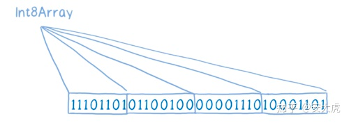
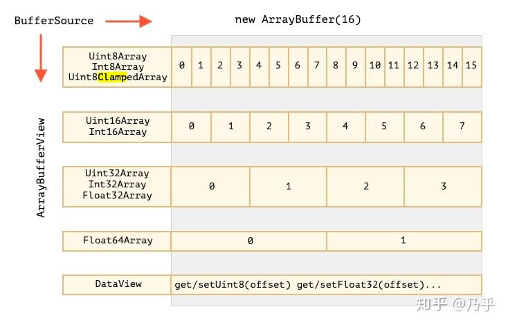

## ArrayBuffer 是什么

> ArrayBuffer 对象用来表示通用的、固定长度的原始二进制数据缓冲区。

它是一个字节数组，通常在其他语言中称为“byte array”。

你不能直接操作 ArrayBuffer 的内容，而是要通过类型数组对象或 DataView 对象来操作，它们会将缓冲区中的数据表示为特定的格式，并通过这些格式来读写缓冲区的内容。


简单用法
```js
const buffer = new ArrayBuffer(8);

console.log(buffer.byteLength); // 8
```

**length 大于 Number.MAX_SAFE_INTEGER（>= 2 ** 53）或为负数，则抛出一个  RangeError  异常。**


## 作用

从XHR、File API、Canvas, WebGL 等等各种地方，读取了一大串字节流，如果用JS里的Array去存，又浪费，又低效

于是为了配合这些新的API增强JS的二进制处理能力，就有了ArrayBuffer

创建 ArrayBuffer 的时候,就相当于申请了一块内存, 不能（也不方便）直接用它


所以也就有了 TypedArray, 比如 Uint32Array，Int16Array , Int8Array, Float32Array 等等等等

这些就是用来操作 TypedArray 的具体实现


## TypeArray

> 一个类型化数组（TypedArray）对象描述了一个底层的二进制数据缓冲区（binary data buffer）的一个类数组视图（view）。事实上，没有名为 TypedArray 的全局属性，也没有一个名为 TypedArray 的构造函数。相反，有许多不同的全局属性，它们的值是特定元素类型的类型化数组构造函数，如下所示
>
> 

```js
// 下面代码是语法格式，不能直接运行，
// TypedArray 关键字需要替换为底部列出的构造函数。
new TypedArray(); // ES2017中新增
new TypedArray(length);
new TypedArray(typedArray);
new TypedArray(object);
new TypedArray(buffer [, byteOffset [, length]]);
```


```js
// TypedArray 指的是以下的其中之一：

Int8Array();
Uint8Array();
Uint8ClampedArray();
Int16Array();
Uint16Array();
Int32Array();
Uint32Array();
Float32Array();
Float64Array();
```

- Unit8Array 指的是，把 ArrayBuffer 的每个 byte(8-bit) 当作一个单独的无符号整型数字 (0 - 255)
  
- Unit16Array 表示为使用 16 bits (2 bytes) 表示一个无符号整型 (0 ~ 2^16-1) 的数的数组
  
- Int8Array 表示使用 8 bits 表示一个有符号整型 (-128 ~ 127)
- Float32Array 表示使用 32 bits 表示一个浮点数
- Unit7ClampedArray 在 0 ～ 255 范围内和 Unit8Array 是一样的，对超出范围的处理有所不同，和图像处理相关（一般像素范围也是 0 ～ 255）




## 使用场景:


### 文件的转换:

arrayBuffer 可以转换为 Blob 对象:

```js
 const blob = new Blob([arrayBuffer],{type:"xxx/xxx"});
```

Blob 转换为 arrayBuffer:

```js

  const fileReader:FileReader = new FileReader();

  fileReader.addEventListener("load",(event)=>{
    const arrayBuffer = event.target.result;
    //...
  })

  fileReader.readAsArrayBuffer(file);
```

或者:

```js
  const arrayBuffer = await file.arrayBuffer();
```

从 ajax 获取:

```js
  var xhr = new XMLHttpRequest();
  xhr.open('GET', 'xxxxx');

  xhr.responseType = 'arraybuffer';

  xhr.onload = function(e) {
    if (this.status == 200) {
      const arrayBuffer = xhr.response;
    }
  };

  xhr.send();

```


### 例子 1

音频的某一种播放方法

```js
  const audioContext = new AudioContext();

  const buffer = await file.arrayBuffer();

  const auidoBuffer = await audioContext.decodeAudioData(buffer);

  const source = audioContext.createBufferSource();

  source.buffer = auidoBuffer;

  source.connect(audioContext.destination);
  source.start();
```

### 例子 2

读取二进制文件

```js
// HTML 代码如下
// <input type="file" onchange="typefile(this.files[0])"></input>
function typefile(file) {
  // 文件开头的四个字节，生成一个 Blob 对象
  let slice = file.slice(0, 4);
  let reader = new FileReader();
  // 读取这四个字节
  reader.readAsArrayBuffer(slice);
  reader.onload = function (e) {
    let buffer = reader.result;
    // 将这四个字节的内容，视作一个32位整数
    let view = new DataView(buffer);
    let magic = view.getUint32(0, false);
    // 根据文件的前四个字节，判断它的类型
    switch(magic) {
      case 0x89504E47: file.verified_type = 'image/png'; break;
      case 0x47494638: file.verified_type = 'image/gif'; break;
      case 0x25504446: file.verified_type = 'application/pdf'; break;
      case 0x504b0304: file.verified_type = 'application/zip'; break;
    }
    console.log(file.name, file.verified_type);
  };
}
```

## 总结

在前端使用到 buffer 的场景确实非常少见, 但涉及到比较底层或者偏门一点点的时候就会看到他了, 这个时候也要求我们要了解他, 比如文件, canvas, WebGL, WASM, EXCEL 处理

## 引用

- https://developer.mozilla.org/zh-CN/docs/Web/JavaScript/Reference/Global_Objects/ArrayBuffer
- https://www.zhihu.com/question/30401979?sort=created
- https://javascript.info/arraybuffer-binary-arrays
- https://zhuanlan.zhihu.com/p/376721544
- https://developer.mozilla.org/zh-CN/docs/Web/JavaScript/Reference/Global_Objects/TypedArray
- https://zhuanlan.zhihu.com/p/225286934
- https://zhuanlan.zhihu.com/p/97711340
