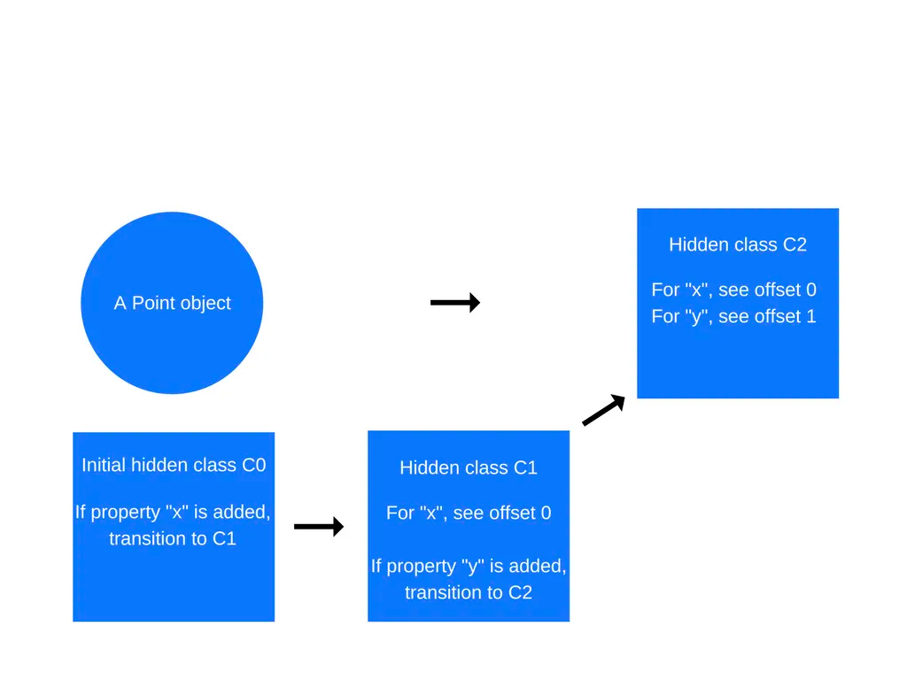
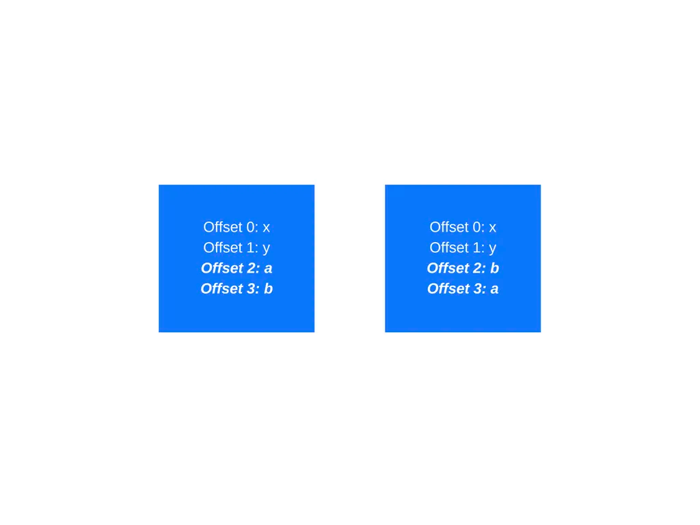

## V8 入门记录之初识

本文就 V8 入门，做一个记录

## 关于 V8

我想前端从业人员或多或少会听说过这个词，但是他具体是什么， 怎么入门， 怎么学习是一个较高的门槛

> V8 是 Google 用 C++ 编写的开源高性能 JavaScript 和 WebAssembly 引擎。它被用于 Chrome 浏览器和 Node.js 等。它实现了 ECMAScript 和 WebAssembly，可在 Windows 7 或更高版本、macOS 10.12+ 和使用 x64、IA-32、ARM 或 MIPS 处理器的 Linux 系统上运行。V8 可独立运行，也可嵌入到任何 C++ 应用程序中。

### js 引擎

JavaScript本质上是一种解释型语言，与编译型语言不同的是它需要一遍执行一边解析，而编译型语言在执行时已经完成编译，可直接执行，有更快的执行速度(如上图所示)。

为了提高性能，引入了Java虚拟机和C++编译器中的众多技术。现在JavaScript引擎的执行过程大致是：

源代码-→抽象语法树-→字节码-→JIT-→本地代码

V8更加直接的将抽象语法树通过JIT技术转换成本地代码，放弃了在字节码阶段可以进行的一些性能优化，但保证了执行速度。在V8生成本地代码后，也会通过Profiler采集一些信息，来优化本地代码。

这便是现在的执行过程：
源代码-→抽象语法树-→JIT-→本地代码

在v5.9版本之前，V8 使用两个编译器：

* full-codegen：一个简单快速的编译器，用于生成简单但相对较慢的机器代码
* Crankshaft：一个复杂的 (JIT) 优化的编译器，用于生成高度优化的代码

V8引擎内部会使用几个线程：

* 主线程完成用户期望的工作：获取代码，编译，执行
* 单独的编译线程：在主线程执行的同时，进行代码优化
* 单独的profiler线程：提供给Crankshaft判断哪些方法更耗时以进行优化
* 垃圾收集器(Garbage Collector)进行垃圾清理的额外一些线程

首次执行 JavaScript 代码时，V8使用 full-codegen，它直接将已解析的 JavaScript 转换为机器代码，而无需任何中间转换，这使它可以“非常快地”开始执行机器代码。V8 没有使用中间字节码表示，因而消除了对解释器的需求。

代码运行了一段时间后，profiler 线程收集到了足够的数据，可以判断对哪些方法应该进行优化。

接下来，另一个线程开始 **Crankshaft** 优化。它将 JavaScript 抽象语法树转换为叫做 **Hydrogen** 的高级静态单分配（SSA, static single-assignment）表示形式，并尝试优化该 Hydrogen graph。大多数优化都是在这一等级上完成的。

### V8 引擎编译

编译本地代码时使用的主要类如下所示：

* Script：表示JavaScript代码，即包含源代码，又包含编译之后生成的本地代码，即是编译入口，又是运行入口；
* Compiler：编译器类，辅组Script类来编译生成代码，调用解释器(Parser)来生成AST和全代码生成器，将AST转变为本地代码；
* AstNode：抽象语法树节点类，是其他所有节点的基类，包含非常多的子类，后面会针对不同的子类生成不同的本地代码；
* AstVisitor：抽象语法树的访问者类，主要用来遍历异构的抽象语法树；
* FullCodeGenerator：AstVisitor类的子类，通过遍历AST来为JavaScript生成本地可执行代码。


JavaScript代码编译的过程大致为：
Script类调用Compiler类的Compile函数为其生成本地代码。
Compile函数先使用Parser类生成AST，再使用FullCodeGenerator类来生成本地代码。

### v8的具体优化方案

#### 隐藏类  (Hidden class)

对于动态类型语言来说，由于类型的不确定性，在方法调用过程中，语言引擎每次都需要进行动态查询，这就造成大量的性能消耗，从而降低程序运行的速度。

静态语言中，可以直接通过偏移量查询来查询对象的属性值。

既然静态语言的查询效率这么高，那么是否能将这种静态的特性引入到 V8 中呢？

而V8引擎就引入了隐藏类(`Hidden Class`)的机制，起到给对象分组的作用。

在初始化对象的时候，V8引擎会创建一个隐藏类，随后在程序运行过程中每次增减属性，就会创建一个新的隐藏类或者查找之前已经创建好的隐藏类。每个隐藏类都会记录对应属性在内存中的偏移量，从而在后续再次调用的时候能更快地定位到其位置。


```
function Point(x, y) {
    this.x = x;
    this.y = y;
}
var p1 = new Point(1, 2);
```

调用 `new Point(1,2)` 时，V8引擎将创建一个名为 `C0` 的隐藏类。


Point 还没有定义任何属性，因此 `C0` 是空的。

一旦执行第一条语句 `this.x = x`（在 `Point` 函数内部），V8引擎将在 `C0` 的基础上创建第二个名为 `C1` 的隐藏类。

`C1` 描述了属性 `x` 在内存中的位置（相对于对象指针）。 在本例中，`x` 存储在偏移 0 处，这意味着当以连续缓冲区的形式查看内存中的 `Point` 对象时，第一个偏移将对应于属性 `x`。

V8引擎还将通过 "类转换" 更新 `C0`，即如果在 `Point` 对象中添加了属性 `x`，则隐藏类将从 "C0 "转换为 "C1"。

下面这个 `Point` 对象的隐藏类现在是 `C1`。


> 每当一个对象添加一个新属性时，旧的隐藏类就会更新为新的隐藏类。 隐藏类转换之所以重要，是因为它允许**以相同方式创建的对象共享隐藏类**。
> 
> 如果两个对象共享一个隐藏类，并且两个对象都添加了相同的属性，那么转换将确保两个对象都获得相同的新隐藏类以及随之而来的所有优化代码。

当执行语句 `this.y = y` 时（同样是在 Point 函数内部，`this.x = x` 语句之后），这一过程将重复执行。

创建了一个名为 `C2` 的新隐藏类，并在 `C1` 中添加了一个类转换。


**隐藏类的转换取决于向对象添加属性的顺序。**

```js
function Point(x, y) {
    this.x = x;
    this.y = y;
}
var p1 = new Point(1, 2);
p1.a = 5;
p1.b = 6;
var p2 = new Point(3, 4);
p2.b = 7;
p2.a = 8;
```

现在，你会认为 `p1` 和 `p2` 都会使用相同的隐藏类和转换吗？

其实不然。对于 `p1`，首先要添加属性 `a`，然后再添加属性 `b`。而对于 `p2`，首先会分配 `b`，然后是 `a`。
因此，由于过渡路径不同，`p1` 和 `p2` 最终会拥有不同的隐藏类。
在这种情况下，最好以相同的顺序初始化动态属性，这样隐藏类就可以重复使用。


想要知道更多隐藏类的信息可查看文章：
https://juejin.cn/post/7064390052519870501

#### 内联缓存

V8 利用了另一种用于优化动态类型语言的技术，称为**内联缓存**。内联缓存依赖于对作用在相同类型对象的、重复调用相同方法的趋势观察。更深入的讨论内联缓存说明，可以点击[这里](https://github.com/sq/JSIL/wiki/Optimizing-dynamic-JavaScript-with-inline-caches)查看。如果您没时间详细阅读深入说明，我们这里也将介绍一些内联缓存的一般概念:

**那么它是如何工作的呢？**

V8 会对近期方法调用中作为参数传递的对象类型进行缓存，并利用这些信息对未来作为参数传递的对象类型做出假设。如果 V8 能够很好地推测出传递给方法的对象类型，那么它就可以绕过计算如何访问对象属性的过程，转而使用以前查询到的存储信息来访问对象的隐藏类。

V8 维护着一个对象类型缓存，缓存的是最近被作为参数传递到调用方法中对象，并假设这些对象类型将来也会被作为参数传递。如果V8能较准确的预测被传递到方法中的对象类型，那么他就可以绕过寻找如何访问对象属性的过程，使用以前查找到对象的存储信息作为替代。


```js
var arr = [1, 2, 3, 4];
arr.forEach((item) => console.log(item.toString());
```

像上面这段代码，数字1在第一次toString()方法时会发起一次动态查询，并记录查询结果。当后续再调用toString方法时，引擎就能根据上次的记录直接获知调用点，不再进行动态查询操作。

```js
var arr = [1, '2', 3, '4'];
arr.forEach((item) => console.log(item.toString());
```

可以看到，调用 `toString` 方法的对象类型经常发生改变，这就会导致缓存失效。为了防止这种情况发生，V8引擎采用了  `polymorphic inline cache (PIC)` 技术， 该技术不仅仅只缓存最后一次查询结果，还会缓存多次的查询结果（取决于记录上限）。

**那么，隐藏类和内联缓存的概念有什么关系呢？**

每当调用特定对象的方法时，V8 引擎都要对该对象的隐藏类进行查找，以确定访问特定属性的偏移量。在对同一隐藏类成功调用两次同一方法后，V8 会省略隐藏类查找，直接将属性偏移量添加到对象指针本身。在以后对该方法的所有调用中，V8 引擎都会假定隐藏类没有改变，并使用以前查找时存储的偏移量直接跳转到特定属性的内存地址。这大大提高了执行速度。

如果你创建了两个类型相同但隐藏类不同的对象（就像我们在前面的例子中所做的），V8 将无法使用内联缓存，因为即使这两个对象的类型相同，它们对应的隐藏类分配给它们的属性的偏移量也是不同的。



##### 小结

1. 使用字面量初始化对象时，要保证属性的顺序是一致的。
2. 尽量在构造函数中使用字面量一次性初始化完整对象属性。
3. 重复执行相同方法的代码会比只执行一次许多不同方法的代码运行得更快。

#### 编译为机器码

最后，Lithium 被编译成机器代码。然后会发生另一件事，叫做 OSR：栈上替换。在我们开始编译和优化一个明显长期运行的方法之前，我们很可能正在运行它。V8 不会忘记它刚刚缓慢执行的内容，而重新开始使用优化后的版本。相反，它会转换我们拥有的所有上下文（堆栈、寄存器），以便我们在执行过程中切换到优化版本。这是一项非常复杂的任务，因为除其他优化措施外，V8 最初还对代码进行了内联。V8 并不是唯一能做到这一点的引擎。

有一种称为去优化的保障措施，可以进行相反的转换，并在引擎做出的假设不再成立时，返回到未优化的代码

#### 垃圾回收

在垃圾回收方面，V8 采用了传统的标记-清扫（mark-and-sweep）方法来清理旧的一代。标记阶段应该是停止 JavaScript 的执行。为了控制 GC 成本并使执行更稳定，V8 采用了增量标记法：它不会走遍整个堆，试图标记每一个可能的对象，而是只走一部分堆，然后恢复正常执行。下一次 GC 停止将从上一次堆行走停止的地方继续进行。这样，在正常执行过程中就可以有很短的停顿。如前所述，扫描阶段由不同的线程处理。


#### 点火装置和涡轮风扇
2017 年早些时候发布的 V8 5.9 引入了新的执行管道。在实际的 JavaScript 应用程序中，新管道实现了更大的性能提升和显著的内存节省。

新的执行管道建立在 V8 的解释器 Ignition 和 V8 最新的优化编译器 TurboFan 之上。

您可以点击这里查看 V8 团队的相关博文。

自 V8 5.9 版本发布以来，由于 V8 团队一直在努力跟上 JavaScript 语言的新特性以及这些特性所需的优化，V8 不再使用 full-codegen 和 Crankshaft（自 2010 年以来一直为 V8 服务的技术）来执行 JavaScript。

这意味着今后 V8 的整体架构将更加简单，可维护性更高。


这些改进仅仅是个开始。新的 Ignition 和 TurboFan 管道为进一步优化铺平了道路，这些优化将在未来几年内提升 JavaScript 性能并减少 V8 在 Chrome 浏览器和 Node.js 中的占用空间。


### 如何编写最优化的 JavaScript

1. 对象属性的顺序：始终按照相同的顺序实例化对象属性，以便共享隐藏类和随后的优化代码。
2. 动态属性：在实例化后向对象添加属性会强制改变隐藏类，并减慢为前一个隐藏类优化的任何方法的运行速度。因此，应在构造函数中分配对象的所有属性。
3. 方法：重复执行相同方法的代码会比只执行一次不同方法的代码运行得更快（由于内联缓存）。
4. 数组：避免使用键不是递增数字的稀疏数组。稀疏数组中的每个元素都不在数组内，这就是哈希表。此类数组中的元素访问成本较高。此外，尽量避免预先分配大型数组。最好是边使用边增长。最后，不要删除数组中的元素。这会使键变得稀疏。
5. 标记值： V8 用 32 位表示对象和数字。它使用一个位来识别是对象（标记 = 1）还是整数（标记 = 0），因为它有 31 位，所以称为 SMI（SMall Integer）。然后，如果数值大于 31 位，V8 将对该数字进行框选，将其转化为 double，并创建一个新对象将该数字放入其中。请尽可能使用 31 位有符号数字，以避免将其装入 JS 对象的昂贵装箱操作。

## 环境搭建

### 我的环境

系统： Mac Monterey 12.6.8
Xcode: 14.2
Python: 3.11.6


### 结语


最后附上 [JSIL](https://github.com/sq/JSIL/wiki/Optimizing-dynamic-JavaScript-with-inline-caches#final-thoughts) 中看到的一句：

> If your goal is to write the fastest possible JavaScript for your libraries or applications, you may need to go to those same lengths. For many applications, it's not worth the trouble - so resist the temptation to go nuts micro-optimizing something that really isn't particularly slow to begin with :-)


## 引用

- https://v8.dev/
- https://v8.js.cn/
- https://www.jianshu.com/p/47afd0ac17fd
- https://medium.com/sessionstack-blog/how-javascript-works-inside-the-v8-engine-5-tips-on-how-to-write-optimized-code-ac089e62b12e
- https://juejin.cn/post/6844903758908899341
- https://panzhongxian.cn/cn/2021/04/02-inside-the-v8-engine-5-tips-on-how-to-write-optimized-code/
- https://juejin.cn/post/7064390052519870501
- https://richardartoul.github.io/jekyll/update/2015/04/26/hidden-classes.html
