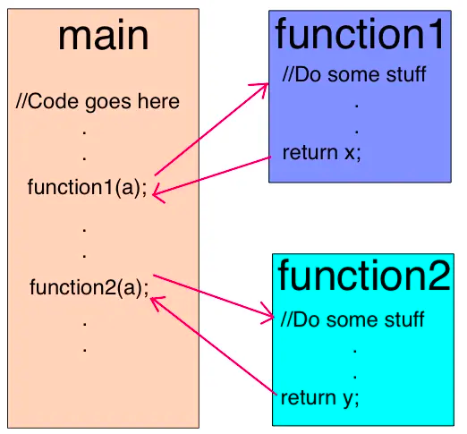

## V8 入门记录之初识

本文就 V8 入门，做一个记录

## 关于 V8

我想前端从业人员或多或少会听说过这个词，但是他具体是什么， 怎么入门， 怎么学习是一个较高的门槛

> V8 是 Google 用 C++ 编写的开源高性能 JavaScript 和 WebAssembly 引擎。它被用于 Chrome 浏览器和 Node.js 等。它实现了 ECMAScript 和 WebAssembly，可在 Windows 7 或更高版本、macOS 10.12+ 和使用 x64、IA-32、ARM 或 MIPS 处理器的 Linux 系统上运行。V8 可独立运行，也可嵌入到任何 C++ 应用程序中。

### js 引擎

JavaScript本质上是一种解释型语言，与编译型语言不同的是它需要一遍执行一边解析，而编译型语言在执行时已经完成编译，可直接执行，有更快的执行速度(如上图所示)。

为了提高性能，引入了Java虚拟机和C++编译器中的众多技术。现在JavaScript引擎的执行过程大致是：

源代码-→抽象语法树-→字节码-→JIT-→本地代码

V8更加直接的将抽象语法树通过JIT技术转换成本地代码，放弃了在字节码阶段可以进行的一些性能优化，但保证了执行速度。在V8生成本地代码后，也会通过Profiler采集一些信息，来优化本地代码。

这便是现在的执行过程：
源代码-→抽象语法树-→JIT-→本地代码

### V8引擎编译

编译本地代码时使用的主要类如下所示：

* Script：表示JavaScript代码，即包含源代码，又包含编译之后生成的本地代码，即是编译入口，又是运行入口；
* Compiler：编译器类，辅组Script类来编译生成代码，调用解释器(Parser)来生成AST和全代码生成器，将AST转变为本地代码；
* AstNode：抽象语法树节点类，是其他所有节点的基类，包含非常多的子类，后面会针对不同的子类生成不同的本地代码；
* AstVisitor：抽象语法树的访问者类，主要用来遍历异构的抽象语法树；
* FullCodeGenerator：AstVisitor类的子类，通过遍历AST来为JavaScript生成本地可执行代码。


JavaScript代码编译的过程大致为：
Script类调用Compiler类的Compile函数为其生成本地代码。
Compile函数先使用Parser类生成AST，再使用FullCodeGenerator类来生成本地代码。


v8充分多进程，主进程负责获取代码，编译生成机器码，有专门负责优化的进程，，还有一个监控进程负责分析那些代码执行比较慢，以遍Crankshaft 做优化，最后还有一个就是GC进程，负责内存垃圾回收。

### v8的具体优化方案

第一种优化方法是提前尽可能多地内联代码。内联是将调用点（调用函数的代码行）替换为被调用函数的主体的过程。这个简单的步骤可以让后续的优化更有意义。




// todo

第二个优化就隐藏类。

JavaScript 是一种基于原型的语言：没有类，对象是通过克隆过程创建的。JavaScript 还是一种动态编程语言，这意味着可以在对象实例化后轻松添加或删除其属性。

大多数 JavaScript 解释器使用类似字典的结构（基于哈希函数）来存储对象属性值在内存中的位置。与 Java 或 C# 等非动态编程语言相比，这种结构使得在 JavaScript 中检索属性值的计算成本更高。在 Java 中，所有的对象属性都是在编译前由固定的对象布局决定的，不能在运行时动态添加或删除（C# 有动态类型，这是另一个话题）。因此，属性值（或指向这些属性的指针）可以作为一个连续的缓冲区存储在内存中，每个缓冲区之间有一个固定的偏移量。偏移量的长度可以很容易地根据属性类型来确定，而在 JavaScript 中这是不可能的，因为属性类型可能会在运行时发生变化。


由于使用字典查找内存中对象属性的位置效率很低，因此 V8 使用了另一种方法：隐藏类。隐藏类的工作原理类似于 Java 等语言中使用的固定对象布局（类），只不过它们是在运行时创建的。现在，让我们来看看它们到底是什么样子的：

```
function Point(x, y) {
    this.x = x;
    this.y = y;
}
var p1 = new Point(1, 2);
```

一旦调用了 "new Point(1,2)"，V8 将创建一个名为 "C0 "的隐藏类。


Point 还没有定义任何属性，因此 "C0 "是空的。

一旦执行第一条语句 "this.x = x"（在 "Point "函数内部），V8 将在 "C0 "的基础上创建第二个名为 "C1 "的隐藏类。"C1 "描述了属性 x 在内存中的位置（相对于对象指针）。在本例中，"x "存储在偏移 0 处，这意味着当以连续缓冲区的形式查看内存中的点对象时，第一个偏移将对应于属性 "x"。V8 还将通过 "类转换 "更新 "C0"，即如果在点对象中添加了属性 "x"，则隐藏类将从 "C0 "转换为 "C1"。下面这个点对象的隐藏类现在是 "C1"。

每当一个对象添加一个新属性时，旧的隐藏类就会更新为新的隐藏类。隐藏类转换之所以重要，是因为它允许以相同方式创建的对象共享隐藏类。如果两个对象共享一个隐藏类，并且两个对象都添加了相同的属性，那么转换将确保两个对象都获得相同的新隐藏类以及随之而来的所有优化代码。

当执行语句 "this.y = y "时（同样是在 Point 函数内部，"this.x = x "语句之后），这一过程将重复执行。

我们创建了一个名为 "C2 "的新隐藏类，并在 "C1 "中添加了一个类转换，说明如果在点对象（已包含属性 "x"）中添加属性 "y"，则隐藏类应更改为 "C2"，点对象的隐藏类也更新为 "C2"。

#### 内联缓存

V8 利用了另一种优化动态类型语言的技术，即内联缓存。内联缓存的原理是，对同一方法的重复调用往往发生在同一类型的对象上。

那么它是如何工作的呢？V8 会对近期方法调用中作为参数传递的对象类型进行缓存，并利用这些信息对未来作为参数传递的对象类型做出假设。如果 V8 能够很好地推测出传递给方法的对象类型，那么它就可以绕过计算如何访问对象属性的过程，转而使用以前查询到的存储信息来访问对象的隐藏类。


那么，隐藏类和内联缓存的概念有什么关系呢？每当调用特定对象的方法时，V8 引擎都要对该对象的隐藏类进行查找，以确定访问特定属性的偏移量。在对同一隐藏类成功调用两次同一方法后，V8 会省略隐藏类查找，直接将属性偏移量添加到对象指针本身。在以后对该方法的所有调用中，V8 引擎都会假定隐藏类没有改变，并使用以前查找时存储的偏移量直接跳转到特定属性的内存地址。这大大提高了执行速度。

内联缓存也是同一类型的对象共享隐藏类如此重要的原因。如果你创建了两个类型相同但隐藏类不同的对象（就像我们在前面的例子中所做的），V8 将无法使用内联缓存，因为即使这两个对象的类型相同，它们对应的隐藏类分配给它们的属性的偏移量也是不同的。


#### 编译为机器码

最后，Lithium 被编译成机器代码。然后会发生另一件事，叫做 OSR：栈上替换。在我们开始编译和优化一个明显长期运行的方法之前，我们很可能正在运行它。V8 不会忘记它刚刚缓慢执行的内容，而重新开始使用优化后的版本。相反，它会转换我们拥有的所有上下文（堆栈、寄存器），以便我们在执行过程中切换到优化版本。这是一项非常复杂的任务，因为除其他优化措施外，V8 最初还对代码进行了内联。V8 并不是唯一能做到这一点的引擎。

有一种称为去优化的保障措施，可以进行相反的转换，并在引擎做出的假设不再成立时，返回到未优化的代码

#### 垃圾回收

在垃圾回收方面，V8 采用了传统的标记-清扫（mark-and-sweep）方法来清理旧的一代。标记阶段应该是停止 JavaScript 的执行。为了控制 GC 成本并使执行更稳定，V8 采用了增量标记法：它不会走遍整个堆，试图标记每一个可能的对象，而是只走一部分堆，然后恢复正常执行。下一次 GC 停止将从上一次堆行走停止的地方继续进行。这样，在正常执行过程中就可以有很短的停顿。如前所述，扫描阶段由不同的线程处理。


#### 点火装置和涡轮风扇
2017 年早些时候发布的 V8 5.9 引入了新的执行管道。在实际的 JavaScript 应用程序中，新管道实现了更大的性能提升和显著的内存节省。

新的执行管道建立在 V8 的解释器 Ignition 和 V8 最新的优化编译器 TurboFan 之上。

您可以点击这里查看 V8 团队的相关博文。

自 V8 5.9 版本发布以来，由于 V8 团队一直在努力跟上 JavaScript 语言的新特性以及这些特性所需的优化，V8 不再使用 full-codegen 和 Crankshaft（自 2010 年以来一直为 V8 服务的技术）来执行 JavaScript。

这意味着今后 V8 的整体架构将更加简单，可维护性更高。


这些改进仅仅是个开始。新的 Ignition 和 TurboFan 管道为进一步优化铺平了道路，这些优化将在未来几年内提升 JavaScript 性能并减少 V8 在 Chrome 浏览器和 Node.js 中的占用空间。

<!-- 
V8在执行之前将JavaScript编译成了机器代码，而非字节码或是解释执行它，以此提升性能。更进一步，使用了如内联缓存（inline caching）等方法来提高性能。有了这些功能，JavaScript程序与V8引擎的速度媲美二进制编译。

传统的Javascript是动态语言，又可称之为Prototype-based Language，JavaScript继承方法是使用prototype，透过指定prototype属性，便可以指定要继承的目标。属性可以在运行时添加到或从对象中删除，引擎会为执行中的物件建立一个属性字典，新的属性都要透过字典查找属性在内存中的位置。V8为object新增属性的时候，就以上次的hidden class为父类别，创建新属性的hidden class的子类别，如此一来属性访问不再需要动态字典查找了。

为了缩短由垃圾回收造成的停顿，V8使用stop-the-world, generational, accurate的垃圾回收器。在执行回收之时会暂时中断程序的执行，而且只处理物件堆栈。还会收集内存内所有物件的指针，可以避免内存溢出的情况。V8汇编器是基于Strongtalk汇编器。 -->

// TODO

## 环境搭建

### 我的环境

系统： Mac Monterey 12.6.8
Xcode: 14.2
Python: 


### 


## 引用

- https://v8.dev/
- https://v8.js.cn/
- https://www.jianshu.com/p/47afd0ac17fd
- https://medium.com/sessionstack-blog/how-javascript-works-inside-the-v8-engine-5-tips-on-how-to-write-optimized-code-ac089e62b12e
