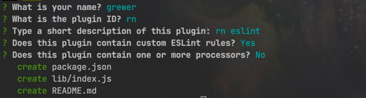
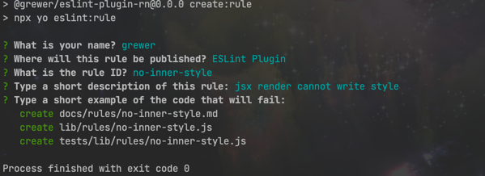
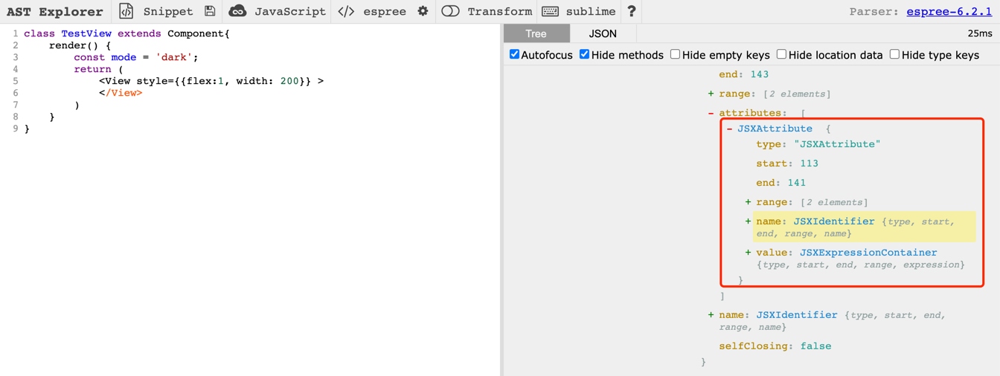

# 打造自定义 eslint

## 起因

在多人合作项目中, eslint 和 prettier 是不必能缺少的, 他能帮助你,统一规范某一事物, 某一个方法的使用

但是有时候也并不尽如人意, 有些规范官方包没提供, 但是我们也需要进行一定的规范, 这个时候靠人工 code review 是不可靠的了

所以我们需要的是自定义 eslint ,来规范我们的开发

## 原理

### ast 语法树

其实 eslint 的原理就是依据于 ast 语法树, 关于他这一块 可以参阅我之前写的文章: [babel 与 ast](https://segmentfault.com/a/1190000038544336)

## 初始化

首先我们需要创建一个仓库来存储我们的代码, 我取名为: `@grewer/eslint-plugin-rn`

使用指令来初始化项目:

```
npx -p yo -p generator-eslint yo eslint:plugin
```



在这我们可以在 `package.json` 修改我们的项目名称和配置, 比如我就将项目名改成这样:  
`eslint-plugin-rn` => `@grewer/eslint-plugin-rn`

再执行 `yarn` 指令(或者 `npm i`) 下载我们需要的依赖

这时可以将 `generator-eslint` 放入项目的 `devDependencies` 中方便我们使用,

`yarn add -D generator-eslint`

到这为止项目的初始化正式完成

## 创建

将指令 `npx yo eslint:plugin` 放入 `scripts` 中:

```json
    "scripts": {
"test": "mocha tests --recursive",
"create:rule": "npx yo eslint:rule"
},
```

开始执行指令: `yarn create:rule`:

效果如图:


1. `What is your name?` 作者名称, 填自己名字就行

2. `Where will this rule be published? (Use arrow keys)` 选择哪个生成的文件都一样, 所以回车即可

3. `What is the rule ID? ` rule 的名称, 如: `no-inner-style`

4. `Type a short description of this rule: `  随便填就行, 也可以直接回车

5. `Type a short example of the code that will fail:` 失败的代码情况, 因为在终端里打比较麻烦, 直接回车跳过, 后面补充

创建完成后的文件目录:

```
├── README.md
├── docs
│   └── rules
│       └── no-inner-style.md
├── lib
│   ├── index.js
│   └── rules
│       └── no-inner-style.js
├── package.json
├── tests
│   └── lib
│       └── rules
│           └── no-inner-style.js
└── yarn.lock
```

## 例子

我们需要在 `lib/rules/no-inner-style.js` 文件中填写我们的逻辑

```js
module.exports = {
    meta: {
        docs: {
            description: "jsx render cannot write style",
            category: "Fill me in",
            recommended: false
        },
        fixable: null,  // or "code" or "whitespace"
        schema: [
            // fill in your schema
        ]
    },
    create: function (context) {

        // variables should be defined here

        //----------------------------------------------------------------------
        // Helpers
        //----------------------------------------------------------------------

        // any helper functions should go here or else delete this section

        //----------------------------------------------------------------------
        // Public
        //----------------------------------------------------------------------

        return {

            // give me methods

        };
    }
};
```

首先要有一个思路, 我的目的是 `render` 中的 jsx 不能写行内样式, 我们要做的就是在 jsx 的属性中检测 `style` 这个属性是否存在, 他是否是一个 `object` 格式

当然也存在特殊情况, 比如 `style` 中的 `width` 会根据变量变化 `{width:flag?100:0}`, 或者动画方面的一些变化, 所以在判断的时候需要注意

那问题来了, 我们怎么寻找 jsx 中的 `style` 属性呢

这里我们需要一些工具了, 下面我推荐两个网址(他们的功能都是一样的)

- https://lihautan.com/babel-ast-explorer
- https://astexplorer.net/

### 工具的使用

首先我们需要两段符合场景的代码:

```js
// 这就是特殊的情况, 这种情况下我们不会禁止行内样式
class TestView extends Component {
    render() {
        const mode = 'dark';
        return (
            <View style={{flex: 1, width: 200, color: mode === 'dark' ? '#000' : '#fff'}}>
            </View>
        )
    }
}

// 这是需要禁止的情况
class TestView extends Component {
    render() {
        const mode = 'dark';
        return (
            <View style={{flex: 1, width: 200}}>
            </View>
        )
    }
}
```

将需要禁止的情况放入, 上述的网站中(如果报错,需要修改配置, 使得他支持 jsx)

将鼠标光标放到 `style` 标签上, 如图:



通过网站的解析可以看到, style 在 ast 中的属性是叫 `JSXAttribute`

所以我们将它作为键, 添加方法:

```js

module.exports = {
    meta: {
        // 省略, 不改变
    },
    create: function (context) {
        // 省略这里的注释
        return {
            // 将 JSXAttribute 作为键
            JSXAttribute: node => {
                // 注意 如果这里写不下去了, 可以直接跳到下一步(调试)中

                const propName = node.name && node.name.name;
                // console.log(propName)

                // 先判断 style 是否存在
                if (propName === 'style') {

                    // node.value.expression.type 这个路径, 在 ast 网站中可以快速找到, ObjectExpression也一样
                    // 意思是 当 style 的值是一个 Object 的时候, 抛出信息
                    if (node.value.expression.type === 'ObjectExpression') {

                        // context.report 的作用就是抛出信息, node参数 就是抛出信息的节点在那个位置
                        context.report({
                            node,
                            message: "不要使用行内样式",
                        });
                        // TODO 注意!  这里我们还没考虑特殊情况
                    }
                }
            }
        }
    }
};
```

到这一步我们已经抓到了 ast 的精髓所在了

## 调试&测试

这里我们就需要测试文件来调试我们的规则了, 打开文件 `tests/lib/rules/no-inner-style.js`:

```js
"use strict";

var rule = require("../../../lib/rules/no-inner-style"),

    RuleTester = require("eslint").RuleTester;

var ruleTester = new RuleTester();
ruleTester.run("no-inner-style", rule, {

    valid: [
        // give me some code that won't trigger a warning
    ],

    // 先将我们刚刚的例子代码上到这里的 code 中
    invalid: [
        {
            code: `
            class TestView extends Component{
                render() {
                    const mode = 'dark';
                    return (
                        <View style={{flex:1, width: 200}} >
                        </View>
                    )
                }
            }
            `,
            errors: [{
                message: "不要使用行内样式",
            }]
        }
    ]
});

```

填充 `code` 和 `errors` 中的 `message`

在终端中使用 node 指令运行: `node tests/lib/rules/no-inner-style.js`

**但是**, 她会报出错误:
`
AssertionError [ERR_ASSERTION]: A fatal parsing error occurred: Parsing error: The keyword 'class' is reserved
`
原因是在于执行的环境问题

### test 配置

在 `tests/lib` 中添加文件 `config.js`, 路径为(`tests/lib/config.js`)

```js
const testConfig = {
    env: {
        es6: true
    },
    parserOptions: {
        ecmaFeatures: {
            jsx: true,

        },
        ecmaVersion: 2021,
        sourceType: 'module',
    },
}

module.exports = {
    testConfig
}
```
在 `tests/lib/rules/no-inner-style.js` 中引入和使用:

```js
var rule = require("../../../lib/rules/no-inner-style"),

    RuleTester = require("eslint").RuleTester;

// 引入
const {testConfig} = require("../config.js");

// 使用
var ruleTester = new RuleTester(testConfig);
ruleTester.run("no-inner-style", rule, {

    valid: [],
    invalid: [
        {
         // 因为没变化所以此处省略
        }
    ]
});
```

到此, 我们再度执行指令: `node tests/lib/rules/no-inner-style.js`

如果验证成功(即 `context.report` 抛出的 `message` 和 测试用例中的 `message`相等) 就不会有任何返回信息

如果验证失败则会打印出原因

### 添加特殊情况
之前我们就说到了 style 的特殊情况, 在这种有变量的情况下, 我们是不会再抛出错误信息的

现在将代码复制到测试用例文件中的 `valid` 中:

```js
var rule = require("../../../lib/rules/no-inner-style"),

    RuleTester = require("eslint").RuleTester;

// 引入
const {testConfig} = require("../config.js");

// 使用
var ruleTester = new RuleTester(testConfig);
ruleTester.run("no-inner-style", rule, {

    valid: [
        `
        class TestView extends Component {
            render() {
                const mode = 'dark';
                return (
                    <View style={{flex: 1, width: 200, color: mode === 'dark' ? '#000' : '#fff'}}>
                    </View>
                )
            }
        }
        `
    ],
    invalid: [
        {
         // 因为没变化所以此处省略
        }
    ]
});
```

这时候我们再执行指令: `node tests/lib/rules/no-inner-style.js` 就会发现报错了, 当然这是我们已经预料到的特殊情况:

```bash
AssertionError [ERR_ASSERTION]: Should have no errors but had 1: [
  {
    ruleId: 'no-inner-style',
    severity: 1,
    message: '不要使用行内样式',
    line: 6,
    column: 27,
    nodeType: 'JSXAttribute',
    endLine: 6,
    endColumn: 98
  }
]
```

这时候再来修改我们的规则文件 `lib/rules/no-inner-style.js` :

```js

module.exports = {
    meta: {
        // 省略没有变化的内容
    },
    create: function (context) {
        return {
            JSXAttribute: node => {
                const propName = node.name && node.name.name;
                if (propName === 'style') {
                    // 可以通过执行  `node tests/lib/rules/no-inner-style.js` 和 console 来调试当前程序
                    // console.log(node.value.expression)
                    if (node.value.expression.type === 'ObjectExpression') {
                        // const arr = node.value.expression.properties
                        // 如果 style 中有表达式, 则不判断
                        for (let i = 0, len = arr.length; i < len; i++) {
                            // ConditionalExpression当然是可以在 ast 网站中找到, 也可以通过 console 慢慢调试出来
                            if (arr[i].value.type === 'ConditionalExpression') {
                                // 如果有表达式则直接返回, 不抛出任何信息
                                return
                            }
                        }
                        context.report({
                            node,
                            message: "不要使用行内样式",
                        });
                    }
                }
            }
        }

    }
};
```
再度执行指令, 可以发现正常通过了

再添加一些函数的组件, 扩大测试范围, 保证我们的规则万无一失, 这部分可以看我结尾的仓库, 文章里就不赘述了


### 测试工具
在我们项目中初始化的时候, 他内置了测试工具 `mocha`, 我们可以直接运行:

```
yarn test
// 或者
npm run test
```
>如果项目中报错 `sh: mocha: command not found`  
可以使用这个指令: `"test": "node_modules/.bin/mocha tests --recursive",` 替代之前的旧指令

它可以测试 `tests` 文件中的所有事例, 当然调试也可以, 只要你不嫌他麻烦

## 文档

在我们使用指令新建规则的时候, 他还有一个新建文件就是文档文件: `docs/rules/no-inner-style.md`

在此文件中, 我们可以详细写一下需要注意的事项, 有些待填写区域可以删除
```
# jsx render cannot write style (no-inner-style)

## Rule Details

Examples of **incorrect** code for this rule:

```js

function TestView(){
    return (
        <View style={{flex:1, width: 200}} >
        </View>
    )
}

```

Examples of **correct** code for this rule:

```js

function TestView(){
    const mode = 'dark';
    return (
        <View style={{flex: 1, width: 200, color: mode === 'dark' ? '#000' : '#fff'}}>
        </View>
    )
}
```


## When Not To Use It

规范项目的行内样式, 如果不需要可以关闭

```

## 项目默认值

## 结语

### 引用

