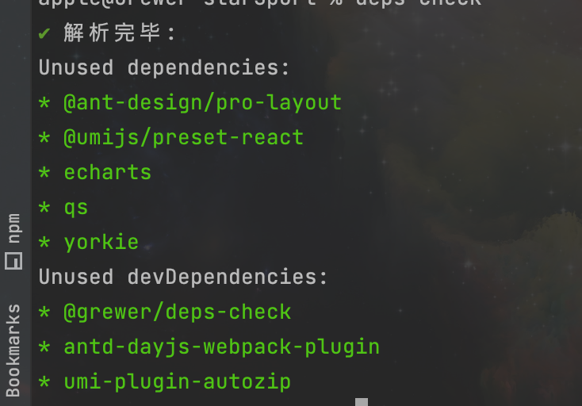

node_modules 瘦身-修改版

## 起因

**场景一:**  
当前项目经历了刀耕火种地开发, 之后接入了 cli 工具集中管理打包, 那么项目中的依赖,
和 cli 工具中的依赖重合度是多少, 并且他的的版本是否相同, 是否有冗余代码

**场景二:**  
项目中某一个库升级了, 他依赖了 A 库的 V3 版本, 同时当前项目依赖的是 A 库 V2版本, 这个时候打包很明显, 就会将这一个包的不同版本同时打入

**场景三:**  
当前 deps 中有对应的依赖库, 但是业务代码中并未使用到

由于上述的场景, 我们需要一个工具来解决这些情况


## 思考🤔

> 这些场景改如何解决, 解决的方案是什么

针对场景三来说, 现在已经有一个库: [depcheck](https://www.npmjs.com/package/depcheck)

简单的原理: 通过检测项目中的文件 `import` 或者 `require` 和依赖进行对比, 最后生成依赖列表

想要一定的配置
(通过实际的调用, 发现还存在一定的问题: 在子模块中的代码未能被检测, 同时关于依赖中的 babel 配置插件检测也是同样的)

而场景一和二就和三不太一样了, 他是已有库, 但是略有重复, 所有需要针对库进行检测

目前计划是通过 node 脚本来运行

- 检查 node_modules 或者 lock 文件中, 是否存在同一库的多个版本

- node_modules 文件层级太多, lock 文件是他的一层映射, 考虑从这里入手

- 确保 lock 文件是最新的(这一层比较麻烦, 没标识来保证, 明确就确保此文件是否存在即可)

- 打开本地网站, 针对结果的可视化显示(经过实际的操作, 这一场景放弃, 具体原因放下下方详述)


## 开发

这里我们首先解决场景一的问题

### 场景一
在上面的思考中针对此场景已经了一解决方案了, 即 `depcheck` 场景, 但是他的配置需要重新编写:
  

#### check 配置更新

```js
const options = {
    ignoreBinPackage: false, // ignore the packages with bin entry
    skipMissing: false, // skip calculation of missing dependencies
    ignorePatterns: [
        // files matching these patterns will be ignored
        'sandbox',
        'dist',
        'bower_components',
        'tsconfig.json'
    ],
    ignoreMatches: [
        // ignore dependencies that matches these globs
        'grunt-*',
    ],
    parsers: {
        // the target parsers
        '**/*.js': depcheck.parser.es6,
        '**/*.jsx': depcheck.parser.jsx,
        '**/*.ts': depcheck.parser.typescript,
        // 这里 ts 类型可能会出问题, 但是经过实际的运行和文档说明是没问题的
        '**/*.tsx': [depcheck.parser.typescript, depcheck.parser.jsx],
    },
    detectors: [
        // the target detectors
        depcheck.detector.requireCallExpression,
        depcheck.detector.requireResolveCallExpression,
        depcheck.detector.importDeclaration,
        depcheck.detector.exportDeclaration,
        depcheck.detector.gruntLoadTaskCallExpression,
        depcheck.detector.importCallExpression,
        depcheck.detector.typescriptImportEqualsDeclaration,
        depcheck.detector.typescriptImportType,
    ],
    // specials: [
    //     // Depcheck API在选项中暴露了特殊属性，它接受一个数组，以指定特殊分析器。
    // ],
    // 这里将会覆盖原本的 package.json 的解析
    // package: {
    // },
};
```

之后再调用配置:

```js
// 默认即当前路径
const check = (path = process.cwd()) => depcheck(path ,options)
```

最后加上打印结果:

```js
console.log('Unused dependencies:')
unused.dependencies.forEach(name=>{
    console.log(chalk.greenBright(`* ${name}`))
})
console.log('Unused devDependencies:'); 
unused.devDependencies.forEach(name=>{
    console.log(chalk.greenBright(`* ${name}`))
})
```

调用结果的例子展示:


### 场景二

#### 指令技术选型:

1. commander

推荐最多的, 同时也是下载量最多的, 下载量 8kw+

2. package-lock.json

针对的 lock 文件, 默认 `npm` 及其对应的解析, 现在还有 `yarn`, `pnpm` 比较流行, 但是
一般在服务器上打包时都用使用 `npm` 指令

### 指令的开发


#### 第一步
#### 第二步

#### 第三步
图形化, 已经弃用

效果图