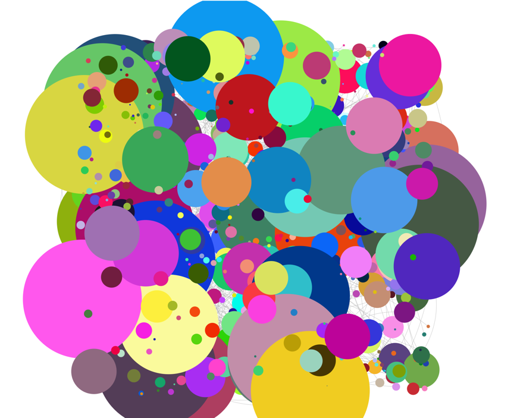

## 起因
场景一:  
当前项目经历了刀耕火种地开发, 之后接入了 cli 工具集中管理打包, 那么项目中的依赖,
和 cli 工具中的依赖重合度是多少, 并且他的的版本是否相同, 是否有冗余代码

场景二:  
项目中某一个库升级了, 他依赖了 A 库的 V3 版本, 同时当前项目依赖的是 A 库 V2版本, 这个时候打包很明显, 就会将这一个包的不同版本同时打入

场景三:
当前 deps 中有对应的依赖库, 但是业务代码中并未使用到

由于上述的场景, 我们需要一个工具来解决这些情况

## 思考🤔

> 这些场景改如何解决, 解决的方案是什么
>

针对场景三来说, 现在已经有一个库: [depcheck](https://www.npmjs.com/package/depcheck)

简单的原理: 通过检测项目中的文件 `import` 或者 `require` 和依赖进行对比, 最后生成依赖列表

但是这个库通过实际的调用, 发现还存在一定的问题, 在子模块中的代码未能被检测, 同时关于依赖中的 babel 配置插件检测也是同样地,
其他的一些node_modules 库中的强依赖, 也无法检测, 可能是需要对应的配置

而场景一和二就和三不太一样了, 他是已有库, 但是略有重复, 所有需要针对库进行检测

目前计划是通过 node 脚本来运行
- 检查 node_modules 或者 lock 文件中, 是否存在同一库的多个版本

- node_modules 文件层级太多, lock 文件是他的一层映射, 考虑从这里入手

- 确保 lock 文件是最新的, 那么我们需要在运行一遍 `npm i` 指令, 针对 lock 的解析方案

- 打开本地网站, 针对结果的可视化显示(树形图, 父节点-重复的库, 子节点对应多个依赖)

## 开发

这里我们首先解决场景一和场景二的问题, 因为场景三已经有一个大概的解决方案了, 具体的配置放到下面

### 指令技术选型:

1. commander

推荐最多的, 同时也是下载量最多的, 下载量 8kw+

2. package-lock.json 

针对的 lock 文件, 默认 `npm` 及其对应的解析, 现在还有 `yarn`, `pnpm` 比较流行, 但是
一般在服务器上打包时都用使用 `npm` 指令

3. 可视化库

针对数据的图形化, 考虑了两方面, 数据的图形化应该用什么样的格式, 另一个是他的支持程度和方便程度

最后我决定是用 echarts 来实现, 首先是因为公司内部项目基本都是有 echarts 的依赖, 其次这个库的使用人群特别多, 适配性更好, 尽量避免了多余的依赖库

### 第一步


1. 获取配置文件, 可以单独文件, 也可在 package.json 中, 也可通过指令配置
2. 确认本地有无 package-lock.json
3. 若有则对其进行解析, 若无则运行 `npm i` v指令, 待其下载完毕后再解析 lock 文件

根据我们的思路先实现第一步的开发:

```js
const lockPath = path.resolve('package-lock.json')

async function main() {
    const isExist = fs.existsSync(lockPath)
    // 判断 lock 文件, 如果不存在则 执行 install
    if(!isExist){
        await execNpmInstall()
    }
    // 获取 lock 文件内容
    const data = fs.readFileSync(lockPath, 'utf8')
    // 解析 json
    console.log(JSON.parse(data))
}

main()
```

### 第二步

具体的解析文件

我们以一个结构来分析, 取名为结构 A:

```json5
{
  "requires": true,
  "lockfileVersion": 1,
  "dependencies": {
    // 省略
    "react-redux": {
      "version": "7.2.8",
      "resolved": "https://registry.npmmirror.com/react-redux/-/react-redux-7.2.8.tgz",
      "integrity": "sha512-6+uDjhs3PSIclqoCk0kd6iX74gzrGc3W5zcAjbrFgEdIjRSQObdIwfx80unTkVUYvbQ95Y8Av3OvFHq1w5EOUw==",
      "requires": {
        "@babel/runtime": "^7.15.4",
        "@types/react-redux": "^7.1.20",
        "hoist-non-react-statics": "^3.3.2",
        "loose-envify": "^1.4.0",
        "prop-types": "^15.7.2",
        "react-is": "^17.0.2"
      },
      "dependencies": {
        "@babel/runtime": {
          "version": "7.17.9",
          "resolved": "https://registry.npmmirror.com/@babel/runtime/-/runtime-7.17.9.tgz",
          "integrity": "sha512-lSiBBvodq29uShpWGNbgFdKYNiFDo5/HIYsaCEY9ff4sb10x9jizo2+pRrSyF4jKZCXqgzuqBOQKbUm90gQwJg==",
          "requires": {
            "regenerator-runtime": "^0.13.4"
          }
        },
        "react-is": {
          "version": "17.0.2",
          "resolved": "https://registry.npmmirror.com/react-is/-/react-is-17.0.2.tgz",
          "integrity": "sha512-w2GsyukL62IJnlaff/nRegPQR94C/XXamvMWmSHRJ4y7Ts/4ocGRmTHvOs8PSE6pB3dWOrD/nueuU5sduBsQ4w=="
        }
      }
    }
  }
}
```

先讲解一下主要的 key 是什么意思:

- lockfileVersion  
  一个整数的版本，从1开始是本文档的版本号，在生成这个package-lock.json时使用了其语义。
  - 未提供此值, 说明是 npm v5 版本以前生成的
  - 1: npm v5和v6使用的lockfile版本。
  - 2: npm v7使用的lockfile版本，向后兼容v1的lockfiles
  - 3: npm v7使用的锁文件版本，没有向后兼容的能力。这个版本可能会在未来的npm中使用。
- dependencies  
  这是一个软件包名称到依赖对象的映射。
  - integrity
    在此位置解压的文件的sha512或sha1标准子资源完整性字符串。可用于 git 提交。
  - resolved 这是相对于注册表URL的压缩包路径。
  - requires 这是一个模块名称与版本的映射关系。这是该模块需要的所有东西的列表，不管它将被安装在哪里。
  - dependencies 和他的父元素一样, 但是是在当前包的 node_modules 中。


在这个依赖中的 `dependencies` 对应的包都会存在于此包的 node_modules 中, 比如:

`react-redux/dependencies/@babel/runtime` 路径就是这样:
`node_modules/react-redux/node_modules/@babel/runtime`


遍历所有的依赖, 如果依赖中还有 dependencies 则将他拿出来存入, 并且存入对应关系
同时其他库的正常联系也要展现出来

```js

async function main() {
  const isExist = fs.existsSync(lockPath)
  if(!isExist){
    await execNpmInstall()
  }
  const data = fs.readFileSync(lockPath, 'utf8')
  const contents = JSON.parse(data)
  const allDeps = contents.dependencies
  
  // 这里距离出对应的格式
  // 所有当前依赖以及对应的版本
  const mainPack = new Map() // 'zscroller' => '0.4.8'
  
  // 所有的被依赖项, 如 typedarray-to-buffer 仓库, 是write-file-atomic的依赖之一, 依赖的版本是3.1.5, write-file-atomic.requires = typedarray-to-buffer
  const commonPack = new Map() // 'typedarray-to-buffer' => [ { mainPack: 'write-file-atomic', requireVersion: '^3.1.5' } ],
  
  // 所有在子模块中的依赖, key 是主依赖, 位置: node_modules/whatwg-encoding/node_modules/iconv-lite
  const reDepsPack = new Map() // 'whatwg-encoding' => [ { name: 'iconv-lite', version: '0.4.24' } ],


  const setCommonPack = (requires, name)=>{
    Object.keys(requires).forEach(requireName=>{
      if(!commonPack.has(requireName)){
        commonPack.set(requireName, [])
      }
      const oldVal = commonPack.get(requireName)
      oldVal.push({
        mainPack: name,
        requireVersion: requires[requireName]
      })
      commonPack.set(requireName, oldVal)
    })
  }
  
  Object.keys(allDeps).forEach(name=>{
    const item = allDeps[name]
    if(item.dev){
      return
    }
    mainPack.set(name, item.version)

    if(item.requires){
      setCommonPack(item.requires, name)
    }

    if(item.dependencies){
      const rePacks = Object.keys(item.dependencies).reduce((prev, depsName)=>{
        const depsItem = item.dependencies[depsName]
        prev.push({
          name: depsName,
          version: depsItem.version
        })
        if(depsItem.requires){
          setCommonPack(depsItem.requires, name+'/'+depsName)
        }
        return prev
      }, [])
      reDepsPack.set(name, rePacks) // note, 是否添加 flag
    }
    // 以 reDepsPack 的 key 作为 主要元素
  })

  // 主要通过 reDepsPack 转换
  // 对 reDepsPack 进行整理
  let packs = new Map()
  reDepsPack.forEach((value, key)=>{
    value.forEach(item=>{
      const name = item.name
      if(!packs.has(name)){
        packs.set(name, [])
      }
      const packArr = packs.get(name)
      packArr.push({
        location: `${key}/node_modules/${item.name}`,
        ...item,
        label: 'reDeps'
      })
      packs.set(name, packArr)
    })
  })
}

```

在这一步 我发现之前的数据存在很大冗余, 为了调和 `reDepsPack` 和 `commonPack` 的结构对于新建了 `packs` 并且进行了多次遍历

#### 优化

```js
// 重新调整遍历依赖的逻辑, 并且所有数据结构同步为location, version, label
  Object.keys(allDeps).forEach(name => {
    const item = allDeps[name]
    if (item.dev) {
      return
    }
    mainPack.set(name, item.version)

    if (item.requires) {
      setCommonPack(item.requires, name)
    }

    if (item.dependencies) {
      Object.keys(item.dependencies).forEach(depsName => {
        const depsItem = item.dependencies[depsName]
        if (!reDepsPack.has(depsName)) {
          reDepsPack.set(depsName, [])
        }
        const packArr = reDepsPack.get(depsName)
        packArr.push({
          location: `${name}/node_modules/${depsName}`,
          version: depsItem.version,
          label: 'reDeps',
        })
        reDepsPack.set(depsName, packArr)
        // if (depsItem.requires) {
            // 这里会有额外的 requires
          // 但是不会占用实际空间, 他和根节点的 common 是同一个指向, 加入反而容易影响数据源
        // }
      })
    }
  })

// 最后将 reDepsPack 和 commonPack 合并

const packs = new Map()

reDepsPack.forEach((value, key)=>{
  // console.log(key, commonPack.get(key))
  const itemArr = reDepsPack.get(key)
  if(commonPack.has(key)){
    itemArr.push(...commonPack.get(key))
  }
  packs.set(key, itemArr)
})

```

最后输出的结果:

```
  'jsonfile' => [
    {
      location: 'webpack-manifest-plugin/node_modules/jsonfile',
      version: '4.0.0',
      label: 'reDeps'
    },
    { location: 'fs-extra', version: '^6.0.1', label: 'common' },
    {
      location: 'webpack-manifest-plugin/fs-extra',
      version: '^4.0.0',
      label: 'common'
    }
  ],
```

到这里发现 `common` 和 `reDeps` 会存在一个重复的现象, 因为 lock 文件中的结构本身就存在重复的情况:

```
    "webpack-manifest-plugin": {
      "version": "2.2.0",
      //...
      "requires": {
        "fs-extra": "^7.0.0",
        //...
      },
      "dependencies": {
        "fs-extra": {
          // ...
        },
        // ...
      }
    }
```

所以在初始数据获取的时候, 我们需要对其进行重复去除:

```js
if (item.requires) {
  setCommonPack(item.requires, name, item.dependencies)
}

const setCommonPack = (requires, name, deps) => {
  Object.keys(requires).forEach(requireName => {
    //...
    // 添加重复的判断
    if(deps && deps[requireName]){
      return
    }
    //...
  })
}
```

### 第三步

针对数据的图形化, 目前计划使用的图形是 echarts 中的 npm 依赖图  
官方的🌰: https://echarts.apache.org/examples/zh/editor.html?c=graph-npm

其中他的圆形大小尺寸, 我们的数据源中并没有准备, 所以我们需要在数据源中新增 size 数据


```js

function geFileSize(path) {
  const size = readFile(path, 0) // b
  return (size / 1024).toFixed(2) // 单位 kb
}

//遍历读取文件
function readFile(path, size) {
  let files = fs.readdirSync(path)
  files.forEach(walk)

  function walk(file) {
    let states = fs.statSync(path + '/' + file)
    if (states.isDirectory()) {
      readFile(path + '/' + file, size)
    } else {
      size += states.size
    }
  }

  return size
}
```

同时, 我们对于 `common` 作出判断, 只存在一个就足够了
```js
if(!oldVal.find(it=>it.label === 'common')){
  oldVal.push({
    location: name,
    version: requires[requireName],
    label: 'common',
    size: geFileSize(`./node_modules/${name}`)
  })
  commonPack.set(requireName, oldVal)
}
```

生成文件到根目录下

由于现在的数据是 `Map` 格式, 存储到具体文件中的话, 需要一种文件格式, 这里我就将他转换成 json 格式:

```js
  function strMapToObj(strMap){
    let obj= Object.create(null);
    for (let[k,v] of strMap) {
      obj[k] = v;
    }
    return obj;
  }

  fs.writeFileSync('deepCheck.json', `${JSON.stringify(strMapToObj(packs), null, 2)}`, {encoding: 'utf-8'})

```

如果要使用此依赖图表  我们需要将当前的数据做出转换, 生成 2 种:  
普通 `data` 库数据和 `edges` 数据之间的联系数据


在 html 中运行:
```html
<div id='main'></div>

<script type='module'>
  import data from './deepCheck.json' assert { type: 'json' }
  import './node_modules/echarts/dist/echarts.min.js'
  console.log(echarts)


  console.log(data)
  var getRandomColor = function() {
    return '#' + ('00000' + (Math.random() * 0x1000000 << 0).toString(16)).substr(-6)
  }

  let nodes = []
  let edges = []
  Object.keys(data).forEach((name, index) => {
    const arr = data[name]
    arr.forEach((item, itemIndex) => {
      nodes.push({
        x: Math.random() * 10000,
        y: Math.random() * 10000,
        id: item.location,
        name: item.location,
        symbolSize: Number(item.size)*0.01,
        itemStyle: {
          color: getRandomColor(),
        },
      })
    })
    const common = arr.find(it => it.label === 'common')
    if (common) {
      arr.forEach(item => {
        if (item.label === 'common') {
          return
        }
        edges.push({
          attributes: {},
          size: 1,
          sourceID: common.location,
          targetID: item.location,
        })
      })
    }

  })

  console.log(nodes, edges)

  var chartDom = document.getElementById('main');
  var myChart = echarts.init(chartDom);
  var option;

  myChart.showLoading()

  myChart.hideLoading();
  myChart.setOption(
          (option = {
            title: {
              text: 'NPM Dependencies'
            },
            animationDurationUpdate: 1500,
            animationEasingUpdate: 'quinticInOut',
            series: [
              {
                type: 'graph',
                layout: 'none',
                // progressiveThreshold: 700,
                data: nodes,
                edges: edges,
                emphasis: {
                  focus: 'adjacency',
                  label: {
                    position: 'right',
                    show: true
                  }
                },
                roam: true,
                lineStyle: {
                  width: 0.5,
                  curveness: 0.3,
                  opacity: 0.7
                }
              }
            ]
          }))

  console.log(option)
  option && myChart.setOption(option);
</script>
```

这个时候出现了额外的问题, 有的包体积过大, 同样的图形 size 也过大, 导致整个尺寸失衡, 所以现在将最大的 size 调整为 200

```js
const max = 200
symbolSize: size > max ? max : size
```
效果图:



有此可见 当前的依赖包中重复的包是有多么的混乱

因为最大已经限制到了 200, 所以更加具体的数据被隐藏掉了, 这里我再列出占空间最大数 top5 :

```js
const createTopSize = ()=>{
  let arr = []
  const push = (item) => {
    if(!arr.length){
      arr.push(item)
      return
    }
    for(let i =0,len=arr.length;i<len;i++){
      if(item.size >= arr[i].size){
        arr.splice(i, 0, item)
        break;
      }
    }
    if(arr.length === 6){
      arr.pop()
    }
  }

  return {
    length: arr.length,
    push: push,
    arr: arr,
  }
}
// 维护一个数据组, 控制 size 大小, 和保持最大长度
let topSizeIns = createTopSize()


Object.keys(data).forEach((name, index) => {
  let localSize = 0
  arr.forEach((item, itemIndex) => {
    const size = Number(item.size)
    //...
    localSize += size
  })
  topSizeIns.push({ items: arr, size: localSize})
  //...
})
```

最后将其显示到页面上:

```js
  const list = document.getElementById('list')
  topSizeIns.arr.forEach(item=>{
    const box = document.createElement('p')
    const common = item.items.find(it=>it.label === 'common')
    box.textContent = `${common.location}--${item.size.toFixed(2)}KB`
    list.appendChild(box)

    const fragment = document.createElement('ul')

    fragment.innerHTML = item.items.map(it=>{
      return `<li>${it.location}@${it.version}--size:${it.size}</li>`
    }).join('')

    list.appendChild(fragment)
  })
```

后续的整理计划:
1. 将 html 文件中的转换仍然放在 js 文件中
2. 指令执行直接log显示 top5 的数据和生成最终的 json文件

html 代码转换迁移:

```js
直接复制, 这里修改就行
packs.forEach((arr,name, index) => {
  let localSize = 0;
  // omit 
})


// 打印的话 同样通过 `json`,
fs.writeFileSync('deepCheck.json', `${JSON.stringify({nodes, edges, topSizeIns}, null, 2)}`, {encoding: 'utf-8'})

// 打印 top5
console.log(topSizeIns.arr)
```

### 指令的开发

计划中的指令

- check
- check -deep
- check -open -deep

#### 指令得到创建

```js
import {Command} from 'commander';
const program = new Command();

// 通过option 可添加额外的参数, 在 action 中, 通过 options, 可获取是否传递了这些参数
program.command('check')
        .description('检查中:')
        .option('-d, --deep', '解析 lock 文件')
        .option('-o, --open', '打开网站')
        .action((options, command) => {
          console.log(options, options.deep);
          if (options.deep) {
            // deep
          } else {
            // check
          }
        });

program.parse();
```

还需要优化的事项:

1. check 配置
2. top5 打印更加友好
3. 启动服务问题


## 参考

- https://docs.npmjs.com/cli/v8/configuring-npm/package-lock-json
