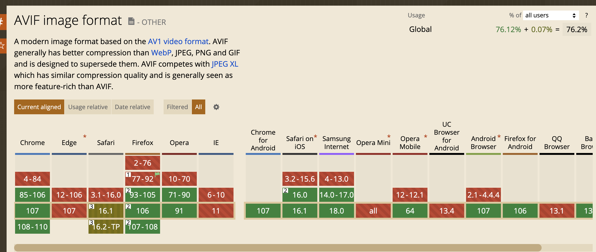
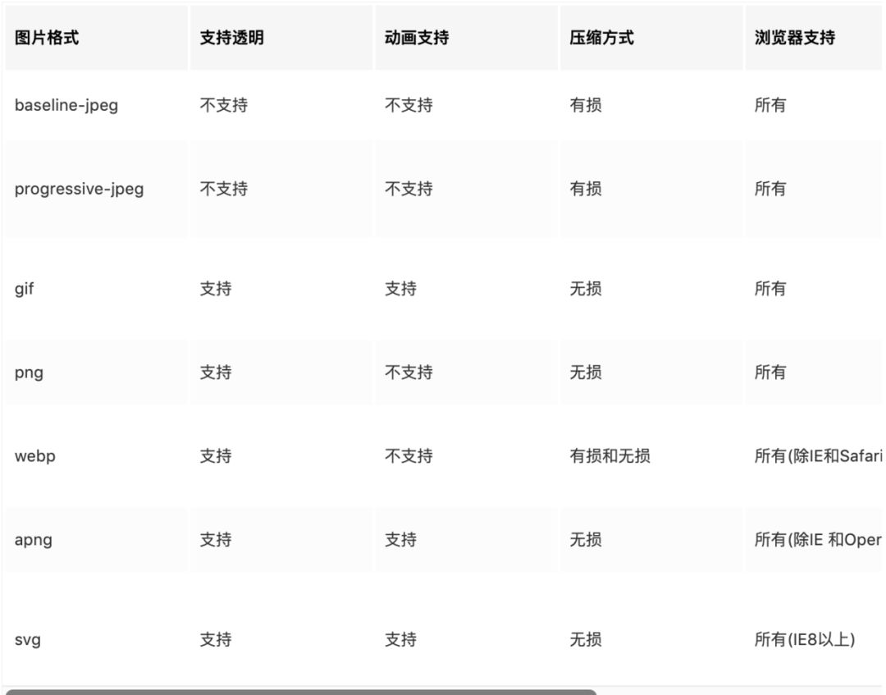
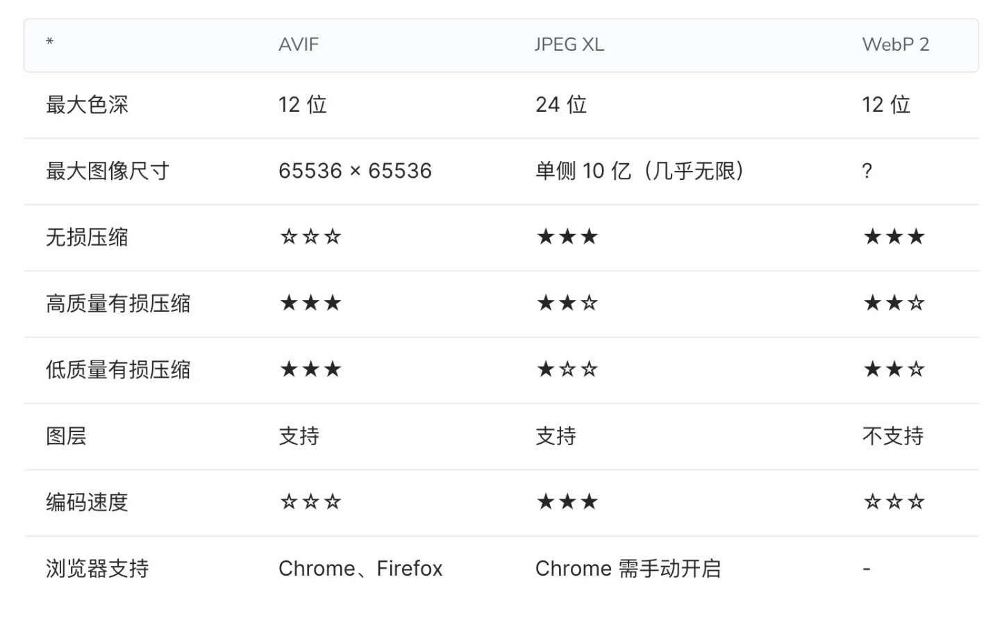
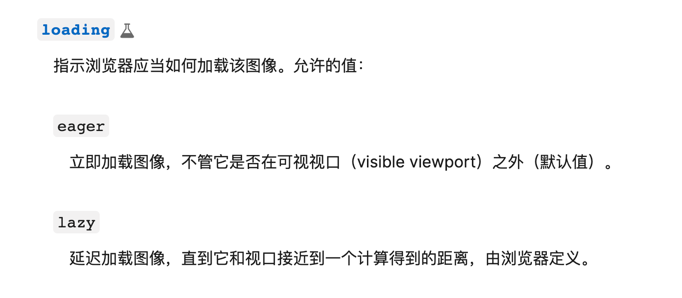
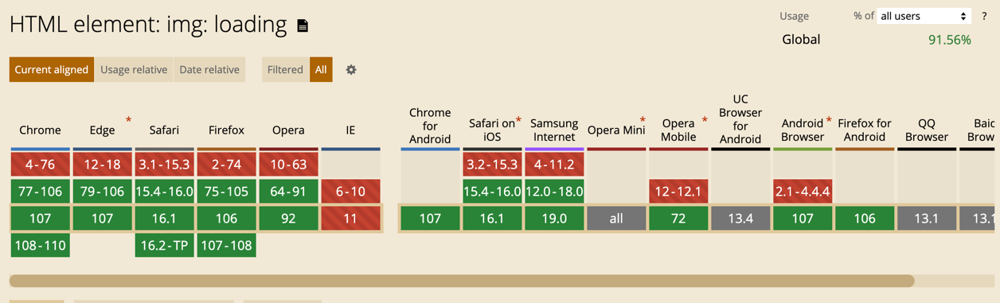

## 前言

在当前的 web 开发过程中, 图片的使用是一种重要的功能

本期就来聊聊, 开发中的图片以及我们如何优化图片

## 图片的类型以及对比

### 位图

> 位图的特点是可以表现色彩的变化和颜色的细微过渡，产生逼真的效果，缺点是在保存时需要记录每一个像素的位置和颜色值，占用较大的存储空间。

位图的文件类型很多，如*.bmp、*.pcx、*.gif、*.jpg、*.tif、PS的*psd等；

### 矢量图

> 矢量图就像用几何图形来描述一幅图，在矢量图放大时，我们所记录的几何图形的各种角度、形状等并没有改变，所以无论是放大还是缩小，都不会影响矢量图的清晰度。

矢量图形格式也很多，如AdobeIllustrator的*.AI、*.EPS和SVG、AutoCAD的*.dwg和dxf、Corel DRAW的*.cdr等。

### 彩色深度

彩色深度标准通常有以下几种：

*   8位色 ，每个像素所能显示的彩色数为2的8次方 ，即256种颜色。
*   16位增强色，16位彩色，每个像素所能显示的彩色数为2的16次方，即65536种颜色。
*   24位真彩色，每个像素所能显示的彩色数为24位，即2的24次方，约1680万种颜色。
*   32位真彩色，即在24位真彩色图像的基础上再增加一个表示图像透明度信息的Alpha通道。
    32位真彩色并非是2的32次方的色数，**它其实也是1677万多色，不过它增加了256阶颜色的灰度,为了方便称呼，就规定它为32位色**

### 图片的压缩

1.  无压缩
2.  有损压缩
3.  无损压缩

### 无压缩

无压缩的图片格式不对图片数据进行压缩处理，能准确地呈现原图片。例如 [BMP](https://baike.baidu.com/item/BMP%E6%A0%BC%E5%BC%8F/3427000?fr=aladdin) 格式的图片。

### 有损压缩

指在压缩文件大小的过程中，损失了一部分图片的信息，也即降低了图片的质量（即图片被压糊了），并且这种损失是**不可逆的**。

常见的有损压缩手段是按照一定的算法将**临近的像素点进行合并**。压缩算法不会对图片所有的数据进行编码压缩，而是在压缩的时候，去除了人眼无法识别的图片细节。因此有损压缩可以在同等图片质量的情况下大幅降低图片的体积。例如`jpg`格式的图片使用的就是有损压缩。

### 无损压缩

在压缩图片的过程中，图片的质量没有任何损耗。我们任何时候都可以从无损压缩过的图片中恢复出原来的信息。

压缩算法对图片的所有的**数据进行编码压缩**，能在保证图片的质量的同时降低图片的体积。例如`png`、`gif`使用的就是无损压缩。

### 图片格式

#### gif

> 无损压缩、索引色、透明、动画

GIF(Graphics Interchange Format) 的原义是“图像互换格式”，是一种基于 LZW 算法连续色调的无损的基于索引色的压缩格式。

**优势**

1.  优秀的压缩算法使其在一定程度上保证图像质量的同时将体积变得很小。

2.  可插入多帧，从而实现动画效果。

3.  可设置透明色以产生对象浮现于背景之上的效果。

**缺点**

由于采用了 8 位压缩，最多只能处理 256 种颜色，故不宜应用于**真彩色**(文末的附录有解释)图片。

#### png

> 无损压缩、索引色、透明、动画

便携式网络图形（简称 PNG，英语全称：Portable Network Graphics）。PNG 能够提供长度比 GIF 小30%的无损压缩图像文件。

png支持8位、24位、32位3种，我们通常叫它们png8、png24、png32。

PNG 同样使用了无损压缩格式，事实上 PNG 的开发就是因为 GIF 所使用的无损压缩格式专利问题而诞生的。

**优点**

1.  不失真的情况下尽可能压缩图像文件的大小
2.  像素丰富
3.  支持透明（alpha通道）

**缺点**

1. 文件大

#### jeg/jpeg

> 有损压缩、直接色、适合大图、体积小

JPEG 是一种很典型的使用有损压缩图像格式，也就是说使用者每次进行 JPEG 的存档动作后，图档的一些内容细节都会遭到永久性的破坏，尤其是使用过高的压缩比例，将使最终解压缩后恢复的图像质量明显降低，如果追求高品质图像，不宜采用过高压缩比例。

#### Baseline JPEG

Baseline JPEG 文件存储方式是按从上到下的扫描方式，把每一行顺序的保存在 JPEG 文件中。打开这个文件显示它的内容时，数据将按照存储时的顺序从上到下一行一行的被显示出来，直到所有的数据都被读完，就完成了整张图片的显示。


#### progressive jpeg

和 Baseline 一遍扫描不同，Progressive JPEG 文件包含多次扫描，这些扫描顺寻的存储在 JPEG 文件中。打开文件过程中，会先显示整个图片的模糊轮廓，随着扫描次数的增加，图片变得越来越清晰。


渐进式图片带来的好处是可以让用户在没有下载完图片就可以看到最终图像的大致轮廓，一定程度上可以提升用户体验（瀑布流的网站建议还是使用标准型的）。


**优点**

*   可以支持 24bit 真彩色，普遍应用于需要连续色调的图像如色彩丰富的图片、照片等；

*   可利用可变的压缩比以控制文件大小；

*   支持交错（对于渐近式 JPEG 文件）；

**缺点**

*   JPEG 不适合用来存储企业 Logo、线框类的图。因为有损压缩会导致图片模糊，而直接色的选用，又会导致图片文件较GIF更大。

*   有损耗压缩会使原始图片数据质量下降。

*   JPEG 图像**不支持透明度处理**，透明图片需要召唤 PNG 来呈现。


#### JPEG XR（了解即可）

JPEG XR（全称JPEG extended range）是一种连续色调静止图像压缩算法和文件格式，基于由Microsoft开发的HD Photo（原称Windows Media Photo），即原来由微软开发并持有专利的图像格式。它支持有损数据压缩以及无损数据压缩，并且是微软的XPS文档的首选图像格式。目前支持的软件包括.NET Framework（3.0 or newer），Windows Vista/Windows 7、Internet Explorer 9，Flashplayer 11等。

微软希望 JPEG XR 能够广泛采用,但是替代 JPEG 格式仍面临很大挑战。

#### JPEG-XL格式（了解即可）

JPEG-XL格式是一种免版税的位图文件格式，支持有损和无损压缩。它旨在超越现有的位图格式，并成为它们的通用替代。


JPEG-XL文件格式2021年才完成标准化，编码系统在2022年早些时候得到确认，但它自2020年底以来一直被冻结而没有被正式采用。如无意外，JPEG XL 格式将在 Chrome 110 版本中被弃用。

#### APNG

APNG（Animated Portable Network Graphics）顾名思义是基于 PNG 格式扩展的一种动画格式，增加了对动画图像的支持，同时加入了 24 位图像和 8 位 Alpha 透明度的支持，这意味着动画将拥有更好的质量，其诞生的目的是为了替代老旧的 GIF 格式，但它目前并没有获得 PNG 组织官方的认可。

这是目前的支持度, 主流浏览器都已经支持了


**优点** 相对GIF来说

*   色彩丰富
*   支持透明
*   向下兼容 PNG
*   支持动画

**缺点**

*   生成比较繁琐
*   未标准化

#### webp

WebP 是谷歌开发的一种新图片格式，WebP 是同时支持有损和无损压缩的、使用直接色的、点阵图。

*   在无损压缩的情况下，相同质量的 WebP 图片，文件大小要比 PNG 小26%；

*   在有损压缩的情况下，具有相同图片精度的 WebP 图片，文件大小要比 JPEG 小 25%~34%；

*   WebP 图片格式支持图片透明度，一个无损压缩的 WebP 图片，如果要支持透明度只需要 22% 的格外文件大小。

目前这个时间点(2022.10), webp 的兼容性是足够的, 可以直接使用:


**优点**

* 同等质量更小
* 压缩之后质量无明显变化
* 支持无损图像
* 支持动画

**缺点**

* 对于低版本浏览器的兼容不好(问题不算大, 有降级方案)

#### svg

> 无损、矢量图、体积小、不失真、兼容性好

SVG是一种用 XML 定义的语言，用来描述二维矢量及矢量/栅格图形。SVG提供了3种类型的图形对象：矢量图形（例如：由直线和曲线组成的路径）、图象、文本。

**优点**


*   SVG 与 JPEG 和 GIF 图像比起来，尺寸更小，且可压缩性更强。

*   SVG 是可伸缩的。

*   SVG 图像中的文本是可选的，同时也是可搜索的（很适合制作地图）。

*   SVG 可以与 JavaScript 技术一起运行

*   SVG图形格式支持多种滤镜和特殊效果，在不改变图像内容的前提下可以实现位图格式中类似文字阴影的效果。

*   SVG图形格式可以用来动态生成图形。例如，可用 SVG 动态生成具有交互功能的地图，嵌入网页中，并显示给终端用户。

**缺点**

* SVG复杂度高会减慢渲染速度, 渲染成本比较高，对于性能有影响。

* SVG 的学习成本比较高，因为它是可编程的。


#### avif

AVIF 是由 [AOMedia（开放媒体联盟）](https://aomedia.org/) 在 2019 年发布，基于 [AV1 视频编解码器](https://zh.wikipedia.org/wiki/AOMedia_Video_1) （源自谷歌的 [VP9](https://zh.wikipedia.org/wiki/VP9) ）， 由 Netflix 主导推动的图片格式。如果你常常使用 Netflix 的客户端，你就已经正在使用 AVIF 了。
这是当前时间点(2022.11), 浏览器的兼容性, 比例差不多和 19 年左右的 webp 一样



目前可搭配的 polyfill: https://www.npmjs.com/package/avif.js

可以使其兼容性达到以下水平:

*   Chrome 57+
*   Firefox 53+
*   Edge 17+
*   Safari 11+


**优点**
*   avif，本身是开源的，同时无专利费用问题，可以免费商用
*   当前压缩比(相对于 webp 来说更高)非常高、功能比较多、色域广的图片格式
*   google,amazon,netflix,microsoft,apple 都参与到开发组织，以后广泛性兼容性就有了保障


目前有一些新的产品已经用上了这一图片技术, 相信在未来的几年内, 此格式的图片会有更好地发展

#### HEIF（了解即可）

HEIF 是 [MPEG（动态影像专家组）](https://zh.wikipedia.org/wiki/MPEG) 于 2015 年发布，基于 [HEVC (H.265) 视频编解码器](https://en.wikipedia.org/wiki/High_Efficiency_Video_Coding) 。HEIF 的特点是支持非破坏新编辑和动画、音频（苹果的 LivePhoto）。HEIF 目前在苹果设备上被广泛使用，iPhone 相机保存的照片已经是 HEIF 了。但是苹果的 Safari 浏览器并不支持，原因应该是它使用的 HEVC (H.265) 的专利限制。


#### WebP 2（了解即可）

[WebP2](https://chromium.googlesource.com/codecs/libwebp2/) 是谷歌在 2021 年公开的 WebP 继任者，主要目标是让其有损压缩能力达到 AVIF ，并且增加 HDR10、快速解码等 WebP 缺失的功能，其无损压缩也有提升

#### 小结

这里是常用图片的小结




---

针对于较新技术的对比



*   AVIF 有损压缩效果最好，无损压缩非常糟糕。编码速度很慢。
*   JPEG XL 无损压缩效果最好，有损压缩较 AVIF 有些许差距。编码速度快。
*   WebP 2 无损压缩效果优秀，有损压缩的上限达到了 AVIF 的水平，但下限很低，不稳定。编码速度很慢。


## data url

通过图片的 base64 编码, 将一副图片数据编码成一串字符串，使用该字符串代替图像地址，图片随着 HTML 的下载同时下载到本地，不再单独消耗一个http来请求图片

当然他也有缺点, 不适用于中,大型的图片, 图片的解析会消耗更多的性能, 并且相对于其他图片格式，要大至少1/3

## 懒加载

说起图片的懒加载, 这是一个老生常谈的话题了

一种方案是: 开始是 loading 图片占位, 通过 API 来监听图片位置是否在视口中, 距离视口多少距离时, 才开始加载图片
> 这里说的 API, 可以是 Intersection Observer 时间也可以使用 scroll 和 resize 事件进行处理

---

现在介绍一下另一种方案: img 的原生属性: `loading`:



具体可查看: https://developer.mozilla.org/zh-CN/docs/Web/HTML/Element/img

至于加载的视口距离阈值，目前是没办法修改的，chrome 会根据当前的网络情况设置对应的阈值。

对于2020 年 7 月以后的 chrome版本，4G 网络下的视口距离阈值是 1250 像素，3G 网络下是 2500 像素。

需要注意的是我们也需要手动指定图片的宽高，否则我们可能会看到布局发生偏移。一个完整的代码实例如下：

这里引用 [一篇文章](https://web.dev/browser-level-image-lazy-loading/) 里的 demo: https://mathiasbynens.be/demo/img-loading-lazy

目前来说兼容性也还可以:



不支持加载属性的浏览器将忽略它的存在。该属性对它们没有负面影响。

## 使用 srcset 和 sizes 属性

在支持 srcset 的用户代理中，当使用 w 描述符时，src 属性会被忽略。当匹配了媒体条件 (max-width: 600px) 时，图像将宽 200px，否则宽 50vw（视图宽度的 50%）。

```html
 
```

查看官方的例子: [点此查看](https://yari-demos.prod.mdn.mozit.cloud/zh-CN/docs/Web/HTML/Element/img/_sample_.Using_the_srcset_and_sizes_attributes.html) 
> 若要看到大小调整的效果，请打开单独的页面查看示例，以便拖动窗口，调整内容区域的大小。

如果想知道 `200w` 和 `400w`, 的具体含义, 可以查看[官方文档](https://developer.mozilla.org/zh-CN/docs/Web/HTML/Element/img#attr-srcset)

## 总结

本文主要介绍了图片的几种基本类型, 以及最新的几种, 分别比较了其中类型的一些优缺点
 
从使用率来说 png 仍然是最多的, 同时 webp 的使用率比以前扩大了许多, 后面又会出现一些新的格式, 他们有着更好的性能以及更小的尺寸

web端上来说, 未来图片的发展还是依靠浏览器的兼容发展, 如果用户使用的浏览器一直是最新的, 那我们就一直更新, 但是很遗憾的是, 现在大多数请求下都要考虑降级处理(一般 OSS 服务会自动降级),
这是目前新格式发展的最大障碍

## 引用

- https://jayzangwill.github.io/blog/2020/04/07/img-knowledge/
- https://zhuanlan.zhihu.com/p/404911919
- https://mp.weixin.qq.com/s/j6V5CLeHJzU5WxysmnQUqg
- https://zhuanlan.zhihu.com/p/460990467
- https://zhuanlan.zhihu.com/p/423328031
- https://developer.mozilla.org/zh-CN/docs/Web/HTML/Element/img