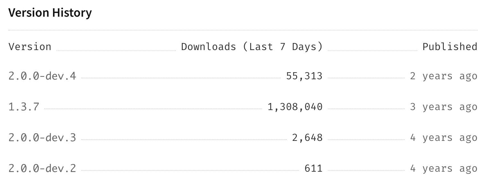

## 前言

在富文本编辑器场景中, **表格**是一种不可忽视的功能, 但是在当前 `quill.js` 的正式版本(`1.x`)中, 却不支持此功能

所以本文承接上文 [链接](ss), 来讲述下 `quill.js` 升级到 `2.x` 的问题以及添加表格功能

## 为什么需要升级

在目前的 1.x 版本中并不支持***表格的元素***, 而我们想要这个功能的话  
一是升级, 通过官方的支持来添加, 二是我们自己开发, 但是这样的成本过大了

## 当前官方进度



根据 [npm](https://www.npmjs.com/package/quill) 官方包的发布时间来看, `2.x` 版本处于开发的停滞阶段

所以本次我们就以当前官方版本 `1.3.7` 为基础, 再手动添加 `2.0.0-dev.4` 的代码

## 手动进行 2.0 升级

目前我们使用的是 `react-quill` 仓库, 我们要将其源码复制下来, 同时也将 `quill` 的 `2.x` 源码克隆, 将其作为依赖

最终维护的文件格式为:
```
├── quill
│   ├── assets
│   ├── blots
│   ├── core
│   ├── core.ts
│   ├── formats
│   ├── modules
│   ├── quill.ts
│   ├── themes
│   └── ui
├── react-quill
│   ├── index.tsx
│   └── quill.snow.less

```

详情可查看仓库: https://github.com/Grewer/react-quill2

差异点:
- CSS 样式问题(原有的 li, ol 不再通过标签来区分, 而是用节点的类型)
- 同样地代码块 `pre` 也是使用了 `div` 代替
- 添加了一些新的 formats
- 不再支持 IE11
- `setContents` API 的变更
  `editor.clipboard.convert` 的使用从原有的 `editor.clipboard.convert(value)` 改为 `editor.clipboard.convert({html: string, text: string}, formats: Record<string, unknown> = {} )`
- 其他的一些 API 变更(和表格功能关系不大)

更加详细的变更可查看: https://github.com/quilljs/quill/blob/develop/docs/guides/upgrading-to-2-0.md


## 现有表格功能调研

在升级 2.0 之后, 我们的编辑器**已经拥有了表格功能**, 但是没有扩展, 比如插入一行, 插入一列, 删除等等, 这些是用户常用的操作  
所以我们需要一个插件来扩展

在 `GitHub` 上搜索关键词 `quill` + `table` 之后出现的[结果](https://github.com/search?q=quill+table):

目前 star 大于 10, 且是正常库(_非测试库, 类似于[这种](https://github.com/dost/quilljs-table)_), 最近 2-3 年有更新的, 结果只有 2 个, 最后我们对这 2 个库来进行调研

1. https://github.com/volser/quill-table-ui
2. https://github.com/soccerloway/quill-better-table

这两个库都是有自己对应的 demo, 可以点击查看:

1. [quill-table-ui](https://codepen.io/volser/pen/QWWpOpr)
2. [quill-better-table](https://codepen.io/soccerloway/pen/WWJowj)

目前看这两个仓库基本都能实现较好的表格方案

本文选择了 `quill-table-ui` 作为接入方案, 大伙如果喜欢 `quill-better-table` 也可以考虑自己来了接入

## 扩展表格功能

新增文件 `modules/table.ts` :
这里就简单展示一下主要逻辑
```tsx

export default class TableUI {
    menuItems: MenuItem[] = [
        {
            title: 'Insert column right',
            icon: iconAddColRight,
            handler: () => {
                if (
                    !(this.options.maxRowCount > 0) ||
                    this.getColCount() < this.options.maxRowCount
                ) {
                    this.table.insertColumnRight();
                }
            },
        },
        // 省略
        // 这里的数据是点击一个表格, 显示的菜单, 新增行列, 删除行列
    ];
    
    
        toggleClickHandler = (e) => {
        // 控制菜单显示
    };
    
    showMenu() {
        // 菜单显示的具体 dom 操作
    }
    
    hideMenu() {
        // 删除菜单的 dom 操作
    }
    
    createMenuItem(item: MenuItem) {
        // 创建菜单时, 构建菜单结构
        const node = document.createElement('div');
        node.classList.add('ql-table-menu__item');
    
        node.addEventListener(
            'click',
            (e) => {
                e.preventDefault();
                e.stopPropagation();
                this.quill.focus();
                item.handler();
                this.hideMenu();
                this.detectButton(this.quill.getSelection());
            },
            false
        );
        return node;
    }
    
    
    
    destroy() {
        // 删除时, 去掉引用对象, 监听等等操作
    }
}
```

在注册之后, 我们就正式调用对应的 API, 来创建表格:

```ts
// 注册
Quill.register({ 'modules/tableUI': TableUI }, true);


```


## 结语

目前来说, 因为 `quill` 一直卡在 `2.0@dev` 中, 后面的升级都需要自己来维护了,
并且

## 引用