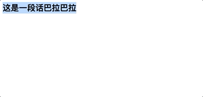

聊聊光标和选区的问题


## 术语表
首先我们需要知道一些术语, 才能更好地理解, 如果您已经了解, 可以跳过这一段

**锚点 (anchor)**

锚指的是一个选区的起始点（不同于 HTML 中的锚点链接）。当我们使用鼠标框选一个区域的时候，锚点就是我们鼠标按下瞬间的那个点。在用户拖动鼠标时，锚点是不会变的。

**焦点 (focus)**

选区的焦点是该选区的终点，当您用鼠标框选一个选区的时候，焦点是你的鼠标松开瞬间所记录的那个点。随着用户拖动鼠标，焦点的位置会随着改变。

**范围 (range)**

范围指的是文档中连续的一部分。一个范围包括整个节点，也可以包含节点的一部分，例如文本节点的一部分。用户通常下只能选择一个范围，但是有的时候用户也有可能选择多个范围（例如当用户按下 Control 按键并框选多个区域时，Chrome 中禁止了这个操作）。“范围”会被作为 [`Range`](https://developer.mozilla.org/zh-CN/docs/Web/API/Range) 对象返回。Range 对象也能通过 DOM 创建、增加、删减。

本术语表来源于 [MDN](https://developer.mozilla.org/zh-CN/docs/Web/API/Selection#%E6%9C%AF%E8%AF%AD%E8%A1%A8)

## contenteditable

> contenteditable全局属性是一个枚举属性，表示该元素是否应该由用户编辑。如果是的话，浏览器就会修改其小部件以允许编辑。

简单的来说, 如果要让一个 div 变得可编辑, 我们加上这个属性就能实现了

这就是富文本编辑器的最基础的构造了, 想要完整的富文本, 首先我们要控制他的光标

而浏览器提供了 selection 对象和 range 对象来操作光标。

## Selection

> Selection 对象表示用户选择的文本范围或插入符号的当前位置。它代表页面中的文本选区，可能横跨多个元素。文本选区由用户拖拽鼠标经过文字而产生。

我们可以通过 API `window.getSelection()` 来获取当前用户选中了哪些文本

这是调用后的返回结果:


### 部分属性说明

#### anchorNode 只读
> 返回该选区起点所在的节点（Node）。

#### anchorOffset 只读
> 返回一个数字，其表示的是选区起点在 `anchorNode` 中的位置偏移量。
>
> 1.  如果 `anchorNode` 是文本节点，那么返回的就是从该文字节点的第一个字开始，直到被选中的第一个字之间的字数（如果第一个字就被选中，那么偏移量为零）。
> 2.  如果 `anchorNode` 是一个元素，那么返回的就是在选区第一个节点之前的同级节点总数。(这些节点都是 `anchorNode` 的子节点)

#### isCollapsed 只读
返回一个布尔值，用于判断选区的起始点和终点是否在同一个位置。

#### rangeCount 只读
返回该选区所包含的连续范围的数量。

### 方法

这里只阐述几个重要的方法

#### getRangeAt

```js
var selObj = window.getSelection();
range = sel.getRangeAt(index)
```

**例子:**

```js
let ranges = [];

sel = window.getSelection();

for(var i = 0; i < sel.rangeCount; i++) {
 ranges[i] = sel.getRangeAt(i);
}
/* 在 ranges 数组的每一个元素都是一个 range 对象，
 * 对象的内容是当前选区中的一个。 */
```
在很多情况下, `rangeCount` 的数量都是 1

他的返回值是一个 `Range`, 具体在本文的 `Range` 部分讲解


#### addRange

> 向选区（Selection）中添加一个区域（Range）。

这里举一个小栗子就能快速理解:

```js
<strong id="foo">这是一段话巴拉巴拉</strong>
<strong id="bar">这是另一段话</strong>
var s = window.getSelection();

// 一开始我们让他选中 foo 节点
var range = document.createRange();
range.selectNode(foo);
s.addRange(range);

// 在一秒钟后我们取消foo 节点的选中, 选择所有body节点
setTimeout(()=>{
    s.removeAllRanges();
    var range2 = document.createRange();
    range2.selectNode(document.body);
    s.addRange(range2);
}, 1000)
```

效果展示:


**遇到 contenteditable** 元素时

如果 `strong#foo` 元素是一个 `contenteditable` 元素: `<strong id="foo" contenteditable="true">这是一段话巴拉巴拉</strong>`
那么我们不能直接用 `range.selectNode(foo);`, 而是应该这样做:

```js
    var range = document.createRange();
    range.setStart(foo, 0)
    range.setEnd(foo, 1)
    // 其中 0, 1 代表子节点数量
    s.addRange(range);
```

其中 `setStart` 和 `setEnd` 第二个参数: 
> 如果起始节点类型是 Text、Comment 或 CDATASection之一，那么 startOffset 指的是从起始节点算起字符的偏移量。对于其他 Node 类型节点，startOffset 是指从起始结点开始算起子节点的偏移量。

或者使用 `selectNodeContents` API:

```js
    var range = document.createRange();
    range.selectNodeContents(foo)
    s.addRange(range);
```


#### collapse

> collapse 方法可以收起当前选区到一个点。文档不会发生改变。如果选区的内容是可编辑的并且焦点落在上面，则光标会在该处闪烁。

同样地, 这里也创建一个例子

```js
<p id="foo">这是一段话巴拉巴拉</p>
var s = window.getSelection();

var range = document.createRange();
range.selectNode(foo);
s.addRange(range);

setTimeout(()=>{
    s.collapse(foo, 0);
}, 1000)
```
效果是, 在 1 秒之后, 选区消失了


我们再在 `p` 标签上添加 `contenteditable` 尝试下:

```js
<p contenteditable="true" id="foo">这是一段话巴拉巴拉</p>
var s = window.getSelection();

var range = document.createRange();
range.selectNodeContents(foo)
s.addRange(range);

setTimeout(()=>{
    s.collapse(foo, 1);
}, 1000)
```
效果展示:


## Range

> Range 接口表示一个包含节点与文本节点的一部分的文档片段。

在上述的例子中, 我们已经尝试过使用 `Document.createRange` 方法创建 `Range`
也可以通过 `Selection` 对象的 `getRangeAt()` 方法或者 `Document` 对象的 `caretRangeFromPoint()` 方法获取 `Range` 对象。

`Range` (通过 `document.createRange();` 创建)拥有这些属性:

```js
{
    collapsed:true // 表示 Range 的起始位置和终止位置是否相同的布尔值
    commonAncestorContainer:document // 返回完整包含 startContainer 和 endContainer 的、最深一级的节点
    endContainer:document // 包含 Range 终点的节点。
    endOffset:0 // 一个表示 Range 终点在 endContainer 中的位置的数字。
    startContainer:document // 包含 Range 开始的节点。
    startOffset:0 // 一个数字，表示 Range 在 startContainer 中的起始位置。
}
```

### collapse

> Range.collapse() 方法向边界点折叠该 Range

**语法:**

```js
range.collapse(toStart);
```

*toStart* 可选

一个布尔值： `true` 折叠到 Range 的 start 节点，`false` 折叠到 end 节点。如果省略，则默认为 false

在之前的 `Selection` - `collapse` 例子中, 我们也可以通过此 API 来操作, 达到相同的效果:

```js
<p contenteditable="true" id="foo">这是一段话巴拉巴拉</p>
var s = window.getSelection();

var range = document.createRange();
range.selectNodeContents(foo)
s.addRange(range);

setTimeout(()=>{
    range.collapse()
    // s.collapse(foo, 1);
}, 1000)
```

---

在前文中已经尝试过使用 `selectNode()` , `selectNodeContents()` , `setEnd()`, `setStart()` 等方法, 这里就不在多赘述


## quill 中的 Selection

在 quill 中, 会基于原生 API 获取信息, 并包装出一个自己的对象:

```js
  getRange() {
    const root = this.scroll.domNode;
    // 省略空值判断
    const normalized = this.getNativeRange(); // 我们先看这个函数
    if (normalized == null) return [null, null];
    // 后续暂时忽略
  }
```
`getRange` 函数就是 `quill` 中, 获取选区的方法, 而 `normalized` 是基于原生的api, 并通过一定的包装, 来获取数据:

```js
  getNativeRange() {
    const selection = document.getSelection();
    if (selection == null || selection.rangeCount <= 0) return null;
    const nativeRange = selection.getRangeAt(0);
    if (nativeRange == null) return null;
    // 上面四句都是通过原生 api, 来判断当前是否有选区
    // 因为基本上 rangeCount 都是 1, 所以直接通过 getRangeAt(0) 即可获取选区
    
    // 这里的 normalizeNative 才是对原生真正的操作
    // nativeRange 是当前
    const range = this.normalizeNative(nativeRange);
    return range;
}
```

### normalizeNative

```js
  normalizeNative(nativeRange) {
    // 判断选区是否在当前的编辑器根元素中, 是否是选中状态
    if (
      !contains(this.root, nativeRange.startContainer) ||
      (!nativeRange.collapsed && !contains(this.root, nativeRange.endContainer))
    ) {
      return null;
    }
    // 构造一个自定义对象, 存储原生数据
    const range = {
      start: {
        node: nativeRange.startContainer,
        offset: nativeRange.startOffset, // 开始元素的偏移, 但是并不代表是从视觉看上去的偏移, 具体看 nativeRange.startContainer.data
      },
      end: { node: nativeRange.endContainer, offset: nativeRange.endOffset },
      native: nativeRange,
    };
    // 开始遍历 [range.start, range.end] 
    [range.start, range.end].forEach(position => {
      // 从原生处取值: node = range.startContainer  offset = range.startOffset
      let { node, offset } = position;
      
      // 当某一节点不是 text, 且有子节点时
      // 因为在 quill, 中会有一些特殊的格式, 比如图片, 视频, emoji 等等
      // 这些特殊格式在选区中的占位是不同的, 举个例子:  一张看着很大的图片, 但其实偏移量只有 1
      // 同时, 如果我们需要一些定制的功能的话, 这里的判断可能会影响选区 , 所以我们需要对这里做出一些特殊的判断
      while (!(node instanceof Text) && node.childNodes.length > 0) {
        if (node.childNodes.length > offset) { // 超出的情况判断
          node = node.childNodes[offset];
          offset = 0;
        } else if (node.childNodes.length === offset) {
          node = node.lastChild;
          if (node instanceof Text) {
            offset = node.data.length;
          } else if (node.childNodes.length > 0) {
            // Container case
            offset = node.childNodes.length;
          } else {
            // Embed case
            offset = node.childNodes.length + 1;
          }
        } else {
          break;
        }
      }
      position.node = node;
      position.offset = offset; // 赋值
    });
    return range;
  }
```
最后返回一个自定义 range 对象

### normalizedToRange

而在自定义对象包装结束之后, 还会经历一次计算 `normalizedToRange` 方法

```js
  getRange() {
    const root = this.scroll.domNode;
    // 省略空值判断
    const normalized = this.getNativeRange(); // 返回的自定义 range
    if (normalized == null) return [null, null];
    
    const range = this.normalizedToRange(normalized);
    return [range, normalized];
  }
```

**normalizedToRange**:

```js
    // range 的结构
    // const range = {
    //  start: {
    //      node: nativeRange.startContainer,
    //          offset: nativeRange.startOffset, // 开始元素的偏移, 但是并不代表是从视觉看上去的偏移, 具体看 nativeRange.startContainer.data
    //  },
    //  end: { node: nativeRange.endContainer, offset: nativeRange.endOffset },
    //  native: nativeRange,
    // };
    // 
    normalizedToRange(range) {
    const positions = [[range.start.node, range.start.offset]];
    // 如果不是闭合的即光标状态, 则新增 末尾的数据到数组中
    if (!range.native.collapsed) {
      positions.push([range.end.node, range.end.offset]);
    }
    // 遍历数据, 获取索引(从编辑框的第 0 个开始算)
    const indexes = positions.map(position => {
        // 经过 normalizeNative 修改的取值,和原生相比,  node 和 offset 可能发生了修改
        const [node, offset] = position;
        // 搜索到对应的 dom
        const blot = this.scroll.find(node, true);
        // 通过他的 api 来获取偏移量, 可以查看 https://github.com/quilljs/parchment
        const index = blot.offset(this.scroll);
        // 如果在某一个 dom 上的偏移量为 0, 那么当前索引就是 dom 的索引
        if (offset === 0) {
            return index;
        }
        // LeafBlot属于特殊情况, 属于子节点, 属于 parchment 库
        if (blot instanceof LeafBlot) {
            return index + blot.index(node, offset);
        }
        // 最后加上当前节点的长度
        return index + blot.length();
    });
    
    // 比较当前的索引和, 编辑器的长度, 不让他超出
    const end = Math.min(Math.max(...indexes), this.scroll.length() - 1);
    // 比较结尾和索引, 获取最小值, 作为开始值
    const start = Math.min(end, ...indexes);
    // 通过原生 api 重新 new 一个新的 Range 对象, 传参为 start 和 length
    return new Range(start, end - start);
    }
```

### 执行顺序


### 查看 selection

通过官方 API, 我们即可查看到之前计算的数据:

```js
    const editorRef = useRef<any>()
    editorRef.current?.getEditor()?.selection
```

结果如图:


其中 `lastRange` 对应 `normalizedToRange` 的结果, 
而 `lastNative` 则是 `getNativeRange` 的返回(包装的原生数据)

## 总结

本文主要介绍了 原生 API: Selection 和 Range 的作用和他的属性、方法的说明,
并通过这两API 介绍在 quill 中, API 会有什么影响, 我们又需要采用哪些判断

总的来说, 这两 API 在除富文本功能中, 基本不会遇见, 所以大多数情况下, 只需要了解即可

## 引用

- https://developer.mozilla.org/zh-CN/docs/Web/API/Selection
- https://github.com/quilljs/parchment
- https://github.com/quilljs/quill