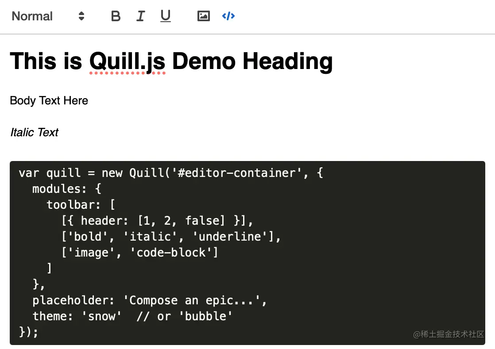
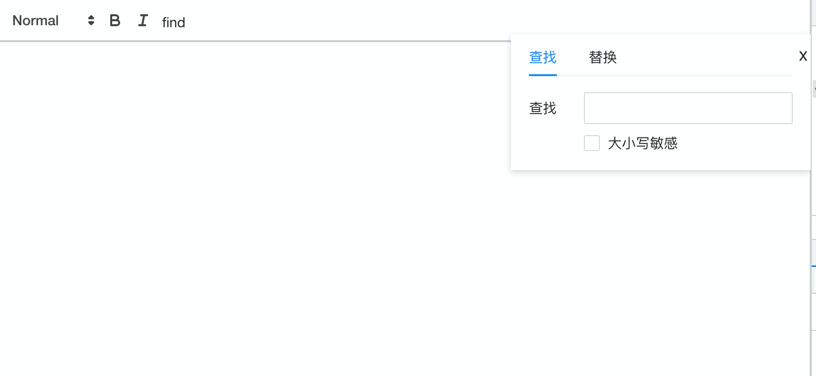

## 前言

在前端开发中, 富文本是一种常见的业务场景, 而本文要讲的就是富文本框架 quill.js 中的插件的开发以及他的升级方案

## 介绍

> Quill.js 是一个具有跨平台和跨浏览器支持的富文本编辑器。凭借其可扩展架构和富有表现力的 API，可以完全自定义它以满足个性化的需求。由于其模块化架构和富有表现力的 API，可以从 Quill 核心开始，然后根据需要自定义其模块或将自己的扩展添加到这个富文本编辑器中。它提供了两个用于更改编辑器外观的主题，可以使用插件或覆盖其 CSS 样式表中的规则进一步自定义。Quill 还支持任何自定义内容和格式，因此可以添加嵌入式幻灯片、3D 模型等。



该富文本编辑器的**特点**：

*   由于其 API 驱动的设计，无需像在其他文本编辑器中那样解析 HTML 或不同的 DOM 树；
*   跨平台和浏览器支持，快速轻便；
*   通过其模块和富有表现力的 API 完全可定制；
*   可以将内容表示为 JSON，更易于处理和转换为其他格式；
*   提供两个主题以快速轻松地更改编辑器的外观。

## 插件的开发

> 本次的编辑器使用 `react-quill` 组件库, 他在 `quill.js` 外层包装了一层 `react` 组件, 使得开发者在 react 框架用使用更加友好  
> 相关链接: https://github.com/zenoamaro/react-quill
> 

### 使用:

```tsx
import React, { useState } from 'react';
import ReactQuill from 'react-quill';
import 'react-quill/dist/quill.snow.css';

function App() {
  const [value, setValue] = useState('');

  return <ReactQuill theme="snow" value={value} onChange={setValue} />;
}
```

### 自定义 toolbar

> 传递自定义 `toolbar` 的值

`toolbar` 中 **自定义的按钮**, 可以用 `iconfont` 的 `svg` 或者 `class`, 这里为了方便, 我们直接用文字
```tsx
const CustomButton = () => <span className="iconfont">
    find
</span>;
```

```tsx
function App() {
    const [value, setValue] = useState('');
    
    function insertStar() {
        // 点击自定义图标后的回调
    }
    
    // 自定义的 toolbar, useCallback 重渲染会有显示问题
    const CustomToolbar = useCallback(() => (
        <div id="toolbar">
            <select
                className="ql-header"
                defaultValue={''}
                onChange={(e) => e.persist()}
            >
                <option value="1"></option>
                <option value="2"></option>
                <option selected></option>
            </select>
            <button className="ql-bold"></button>
            <button className="ql-italic"></button>
            <button className="ql-insertStar">
                <CustomButton/>
            </button>
        </div>
    ), []);
    
    // 直接声明会有显示问题
    const modules = useMemo(() => ({
        toolbar: {
            container: '#toolbar',
            handlers: {
                insertStar: insertStar,
            },
        },
    }), []);
    
    return (<div>
        <CustomToolbar/>
        <ReactQuill theme="snow" value={value} modules={modules} onChange={setValue}/>
    </div>)
}   
```

通过此方案, 可以打造一个属于自己的工具栏了

_但是也有一个缺点: **原有的 `quill.js` 工具栏**功能需要自己手写或者去官方 copy 下来_

## 例子

> 现在可以自定义添加工具栏了, 那就开始我们的插件开发之旅

本次的例子是一个**查找与替换功能**的插件开发

首先根据 `自定义 toolbar` 中的方案添加按钮, 因为上面已经有了例子, 这里就忽略掉自定义按钮的代码

### 主要结构

现在根据点击之后的回调, 显示如下的样式:



```tsx
class FindModal extends React.Component {
    render(){
        return <div className={'find-modal'}>
            <span className={'close'} onClick={this.props.closeFindModal}>x</span>
            <Tabs defaultActiveKey="1" size={'small'}>
                <TabPane tab={'查找'} key="1">
                    {this.renderSearch()}
                </TabPane>
                <TabPane tab={'替换'} key="2">
                    {this.renderSearch()}
                    <div className={'find-input-box replace-input'}>
                        <label>{'替换'}</label>
                        <Input onChange={this.replaceOnChange}/>
                    </div>
                    <div className={'replace-buttons'}>
                        <Button disabled={!indices.length} size={'small'} onClick={this.replaceAll}>
                            {'全部替换'}
                        </Button>
                        <Button
                            disabled={!indices.length}
                            size={'small'}
                            type={'primary'}
                            onClick={this.replace}
                        >
                            {'替换'}
                        </Button>
                    </div>
                </TabPane>
            </Tabs>
        </div>
    }
}
```

在外部使用 `state` 的 `visible` 控制即可:

```tsx
visible ? (<FindModal/>) : null
```

### 搜索栏的处理

这里我们从用户的输入关键词开始入手: 当用户**输入搜索关键词**时, 触发回调:

```tsx
<Input
    onChange={this.onChange}
    value={searchKey}
    suffix={
        // 如果有搜索的结果, 显示个数, 上一个,下一个的操作图标
        indices.length ? (
            <span className={'search-range'}>
                <LeftOutlined onClick={this.leftClick} />
                {currentPosition + 1} / {indices.length}
                <RightOutlined onClick={this.rightClick} />
            </span>
        ) : null
    }
/>
```

`onChange` 输入时的触发 _(这里我们可以加上 debounce)_:

首先我们保存输入的值, 将搜索结果 `indices` 重置为空:
```ts
this.setState({
    searchKey: value,
    indices: [],
});
```

通过 quill 获取所有文本格式:
```ts
const {getEditor} = this.props;
const quill = getEditor();
const totalText = quill.getText();
```

解析用户输入的词, 将其转换成正则 (**_注意这里要对用户输入转义, 避免一些关键词影响正则_**)   
之后则是是非大小写敏感: 使用 `i` 标记, `g` 表示全局匹配的意思(_不加上就只会匹配一次_):
```ts
function escapeRegExp(string) {
    return string.replace(/[.*+?^${}()|[\]\\]/g, '\\$&');
}
const re = new RegExp(escapeRegExp(searchKey), this.state.checked ? 'g' : 'gi');
```

之后我们就要利用 `totalText` 和 `re` 进行循环正则匹配:

```ts
while ((match = re.exec(totalText)) !== null) {
    // 目标文本在文档中的位置
    let index = match.index;
    // 计算 从最初到 index 有多少个特殊 insert
    index = this.countSpecial(index, indices.length ? indices[indices.length - 1].index : 0);
    
    // 来自于 formatText 的方法, 使其高亮, 第 0 个默认选中
    quill.formatText(index, searchKey.length, 'SearchedString', true, 'api');
    // 最后记录搜索到的坐标
    indices.push({index});
}
```

### 特殊字符问题

这里需要注意的是 `countSpecial` 方法

具体实现:

```ts
countSpecial = (index, lastIndex) => {
        const {getEditor} = this.props;
        const quill = getEditor();
        const delta = quill.getContents();
        // 获取上一个节点到当前节点的 delta
        const restDelta = delta.slice(lastIndex, index);
        const initValue = this.specialArray.length
            ? this.specialArray[this.specialArray.length - 1]
            : 0;
        const num = restDelta.reduce((num, op) => {
            if (typeof op.insert === 'object') {
                return num + 1;
            }
            return num;
        }, initValue);
        this.specialArray.push(num);
        return index + num;
    };
```

他的主要作用是用来计算编辑器中的**特殊字符**数量, 如**图片、emoji、附件**等等

这样做的原因在于, 通过 `quill` 的方法 `quill.getText();` 并不能完全返回所有的显示, 他只能返回**文本**, 而像是**图片**这样的, 他是没有实际的文本, 但是却有着真实的占位符

像这些特殊符号只能通过 `delta` 的方案来获取 **它是否存在**, 而如果全局使用 `delta` 方案的话, 他就不能完成搜索了;

#### 举个例子

比如我现在输入一句古诗 `但愿人长久，千里共婵娟。`, 其中 `长久` 两个字使用了**加粗**的格式, 他显示的 `delta` 是这样的: 

```js
[
    {insert: '但愿人'},
    {attributes: {bold: true}, insert: '长久'},
    {insert: '，千里共婵娟。\n'},
]
```

可以看到 `delta` 的文字是断裂的, 会被任意的格式所拆开;

所以现在使用的是这样一种 `text` + `delta` 组合的方案

### 搜索结束

搜索完毕之后, 格局结果的坐标一次赋予对应格式, 同时记录当前选中的第 `0` 个搜索关键词

```ts
if (indices.length) {
  this.currentIndex = indices[0].index;
  // 使得 indices[0].index 到 length 的距离的文本 添加 SearchedStringActive 格式
  quill.formatText(indices[0].index, length, 'SearchedStringActive', true, Emitter.sources.API);
  this.setState({
    currentPosition: 0,
    indices,
  });
}
```

### quill 格式

在上面搜索功能中我们使用了一个 `API`: `quill.formatText` 这里我们就来介绍一下他

在 `quill.js` 中我们可以给他添加自定义的格式, 以这个 `SearchedString` 格式为例子:

```ts
quill.formatText(index, length, 'SearchedString', true, 'api');
```
想要让他起效我们就要先创建文件 `SearchedString.ts`(_使用 js 也没问题_):

```ts
import {Quill} from 'react-quill';
const Inline = Quill.import('blots/inline');

class SearchedStringBlot extends Inline {
  static blotName: string;
  static className: string;
  static tagName: string;
}

SearchedStringBlot.blotName = 'SearchedString';
SearchedStringBlot.className = 'ql-searched-string';
SearchedStringBlot.tagName = 'div';

export default SearchedStringBlot;

```

在入口使用:

```ts
import SearchedStringBlot from './SearchedString'

Quill.register(SearchedStringBlot);
```

添加这样一个格式之后, 在我们搜索调用之后, 搜索到的结果就会有对应的类名了:


### 下一步


## 引用
- https://juejin.cn/post/7084046542994145294
