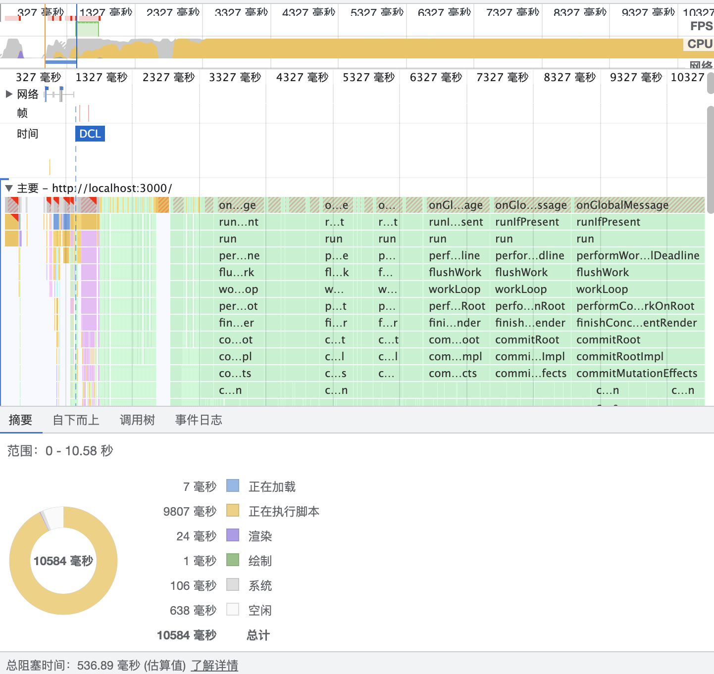

## 前言

在前一段时间做一个需求的时候, 他有一个自定义列表的功能, 他的所有数据显示都是通过 jSON 字符串来存储,使用也是通过 JSON 解析 起先他是有数据上限的, 但是后面提高上限后就出现了卡顿等问题,
所以本文就是介绍一些方案来解决前端大量数据的渲染问题

## 方案

### innerHTML

首先是在很久很久之前的渲染方案 `innerHTML` 插入, 他是官方的 API, 性能较好

这是一个简单的 HTML 渲染例子(在试验时数据取10w级别, 扩大差异, 实际中基本会小于这个级别)

```js
    const items = new Array(100000).fill(0).map((it, index) => {
    return `<div>item ${index}</div>`
}).join('')
content.innerHTML = items
```

来自谷歌的性能分析:


在 10 秒内进行了页面的刷新和滚动, 可以看到 dom 的渲染阻塞了页面 1300 ms  

在性能检测中, 总阻塞时间控制在**300毫秒**以内才是一个合格的状态, 这个时间还会受电脑硬件的影响

总结下这个方法的优缺点:
- 优点: 性能相对可以接受, 但数据较多时也同样有阻塞 
- 缺点: 
  - 有注入的危险, 和框架的搭配较差
  - 在 dom 过多时并没有解决滚动的性能问题

### 批量插入

通过分片来插入, 假如有 10W 条数据, 我们就分成 10 次, 每次 1w 条循环插入

```js
    [...new Array(10)].forEach((_, i) => {
    requestAnimationFrame(() => {
        [...new Array(10000)].forEach((_, index) => {
            const item = document.createElement("div")
            item.textContent = `item ${i}${index}`
            content.append(item)
        })
    })
})
```

经过谷歌分析:


这里也是包括的页面刷新和滚动的性能分析, 可以看到阻塞时间为 1800 毫秒, 相较 innerHTML 来说会差一点, 这是在 10w 的这个数量级, 数量越小, 时间的差距也会越小

#### 关于 requestAnimationFrame

其中 `requestAnimationFrame` 的作用: 此方法会告诉浏览器希望执行动画并请求浏览器在下一次重绘之前调用回调函数来更新动画。

执行方式: 当执行 requestAnimationFrame(callback)的时候，不会立即调用 callback 回调函数，会将其放入回调函数队列,  
当页面可见并且动画帧请求callback回调函数列表不为空时，浏览器会定期将这些回调函数加入到浏览器 UI 线程的队列中（由系统来决定回调函数的执行时机）

总的来说就是不会阻塞其他代码的执行, 但是总的执行时间和 innerHTML 方案差不太多


总结下优缺点: 

- 优点: 不会阻塞代码的运行
- 缺点: 
  - 插入所花费的总时间仍旧和 innerHTML 差不太多     
  - 同样地, 在 dom 过多时也没有解决滚动的性能问题

### 其他原生方式

#### canvas

canvas 是专门用来绘制的一个工具, 可以用于动画、游戏画面、数据可视化、图片编辑以及实时视频处理等方面。

最近在著名框架 Flutter 的 Web 中就是使用 canvas 来渲染页面的

同样我们也可以使用 canvas 来渲染大量的数据

```html

<div style="max-height: 256px;max-width:256px;overflow: scroll;">
    <canvas id="canvas"></canvas>
</div>
```

```js
    let ctx = canvas.getContext('2d');
[...new Array(100000)].map((it, index) => {
    ctx.fillText(`item ${index}`, 0, index * 30)
})
```

经过实际的尝试, canvas 他是有限制的,最大到 6w 左右的高度就不能再继续放大了, 也就是说在大量数据下, canvas 还是被限制住了

- 优点: 在渲染数量上性能很好
- 缺点: 
  - 想要实现列表一样的渲染, 就需要扩大 canvas, 但是这个却被限制了(在其他场景下是一种比较好的方案, 比如动画,地图等)
  - 在 canvas 中的样式难以把控

#### IntersectionObserver

> IntersectionObserver 提供了一种异步观察目标元素与视口的交叉状态，简单地说就是能监听到某个元素是否会被我们看到，当我们看到这个元素时，可以执行一些回调函数来处理某些事务。


注意:
IntersectionObserver的实现，应该采用requestIdleCallback()，即只有线程空闲下来，才会执行观察器。这意味着，这个观察器的优先级非常低，只在其他任务执行完，浏览器有了空闲才会执行。

通过这个 api 我们可以做一些尝试, 来实现类似虚拟列表的方案

这里我实现了往下滑动的一个虚拟列表 demo, 主要思路是监听列表中所有的 dom, 当他消失的时候, 移除并去除监听, 然后添加新的 DOM和监听


核心代码:

```js
    const intersectionObserver = new IntersectionObserver(function (entries) {
        entries.forEach(item => {
            // 0 表示消失
            if (item.intersectionRatio === 0) {
                // 最后末尾添加
                intersectionObserver.unobserve(item.target)
                item.target.remove()
                addDom()
            }
        })
    });
```

谷歌的性能分析(首次进入页面和持续滚动 1000 个 item):


可以看到基本是没有阻塞的, 此方案是可行的, 在初始渲染和滚动之间都没问题

详情点击可以查看, demo只实现了往下滚动方案:  
https://codesandbox.io/s/snowy-glade-w3i9fh?file=/index.html

#### 进一步优化
现在 IntersectionObserver 已经实现了类似虚拟列表的功能了, 但是频繁的添加监听和解除, 怎么都看起来会有隐患, 所以我打算采取扩大化的方案:

大概的思路:  

当前列表以 10 个为一队,当前列表总共渲染 30 个,  当滚动到第 20 个时, 触发事件, 加载第 30-40 个, 同时删除0-10 个, 后面依次触发


这样的话触发次数和监听次数会呈倍数下降, 当然代价就是同事渲染的 dom 数量增加, 后续我们再度增加每一队的数量, 可以维持一个
dom 数和监听较为平衡的状态

#### 兼容
关于 IntersectionObserver 的兼容, 通过 polyfill, 可获得大多浏览器的兼容, 最低支持 IE7, 具体可查看: https://github.com/w3c/IntersectionObserver/tree/main/polyfill

总结下优缺点:  

- 优点: 利用原生 API 实现的一种虚拟列表方案, 没有数据瓶颈
- 缺点: 
  - 生产中的框架的适配性不够高, 实现较为复杂    
  - 在无限滚动中频繁触发监听和解除, 可能存在某些问题

### 框架

前面说了那么多方法, 都是在非框架中的实现, 这里我们来看一下在 react 中列表的表现

#### react
这是一个长度为 1万 的列表渲染

```jsx
function App() {
  const [list, setList] = useState([]);

  useEffect(() => {
    setList([...new Array(50000)]);
  }, []);

  return (
    <div className="App">
      {list.map((item, index) => {
        return <div key={index}>item {index}</div>;
      })}
    </div>
  );
}
```
在 demo 运行的时候可以明显地感知到页面地卡顿了


通过谷歌分析, 在 5 万的数量级下, 重新刷新之后, 10 秒仍然没有渲染完毕  
当然框架中的性能肯定是没有原生强的, 这个结论是在意料之内的


在线 demo 地址: https://codesandbox.io/s/angry-roentgen-25vipz

还需要注意的一点是, 大量数据在 template 中的传输问题:

```jsx
// 这个 list 的数量级是几千甚至上万的, 会导致卡顿成倍的增加, 
<Foo list={list}/>
```

这个结论不管是在 vue 中还是 react 都是适用的, 所以大量数据的传递, 就得在内存中赋值,获取, 而不是通过模块,render 等常规方式

如果数量级在是 100 的, 我们也可以考虑优化, 可以积少成多

#### startTransition

在 react18 中还会有新的 API `startTransition`:
```jsx
startTransition(() => {
    setList([...new Array(10000)]);
})
```
这个 API 的作用, 和我上面所说的 `requestAnimationFrame` 大同小异, 他并不能增强性能, 但是可以避免卡顿, 优先渲染其他的组件, 避免白屏

// https://clusterize.js.org/

### 虚拟列表

这里我正式引入虚拟列表的概念

#### 原理

#### 最小实现方案

#### 其他库

## chrome 官方的支持

### virtual-scroller

在 Chrome dev summit 2018 上，谷歌工程经理 Gray Norton 向我们介绍 virtual-scroller，一个 Web 滚动组件，未来它可能会成为 Web 高层级 API（Layered
API）的一部分。它的目标是解决长列表的性能问题，消除离屏渲染。

**但是, 经过**

### content-visibility

## 总结

## 引用

大纲:

主要讲虚拟列表 首先讲讲以前 jq 时代大量数据的引入 一个具体的例子, 具体的实现方案 讲讲 react 里面怎么实现有没有其他方法, CSS 的优化,一个 API, 例子的对比

看看还有没有什么优化方案

react 的 useTransition 分批插入: RAF 检测的 API:

Object.freeze(items) // 冻结对象 可以减少白屏率 ?

Canvas 渲染

CSS 属性:

```css
.story {
    content-visibility: auto;
    contain-intrinsic-size: 1000px; /* Explained in the next section. */
/ / contain-intrinsic-size: auto 300 px
}
```

https://web.dev/content-visibility/

chrome 对于虚拟列表的优化 <virtual-scroller> 标签 https://github.com/WICG/virtual-scroller
https://blog.csdn.net/qq_21726139/article/details/84107936
https://chromestatus.com/feature/5673195159945216
项目停止的原因: https://github.com/WICG/virtual-scroller/issues/201

之前的不开发了, 转而开发这个: https://github.com/WICG/display-locking
