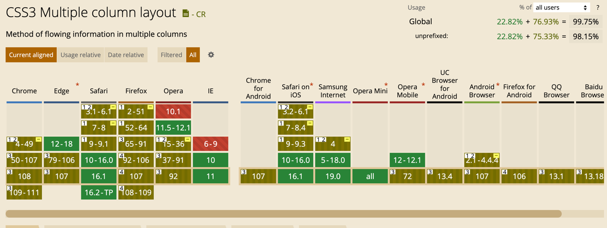

## 前言
上一文讲到了图片, 这里我们就讲一个常用的图片场景: 瀑布流, 他的实现和优化

## 什么瀑布流

> 瀑布流，又称瀑布流式布局。是比较流行的一种网站页面布局，视觉表现为参差不齐的多栏布局，随着页面滚动条向下滚动，这种布局还会不断加载数据块并附加至当前尾部。最早采用此布局的网站是 Pinterest，逐渐在国内流行开来。国内大多数清新站基本为这类风格。

更直观的展示如下图所示:

## 优缺点

**优点：**

1.  外表美观，更有艺术性。
2.  用户浏览时的观赏和思维不容易被打断，留存更容易。

**缺点：**

1. 用户无法了解内容总长度，对内容没有宏观掌控。
2. 用户无法了解现在所处的具体位置，不知道离终点还有多远。
3. 回溯时不容易定位到之前看到的内容。
4. 容易造成页面加载的负荷。
5. 容易造成用户浏览的疲劳，没有短暂的休息时间。

## 实现方案

### 纯 CSS 实现

这里要介绍 CSS 属性: `column`

现在常用的 `column` 属性有这些

- column-count
  将一个元素的内容分成指定数量的列。涉疫设置为具体数字, 或者`auto`
- column-fill  
  控制元素的内容在分成多列时如何平衡。有 `auto`、`balance` 两个值, 分别表示自动填充和水平分配
- column-gap  
  两列间的距离, 可设置: px, 百分比, rem
- column-rule  
  列布局中, 分割线的设置, 可以设置风格、宽度、颜色(和 border 相同的参数)
- column-span  
  列布局中横向的占用元素, 具体作用可查看[此处](https://developer.mozilla.org/en-US/docs/Web/CSS/column-span)
- column-width  
  每一列的最小宽度, 如果外部容易宽度特别小, 则会失效

另一个 CSS 属性 `columns`

他是用来设置元素的列宽和列数属性, 是由  `column-width` 和 `column-count` 两属性合并而来的简写属性

关于兼容性, 目前来看兼容性还可以, 可适应大多数情况

相关 CSS 属性的详情, 可点击[此处](https://developer.mozilla.org/zh-CN/docs/Web/CSS/columns)

这里再提供一个我使用 `columns` 的 demo, 预览图:

在线查看地址: https://grewer.github.io/JsDemo/waterfallLayout/css.html
(_可通过缩放浏览器大小来查看他的效果_)

### js 实现

## 优化

## 总结

## 引用

- https://www.zhihu.com/question/20005422/answer/287568035
- https://developer.mozilla.org/zh-CN/docs/Web/CSS/columns