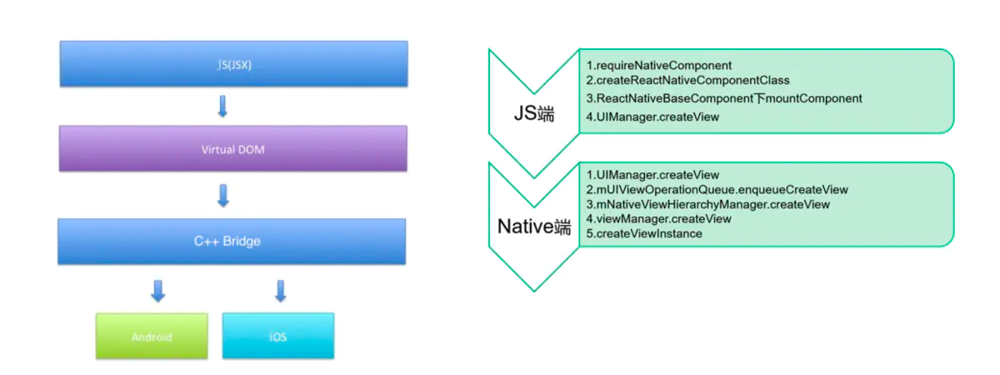
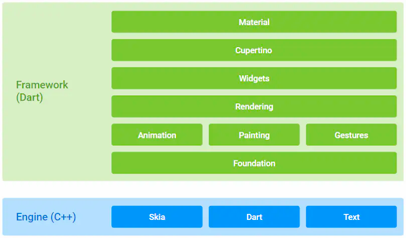
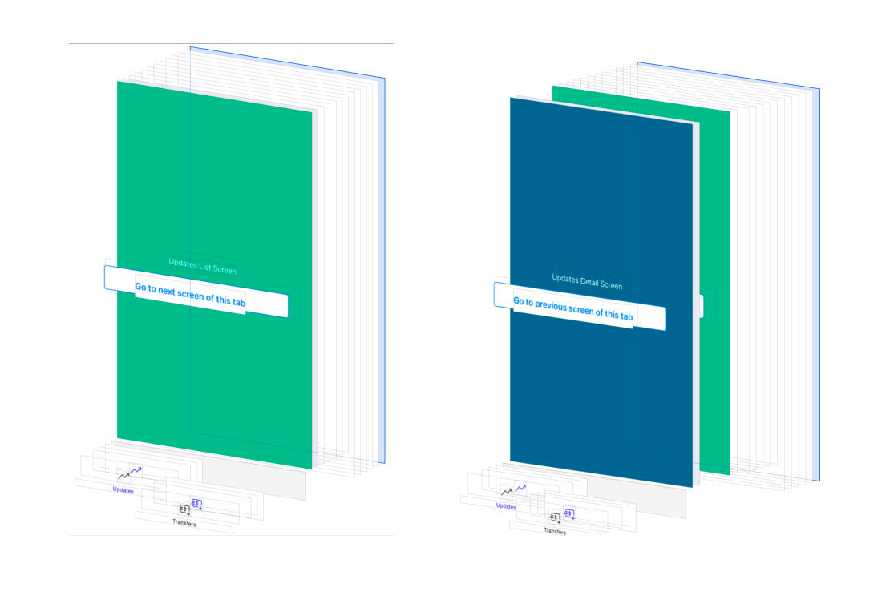
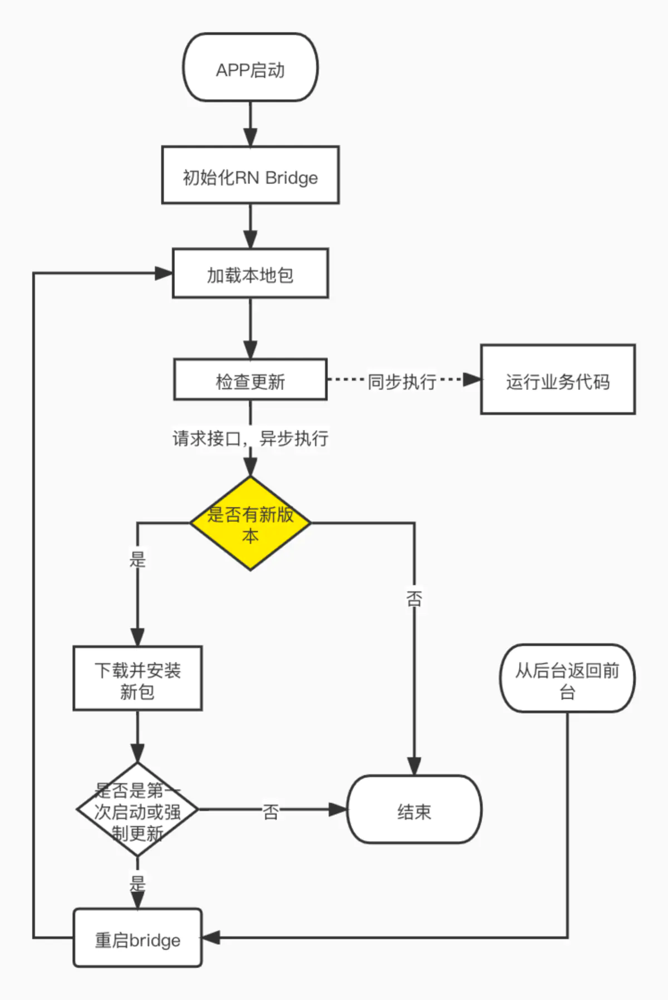

## 前言

本文主要介绍 react-native(下称 RN) 的入门, 和前端的异同点以及学会他有什么好处


## 选择优势

我们先说说, 为什么很多人会选择使用 RN, 以及他对应的特性和普通 Web 的区别

1. 前端资源, 生态的互通

因为使用的语言是 JS和 react, 对于前端来说可以无缝使用, 并且他还能使用前端的各类工具包

在 JS 端, 安卓和 iOS 是同一套代码

2. 热更新

很多选择使用 RN 的一个原因就是因为有热更新

简单解释下热更新, 在运行 APP 时, js 层我们可以通过接受到的通知, 来进行实时替换, 替换完毕之后依赖是要重启 APP 的, 这个时候可以询问用户, 也可以在下次重启时重新载入新的 JS bundle

这样可以保证用户使用的js 环境, 可以是较新的, 如果是原生 APP 则需要让用户去应用商店重新下载

3. 支持原生

RN 通过桥接与原生进行交互, 页面级别的融入原生 APP

他的许多组件, 方法都是调用了原生方法/组件, 相对 webview 来说性能更好


## 跨端框架横向对比

RN 和 Flutter 的简单对比

### 环境
无论是 RN 还是 Flutter ，都需要 Android 和 IOS 的开发环境，也就是 JDK 、Android SDK、Xcode 等环境配置，而不同点在于:

- RN 需要 npm 、node 、react-native-cli 等配置 。
- Flutter 需要 flutter sdk 和 Android Studio / VSCode 上的 Dart 与 Flutter 插件。

针对前端来说 RN 环境相对友好一点

### 实现原理

在 *Android* 和 *IOS* 上，默认情况下 **Flutter** 和 **React Native** 都**需要一个原生平台的
`Activity` / `ViewController` 支持，且在原生层面属于一个“单页面应用”，** 而它们之间最大的不同点其实在于 UI 构建 ：

- RN: 

**React Native** 是一套 UI 框架，默认情况下 **React Native** 会在 `Activity` 下加载 JS 文件，然后运行在 `JavaScriptCore` 中解析 *Bundle* 文件布局，最终堆叠出一系列的原生控件进行渲染。

简单来说就是 **通过写 JS 代码配置页面布局，然后 React Native 最终会解析渲染成原生控件**，如 `<View>` 标签对应 `ViewGroup/UIView` ，`<ScrollView>` 标签对应 `ScrollView/UIScrollView` ，`<Image>` 标签对应 `ImageView/UIImageView` 等。



- Flutter ：

**Flutter** 中绝大部分的 `Widget` 都与平台无关， 开发者基于 `Framework` 开发 App ，而 `Framework` 运行在 `Engine` 之上，由 `Engine` 进行适配和跨平台支持。这个跨平台的支持过程，其实就是将 **Flutter UI 中的 `Widget` “数据化” ，然后通过 `Engine` 上的 `Skia` 直接绘制到屏幕上 。**

**类似于前端的 canvas 绘图**



_此节来自于文章: https://www.jianshu.com/p/da80214720eb_

### 缺点

- RN:
  * 不能完全兼容W3C的规范，比如W3C里面，可以轻易设置圆角的大小，粗细，边框是实现和虚线，但是在客户端，这个实现起来都比较难。所以这类技术都只能有限的支持W3C的标准。
  * js运行性能瓶颈。
  * 数据通信的性能瓶颈。
- Flutter:
  * 无法动态更新。
  * 内存和包大小占用。
  * 学习成本高，生态不足。

## js 运行环境

在使用 RN 时， JS 代码将会运行在两个不同的环境上：

*   大多数情况下，RN 使用的是 [JavaScriptCore](http://trac.webkit.org/wiki/JavaScriptCore) ，也就是 Safari 所使用的 JavaScript 引擎。但是在 iOS 上 JavaScriptCore 并没有使用即时编译技术（JIT），因为在 iOS 中应用无权拥有可写可执行的内存页（因此无法动态生成代码）。
*   在使用 Chrome 调试时，所有的 JavaScript 代码都运行在 Chrome 中，并且通过 WebSocket 与原生代码通信。此时的运行环境是 [V8 引擎](https://v8.dev)。

所以在我们开启调试的时候和正式的运行环境会有一些不一样


RN 内置了Babel 转换器。所以很多语法我们是不需要再配置 babel 的, 语法环境直接上手即用
在 [这里](https://github.com/facebook/metro/tree/main/packages/metro-react-native-babel-preset) 可以看到具体的配置

### 定时器

在 RN 中有针对动画的定时器:  `InteractionManager` 


原生应用感觉流畅的一个重要原因就是在互动和动画的过程中避免繁重的操作。在 RN 里，我们目前受到限制，因为我们只有一个 JavaScript 执行线程。于是就有了 `InteractionManager` 来确保在执行繁重工作之前所有的交互和动画都已经处理完毕。

```js
InteractionManager.runAfterInteractions(() => {
  // ...需要长时间同步执行的任务...
});
```

相比较另外的几个定时器:

*   requestAnimationFrame(): 用来执行在一段时间内控制视图动画的代码
*   setImmediate/setTimeout/setInterval(): 在稍后执行代码。注意这有可能会延迟当前正在进行的动画。
*   runAfterInteractions(): 在稍后执行代码，不会延迟当前进行的动画。

### Hermes 引擎

Hermes 是专门针对 RN 应用而优化的全新开源 JavaScript 引擎。对于很多应用来说，启用 Hermes 引擎可以优化启动时间，减少内存占用以及空间占用。

具体怎么启用和检测这里就不展示了

#### Hermes 的特色

- 预编译字节码（引擎加载二进制代码效率高于运行 JS 脚本）
- 无 JIT 编译器（减小了引擎大小，优化内存占用，但直接运行 JS 脚本的性能差于 V8 和 JSC）
- 针对移动端的垃圾回收策略

#### 优化原理

传统 JavaScript 引擎通常是以上图的模式完成代码执行的，编译阶段只完成 babel 转义和 minify 压缩，产物还是 JavaScript 脚本，解释与执行的任务都需要在运行时完成（如 V8 引擎，还会在运行时将 JavaScript 编译为本地机器码）很明显缺点就是在运行时需要边解释边执行，甚至需要占用系统资源执行编译任务。


Hermes 引擎使用了 aot 编译的方式，将解释和编译过程前置到编译阶段，运行时只完成机器码的执行，大大提高了运行效率。

## 原生 ui 组件

在 RN 中的一个优势就是可以插入原生组件, 提高 APP 的性能  
假如我们在 `js` 中要使用 `ImageView`, 那就需要这几步:

1. 创建一个 `ViewManager` 的子类。
2. 实现`createViewInstance`方法。
3. 导出视图的属性设置器：使用`@ReactProp`（或`@ReactPropGroup`）注解。
4. 把这个视图管理类注册到应用程序包的`createViewManagers`里。
5. 实现 JavaScript 模块。

上述是安卓的添加, 相对来说 iOS 会简单一点:

*   首先创建一个`RCTViewManager`的子类。
*   添加`RCT_EXPORT_MODULE()`宏标记。
*   实现`-(UIView *)view`方法。

```OC
// RNTMapManager.m
#import <MapKit/MapKit.h>

#import <React/RCTViewManager.h>

@interface RNTMapManager : RCTViewManager
@end

@implementation RNTMapManager

RCT_EXPORT_MODULE(RNTMap)

- (UIView *)view
{
  return [[MKMapView alloc] init];
}

@end
```

在 JS 中使用:

```jsx
// MapView.js

import { requireNativeComponent } from 'react-native';

// requireNativeComponent 自动把'RNTMap'解析为'RNTMapManager'
export default requireNativeComponent('RNTMap');

// MyApp.js

import MapView from './MapView.js';

...

render() {
  return <MapView style={{ flex: 1 }} />;
}
```

这是简单的展示, 关于传值的话就是多一些属性的判断, 下面来介绍两端的通信

除了原生组件之外, js 还能传值给移动端, 添加监听事件(包括 promise 回调), 对应的移动端也都可以

这样就组成了两端完整的通信体系

## 链接原生库

在我们使用三方原生库的时候, 就需要做一个 `link` 的功能

我们随着 RN 发布的所有库都在仓库中的Libraries文件夹下。其中有一些是纯 Javascript 代码，你只需要去import它们就可以使用了。另外有一些库基于一些原生代码实现，你必须把这些文件添加到你的应用，否则应用会在你使用这些库的时候产生报错。

而 link 它就是手动链接项目中的依赖项的替代方法。

而手动链接是一个很麻烦的事情, 安卓和 iOS 的方案还是不相同的, [具体可查看](https://www.react-native.cn/docs/linking-libraries-ios)

### 现状

很幸运的是, 但是如果我们使用的 RN 库是在 `0.60` 以上的, 就可以不需要使用 `link`指令了

在安卓中他会自动链接, 而在 iOS 中, 则可以使用 `cocoapods` 来下载原生包

### cocoapods

简单介绍一下, `CocoaPods` 是一个用于 `Swift` 和 `Objective-C` Cocoa项目的依赖管理器.
类比的话, 看成 `npm` 即可.

使用 cocoapods 时, 会需要文件 `Podfile`, 可以类比成 `package.json`  
之后通过指令 `pod install` (类比 `npm install`) 下载, 下载完毕之后会存于 `Pods` 文件下, 同时也存在 `lock` 文件:  
`Podfile.lock`, `Manifest.lock` 两份

悄悄说一句, 如果没有翻墙工具 pod 的下载会变得很麻烦, 经常会卡住

## 路由管理

在 RN 中常用的路由管理有两个 一是 `React Navigation`, 里一个是 `react-native-navigation`

这两的区别在于, 前者是通过 JS 代码, 通过 `monorepo` 的组合, 并且通过 `react-native-screens`和 `react-native-reanimated v2 `等等库的优化, 最终形成最终接近原生的体验, 至于为什么大部分放在 js 端, 他有什么好处, 我会放在下面热更新部分讲解

而后者使用原生容器来作为路由界面, 如 `<ScreenContainer>` 或者 `<Screen>`, 他带来了原生的性能, 特性和体验, 但在我们使用此库, 或者要集成另外的库时会带来一些麻烦


## 和前端有什么异同

在 APP 中的路由会出现一个概念 堆栈(stack), 这就和 web 中最大的一点不同了

这里用一张图来介绍下:



当我们到一个新页面时, 上一个页面是不会销毁的(大多数情况), 他是将新页面添加到栈中, 所以在 APP 中, 要经常小心内存的泄漏问题

## 热更新

这是一个在 RN 中最常用到以及最大的一个优势功能--热更新

### 热更新方案

一般来说有三种方案:

* [react-native-pushy](https://pushy.reactnative.cn/)
    ReactNative中文网推出的代码热更新服务，免费阶段适用于小型应用，轻度更新需求, 超出就需要收费了
* [react-native-code-push](https://github.com/microsoft/react-native-code-push) + [AppCenter](https://appcenter.ms/)
    完全免费，国内速度可能慢，适合个人开发者
* [react-native-code-push](https://github.com/microsoft/react-native-code-push) + [code-push-server](https://github.com/lisong/code-push-server)
    适合公司自建热更新服务器

关于热更新的注意点:

- 苹果App允许使用热更新[Apple's developer agreement](https://developer.apple.com/programs/ios/information/iOS_Program_Information_4_3_15.pdf), 为了不影响用户体验，规定必须使用静默更新。 Google Play不能使用静默更新，必须弹框告知用户App有更新。中国的android市场必须采用静默更新（如果弹框提示，App会被“请上传最新版本的二进制应用包”原因驳回）。
- react-native-code-push只更新资源文件,不会更新java和Objective C，所以npm升级依赖包版本的时候，如果依赖包使用的本地化实现, 这时候必须更改应用版本号(ios修改Info.plist中的CFBundleShortVersionString, android修改build.gradle中的versionName), 然后重新编译app发布到应用商店。

一般来说手机热更新的流程:



其中 检测,下载, 重启等等, 都是 npm 包 [react-native-code-push](https://www.npmjs.com/package/react-native-code-push) 中的 API

关于热更新还有进一步优化的空间, 如: 一次打包出来的 bundle 过大, 对其进行分包, 本文就不在深入解析了

## APP 更新

## 其他不同点

### 手势方案

### debug 方案

### 针对物理键的操作

### 暗黑模式

### 沉浸式状态栏

### 文件管理

## 版本变化

0.59-0.60

0.68 https://juejin.cn/post/7063738658913779743


## 新的架构

## 缺点

第一，库有缺陷，提出的 Issue 得不到快速的解决，那么你只好亲自动手去修改了，往往自己修改要快过等待。

第二，库缺乏一些自己需要的特性，这样的问题，除了自己解决，没有更好的办法。而在自己解决的过程中，你会对 RN 了解的更全面。

在选择 RN 之前，你需要是一个有着 Android 或 iOS 开发经验的程序员，在我看来，这必不可少。

## 总结

## 引用
- https://www.jianshu.com/p/da80214720eb
- https://blog.csdn.net/tyuiof/article/details/105595253
- https://www.infoq.cn/article/r0v5cbf37f75ojwlmh5y