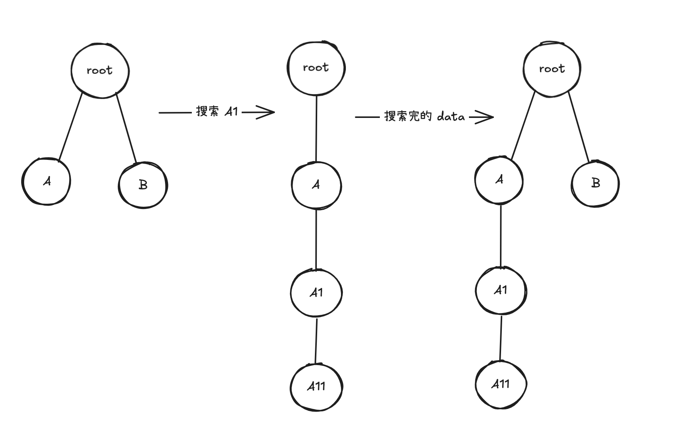

在工作中，树形选择器（tree-select）是一种常见的基础组件

业务背景

在一个大型组织（2 万以上）内，需要有一个选择人、组的一个选择器, 支持搜索功能。


一开始我的思路是这样：

确认第一版方案：

### 层级加载+后端搜索

**既然数据量很多，那最好不要一次性加载，不然问题一是后端的加载速度很慢，二是前端也会手动很大的影响，比如需要开启虚拟列表，选中的值传递、处理、展示都需要修改。**

所以先定为 lazy 加载，点开时传递当前的 node id给后端接口，加载下一层级的数据，搜索的话，需要使用 keyword 参数传递给后端来获取数据，这些数据全部替换当前的数据。


但是问题也随之而来

我在**搜索**数据之后**选中**某个值，之后**退出搜索**模式，选中的值没有对应的 title，显示成key 了

```JS
const [value, setValue] = useState(['0-0-0-1']);
```


### 搜索合并

在搜索出结果时，将结果插入原有的数中：




这里需要一个算法，即树的合并，同时在原有已有数据的场景下，也要根据 id 去重


在两棵树合并之后，还需要借助 tree-select 自身的前端搜索能力，将结果筛选出来

这将是一个完整的懒加载+搜索能力的树形选择器了


### 问题1：全选和半选的显示


在出现搜索的时候，如果我选中 A 组下的 1 ， 那 A 是不是应该是全选，但是组件怎么知道还有 2，3 呢，这时候还没有懒加载出来

在组件里，会有一只值被判断：    

这时候需要后端提供的值


全选，半选的状态解决了


但是迎来了新的难题

### 问题2: 初始值显示

和搜索一样，也是没有 title 的窘境


### 存储节点名

这时候我想到了官方的 API `labelInValue`,  于是我尝试了一把：

```js
const [value, setValue] = useState([{id:'0-0-0-1',label:'员工张三'}]);
```


很明显的，他将名称存储到值里确实能够生效，但是也带来了问题：
数据的传递，存储翻了好几番

>原本只需要 id ，(可能还需要带上 path 路径)的简单数据，现在需要完整的 title，而且变成了对象结构

在我们背景是几万量级的数量下（考虑最大限度），存储必然很吃力

如果后端的存储能接受或者数据量级较小的情况下，这是一个不错的方案。

但是后端不太兼容，这里我们开始改变思路：


这样选择+回显都正常了，但是我想的早了


### 问题3: 未知节点

场景：我选中了 A 组，因为是懒加载的，不知道 A 组下方有到底多少人，这时候我通过搜索 A 组下方的 A1 人员这时候显示的是这样的：

假如我取消 A1 的选中，那么此时我选中的应该是哪些值呢

正确的显示应该是 A2，A3 …… 等等


### 接口集中获取

最终：

还是选择了一次性加载多个组的数据（如果一个接口不行，）


### 结论
