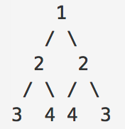
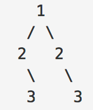

# 二叉树相关

## 对称二叉树

创建一个函数，用来判断一颗二叉树是不是对称的

如图, 这就是对称的二叉树


注意下图, 不是对称二叉树


思路: 从根节点开始, 他的左子树和右子树节点比较, 然后依次递归下去, 只要有一个不同就返回 false

```js
const isSymmetric = function (root) {
    if (root === null) return true
    return isEqual(root.left, root.right)
};

const isEqual = function (left, right) {
    if (left === null) {
        return right === null
    }
    if (right === null) {
        // 到这里 left 肯定不为空, 所以 left !== right 
        return false
    }
    if (left.val !== right.val) {
        return false;
    }

    // 到这一步, 说明 left,right 不为空且相等
    // 继续比较
    return isEqual(left.left, right.right)
        && isEqual(left.right, right.left)
}
```

## 相同的树

思路:

- 如果两个二叉树都为空，则它们相同返回 true。
- 如果两个二叉树中有一个为空，则它们不同返回 false。
- 如果两个二叉树都不为空，首先判断根节点是否相同，不同则返回 false。
- 如果两个二叉树的根节点相同，则分别递归判断其左右子树是否相同。

```js
const isSameTree = function (p, q) {
    if (p === null && q === null) {
        return true;
    }
    if (p === null || q === null) {
        return false;
    }
    if (p.val !== q.val) {
        return false;
    }
    return isSameTree(p.left, q.left) && isSameTree(p.right, q.right);
};
```

## 深度优先搜索

说起来和遍历和差不多, 差距在于搜索到目标时会返回

```js
const dfs = (value) => {
    const stack = [root]
    while (stack.length) {
        const current = stack.pop()
        console.log(current)
        if (current.node === value) {
            return current
        }
        current.right && stack.push(current.right)
        current.left && stack.push(current.left)
    }
}
```

## 广度优先搜索

```js
const bfs = (value) => {
    const queue = [root]
    while (queue.length) {
        const current = queue.shift()
        console.log(current)
        if (current.node === value) {
            return current
        }
        current.left && queue.push(current.left)
        current.right && queue.push(current.right)
    }
}
```

这里和深度比较下, 可以看出最大的区别就是 栈和队列

## 翻转二叉树

翻墙二叉树的要求: 它的所有左右子树要交换位置。

```js
const invertTree = function (root) {
    if (root == null) return null // 递归终止条件

    // 交换左右两节点
    const temp = root.left
    root.left = root.right
    root.right = temp
    
    // 依次递归子节点
    invertTree(root.left)
    invertTree(root.right)
    
    return root
}
```

方案二:


```js
const invertTree = function (root) {
    if (root == null) return null // 递归终止条件
    const stack = [root]
    
    while (stack.length){
        const current = stack.pop()
        const temp = current.left
        current.left = current.right
        current.right = temp
        
        current.right && stack.push(current.right)
        current.left && stack.push(current.left)
    }
    
    return root
}
```

## 结语

这一部分是二叉树的其他方案和情况


参考:

- https://zh.wikipedia.org/wiki/%E6%B7%B1%E5%BA%A6%E4%BC%98%E5%85%88%E6%90%9C%E7%B4%A2
- https://zh.wikipedia.org/wiki/%E5%B9%BF%E5%BA%A6%E4%BC%98%E5%85%88%E6%90%9C%E7%B4%A2
