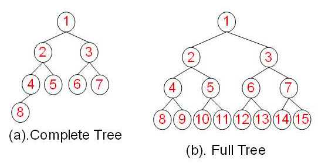
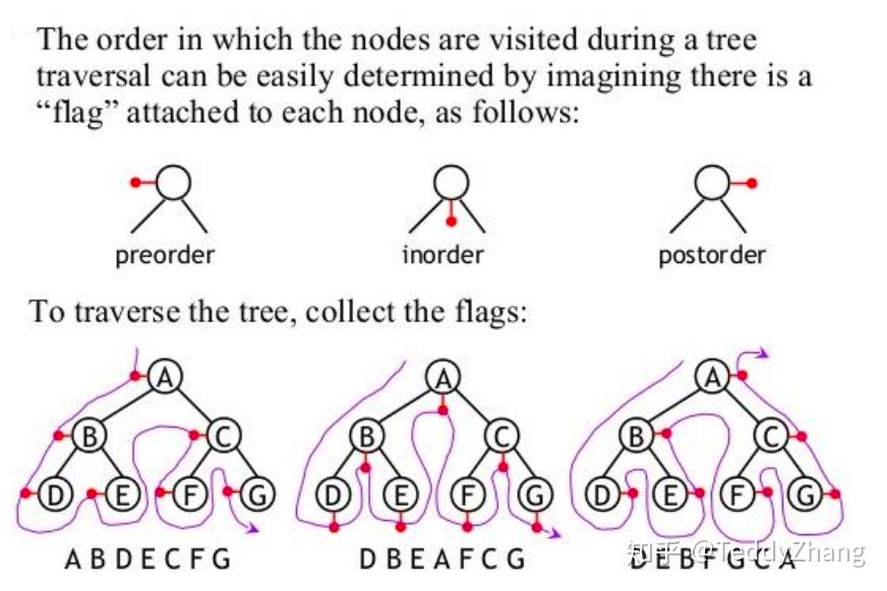
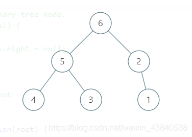

# 二叉树遍历

## 什么是二叉树

> 在计算机科学中，二叉树（英语：Binary tree）是每个节点最多只有两个分支（即不存在分支度大于2的节点）的树结构。通常分支被称作“左子树”或“右子树”。二叉树的分支具有左右次序，不能随意颠倒。  
> 二叉树的第i层至多有2^{i-1}个结点；  
> 深度为k的二叉树至多有2^k-1个结点；  
> 对任何一棵二叉树T，若树叶总数为 n_0，分支度为2的总数为n_2，则n_0=n_2+1。  
> 一棵深度为k，且有2^k-1个节点称之为满二叉树；   
> 深度为k，有n个节点的二叉树，当且仅当其每一个节点都与深度为k的满二叉树中，序号为1至n的节点对应时，称之为完全二叉树。

### 特殊类型



|  | 完全二叉树 | 完美二叉树 |
| --- | --- | --- |
| 总节点k | 2^ (h − 1)  <= k <= 2^(h − 1)   | k = 2^h − 1   |
| 树高h | h = l o g 2 k + 1  | h = l o g 2 ( k + 1 )   |

## 深度优先遍历

英文缩写为DFS即Depth First Search。 在深度优先级中，我们希望从根结点访问最远的结点。前序，中序和后序遍历都是深度优先遍历的特例。

先来看一张图, 一眼了解这三种遍历:



作为前端, 我是肯定先用 JS 来实现这些遍历的, 先定义一个二叉树的结构:

```js
 const nodes = {
    node: 6,
    left: {
        node: 5,
        left: {
            node: 4
        },
        right: {
            node: 3
        }
    },
    right: {
        node: 2,
        right: {
            node: 1
        }
    }
}
```



### 先序遍历

```js
let list = []

function preOrder(node) {
    if (!(node == null)) {
        list.push(node.node);
        preOrder(node.left);
        preOrder(node.right);
    }
}
```

执行: `preOrder(nodes)`

打印 `list` 结果: `[6, 5, 4, 3, 2, 1]`

### 中序遍历

```js
let list = []

function inOrder(node) {
    if (!(node == null)) {
        inOrder(node.left);
        list.push(node.node);
        inOrder(node.right);
    }
}
```

执行: `inOrder(nodes)`

打印 `list` 结果: `[4, 5, 3, 6, 2, 1]`

### 后序遍历

```js
let list = []

function postOrder(node) {
    if (!(node == null)) {
        postOrder(node.left);
        postOrder(node.right);
        list.push(node.node);
    }
}
```

执行: `postOrder(nodes)`

打印 `list` 结果: `[4, 3, 5, 1, 2, 6]`

## 广度优先遍历

英文缩写为BFS即Breadth FirstSearch。其过程检验来说是对每一层节点依次访问，访问完一层进入下一层，而且每个节点只能访问一次。 广度遍历即我们寻常所说的层次遍历。

借助队列实现。

```js
const levelOrder = function (root) {
    if (root == null) {
        return []
    }
    let result = []
    let queue = [root]
    while (queue.length) {
        // 每一层的节点数
        let level = queue.length
        let currLevel = []
        // 每次遍历一层元素
        for (let i = 0; i < level; i++) {
            // 当前访问的节点出队
            let curr = queue.shift()
            curr.left && queue.push(curr.left)
            curr.right && queue.push(curr.right)
            currLevel.push(curr.val)
        }
        result.push.apply(null, currLevel)
    }
    return result
}
```

## 二叉查找树(binary search tree)

## 总结

参考:

- https://zh.wikipedia.org/wiki/%E4%BA%8C%E5%8F%89%E6%A0%91
- https://blog.csdn.net/weixin_43840538/article/details/105674785
