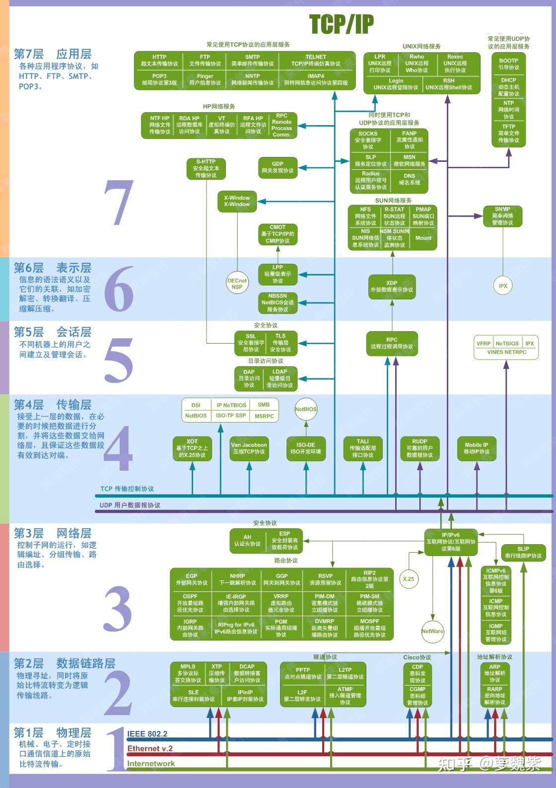

## TCP/IP 网络模型

一般是五层模型。如下图所示

也可以分为四层，就是把链路层和物理层都表示为网络接口层

还有一种就是 OSI 七层网络模型，它就是在五层协议之上加了表示层和会话层

## 细述
1. 物理层  
   一台计算机与另一台计算机要进行通信，第一件要做的事是什么？当然是要把这台计算机与另外的其他计算机连起来啊，这样，我们才能把数据传输过去。例如可以通过光纤啊，电缆啊，双绞线啊等介质把他们连接起来，然后才能进行通信

    也就是说，物理层负责把两台计算机连起来，然后在计算机之间通过高低电频来传送0,1这样的电信号。

2. 数据链路层  
   前面说了，物理层它只是单纯着负责把计算机连接起来，并且在计算机之间传输0，1这样的电信号。如果这些0，1组合的传送毫无规则的话，计算机是解读不了的。一大堆0，1谁知道是什么鬼啊。

   因此，我们需要制定一套规则来进行0，1的传送。例如多少个电信号为一组啊，每一组信号应该如何标识才能让计算机读懂啊等等。
   于是，有了以太网协议。

3. 网络层

   我们所处的网络，是由无数个子网络构成的。广播的时候，也只有同一个子网里面的计算机能够收到。 
   假如没有子网这种划分的话，计算机 A 通过广播的方式发一个数据包给计算机 B , 其他所有计算机也都能收到这个数据包，然后进行对比再舍弃。世界上有那么多它计算机，每一台计算机都能收到其他所有计算机的数据包，那就不得了了。那还不得奔溃。  
   因此产生了子网这么一个东西。 
   那么问题来了，我们如何区分哪些 MAC 地址是属于同一个子网的呢？假如是同一个子网，那我们就用广播的形式把数据传送给对方，如果不是同一个子网的，我们就会把数据发给网关，让网关进行转发。 为了解决这个问题，于是，有了 IP 协议。

4. 传输层  
   
   通过物理层、数据链路层以及网络层的互相帮助，我们已经把数据成功从计算机A传送到计算机B了，可是，计算机B里面有各种各样的应用程序，计算机该如何知道这些数据是给谁的呢？
   这个时候，**端口(Port)** 这个家伙就上场了，也就是说，我们在从计算机A传数据给计算表B的时候，还得指定一个端口，以供特定的应用程序来接受处理。
   也就是说，传输层的功能就是建立端口到端口的通信。相比网络层的功能是建立主机到主机的通信。
   也就是说，只有有了IP和端口，我们才能进行准确着通信。这个时候可能有人会说，我输入IP地址的时候并没有指定一个端口啊。
   其实呢，对于有些传输协议，已经有设定了一些默认端口了。例如http的传输默认端口是80，这些端口信息也会包含在数据包里的。
   传输层最常见的两大协议是 TCP 协议和 UDP 协议，其中 TCP 协议与 UDP 最大的不同就是 TCP 提供可靠的传输，而 UDP 提供的是不可靠传输。

5. 应用层
   终于说到应用层了，应用层这一层最接近我们用户了。
   虽然我们收到了传输层传来的数据，可是这些传过来的数据五花八门，有html格式的，有mp4格式的，各种各样。你确定你能看的懂？
   因此我们需要指定这些数据的格式规则，收到后才好解读渲染。例如我们最常见的 Http 数据包中，就会指定该数据包是 什么格式的文件了。

## 总结

最后用网络上的图来总结下:

参考:

- https://zhuanlan.zhihu.com/p/133765783
- https://zhuanlan.zhihu.com/p/190001214
