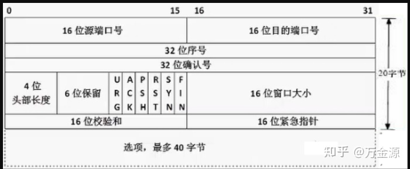
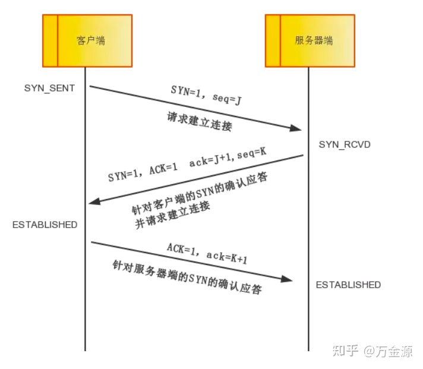
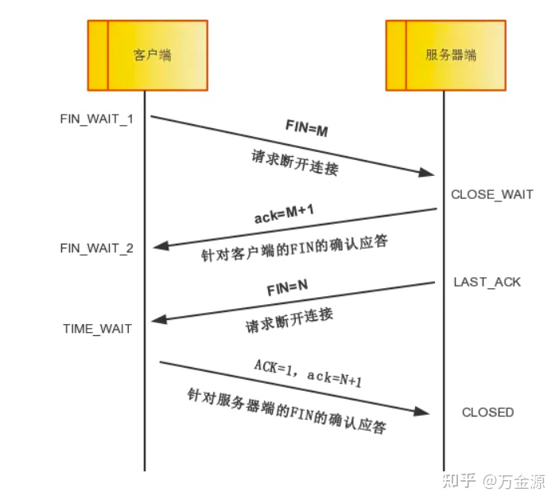

## 知识点

**TCP的序号和确认号：**
**32位序号 seq**：Sequence number 缩写seq ，TCP通信过程中某一个传输方向上的字节流的每个字节的序号，通过这个来确认发送的数据有序，比如现在序列号为1000，发送了1000，下一个序列号就是2000。
**32位确认号 ack**：Acknowledge number 缩写ack，TCP对上一次seq序号做出的确认号，用来响应TCP报文段，给收到的TCP报文段的序号seq加1。

*   **TCP的标志位**
    每个TCP段都有一个目的，这是借助于TCP标志位选项来确定的，允许发送方或接收方指定哪些标志应该被使用，以便段被另一端正确处理。用的最广泛的标志是 **SYN**，**ACK** 和 **FIN**，用于建立连接，确认成功的段传输，最后终止连接。

1.  **SYN**：简写为S，同步标志位，用于建立会话连接，同步序列号；
2.  **ACK**： 简写为.，确认标志位，对已接收的数据包进行确认；
3.  **FIN**： 简写为F，完成标志位，表示我已经没有数据要发送了，即将关闭连接；

## 三次握手

三次握手的目的是连接服务器指定端口，建立 TCP 连接，并同步连接双方的序列号和确认号，交换 TCP 窗口大小信息。在 socket 编程中，客户端执行 connect() 时。将触发三次握手。

*   **第一次握手**：
*   客户端将TCP报文**标志位SYN置为1**，随机产生一个序号值seq=J，保存在TCP首部的序列号(Sequence Number)字段里，指明客户端打算连接的服务器的端口，并将该数据包发送给服务器端，发送完毕后，客户端进入SYN\_SENT状态，等待服务器端确认。
*   **第二次握手**：
*   服务器端收到数据包后由标志位SYN=1知道客户端请求建立连接，服务器端将TCP报文**标志位SYN和ACK都置为1**，ack=J+1，随机产生一个序号值seq=K，并将该数据包发送给客户端以确认连接请求，服务器端进入SYN\_RCVD状态。
*   **第三次握手**：
*   客户端收到确认后，检查ack是否为J+1，ACK是否为1，如果正确则将标志位ACK置为1，ack=K+1，并将该数据包发送给服务器端，服务器端检查ack是否为K+1，ACK是否为1，如果正确则连接建立成功，客户端和服务器端进入ESTABLISHED状态，完成三次握手，随后客户端与服务器端之间可以开始传输数据了。

##  四次挥手

四次挥手即终止TCP连接，就是指断开一个TCP连接时，需要客户端和服务端总共发送4个包以确认连接的断开。在socket编程中，这一过程由客户端或服务端任一方执行close来触发。  

由于TCP连接是全双工的，因此，每个方向都必须要单独进行关闭，这一原则是当一方完成数据发送任务后，发送一个FIN来终止这一方向的连接，收到一个FIN只是意味着这一方向上没有数据流动了，即不会再收到数据了，但是在这个TCP连接上仍然能够发送数据，直到这一方向也发送了FIN。首先进行关闭的一方将执行主动关闭，而另一方则执行被动关闭。

*   **第一次挥手**： Client端发起挥手请求，向Server端发送标志位是FIN报文段，设置序列号seq，此时，Client端进入FIN_WAIT_1状态，这表示Client端没有数据要发送给Server端了。
*   **第二次分手**：Server端收到了Client端发送的FIN报文段，向Client端返回一个标志位是ACK的报文段，ack设为seq加1，Client端进入FIN_WAIT_2状态，Server端告诉Client端，我确认并同意你的关闭请求。
*   **第三次分手**： Server端向Client端发送标志位是FIN的报文段，请求关闭连接，同时Client端进入LAST_ACK状态。
*   **第四次分手** ： Client端收到Server端发送的FIN报文段，向Server端发送标志位是ACK的报文段，然后Client端进入TIME_WAIT状态。Server端收到Client端的ACK报文段以后，就关闭连接。此时，Client端等待**2MSL**的时间后依然没有收到回复，则证明Server端已正常关闭，那好，Client端也可以关闭连接了。

**为什么要等待2MSL？**  
**MSL**：报文段最大生存时间，它是任何报文段被丢弃前在网络内的最长时间。

## 为什么是三次握手？不是两次、四次？

*   三次握手才可以阻止重复历史连接的初始化（主要原因）
*   三次握手才可以同步双方的初始序列号
*   三次握手才可以避免资源浪费

### 原因一：避免历史连接

简单来说，三次握手的**首要原因是为了防止旧的重复连接初始化造成混乱。**

如果是两次握手连接，就不能判断当前连接是否是历史连接，三次握手则可以在客户端（发送方）准备发送第三次报文时，客户端因有足够的上下文来判断当前连接是否是历史连接：

### 原因二：同步双方初始序列号

TCP 协议的通信双方， 都必须维护一个「序列号」， 序列号是可靠传输的一个关键因素，它的作用：

*   接收方可以去除重复的数据；
*   接收方可以根据数据包的序列号按序接收；
*   可以标识发送出去的数据包中， 哪些是已经被对方收到的；

### 原因三：避免资源浪费

如果只有「两次握手」，当客户端的 `SYN` 请求连接在网络中阻塞，客户端没有接收到 `ACK` 报文，就会重新发送 `SYN` ，由于没有第三次握手，服务器不清楚客户端是否收到了自己发送的建立连接的 `ACK` 确认信号，所以每收到一个 `SYN` 就只能先主动建立一个连接，这会造成什么情况呢？

如果客户端的 `SYN` 阻塞了，重复发送多次 `SYN` 报文，那么服务器在收到请求后就会**建立多个冗余的无效链接，造成不必要的资源浪费。**

参考:

- https://zhuanlan.zhihu.com/p/354882017
- https://www.zhihu.com/question/271701044/answer/1279809269
- https://mp.weixin.qq.com/s/S1mv8AE_pQz3uHjRGS7tWg
