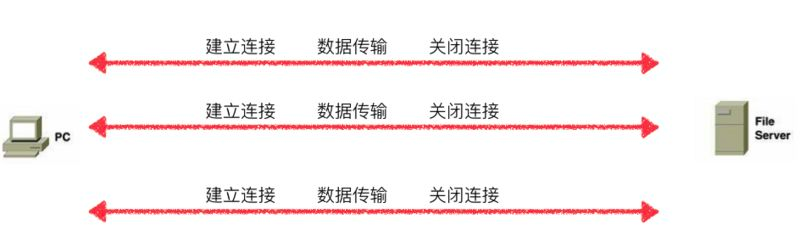
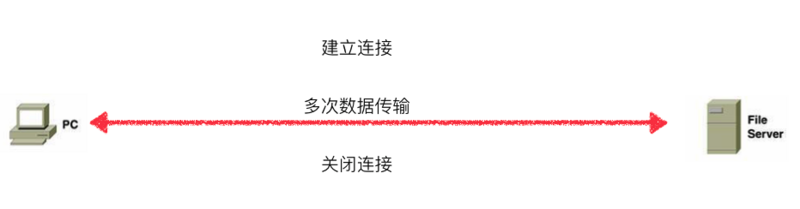

## HTTP 0.9 – 单行协议

最初版本的HTTP协议并没有版本号，后来它的版本号被定位在 0.9 以区分后来的版本。 HTTP/0.9 极其简单：请求由单行指令构成，以唯一可用方法GET开头，其后跟目标资源的路径（一旦连接到服务器，协议、服务器、端口号这些都不是必须的）。
```
GET /mypage.html
```

响应也极其简单的：只包含响应文档本身。

```
这是一个非常简单的HTML页面
```


跟后来的版本不同，HTTP/0.9 的响应内容并不包含HTTP头，这意味着只有HTML文件可以传送，无法传输其他类型的文件；也没有状态码或错误代码：一旦出现问题，一个特殊的包含问题描述信息的HTML文件将被发回，供人们查看。

## http1.0 - 构建可扩展性

由于 HTTP/0.9 协议的应用十分有限，浏览器和服务器迅速扩展内容使其用途更广：

*   协议版本信息现在会随着每个请求发送（`HTTP/1.0`被追加到了`GET`行）。
*   状态码会在响应开始时发送，使浏览器能了解请求执行成功或失败，并相应调整行为（如更新或使用本地缓存）。
*   引入了HTTP头的概念，无论是对于请求还是响应，允许传输元数据，使协议变得非常灵活，更具扩展性。
*   在新HTTP头的帮助下，具备了传输除纯文本HTML文件以外其他类型文档的能力（[Content-Type](https://developer.mozilla.org/zh-CN/docs/Web/HTTP/Headers/Content-Type) 头）。




## http 1.1 - 标准化的协议

默认采用持续连接（Connection: keep-alive），能很好地配合代理服务器工作。
还支持以[管道方式](https://zh.wikipedia.org/wiki/HTTP%E7%AE%A1%E7%BA%BF%E5%8C%96 "HTTP管线化")在同时发送多个请求，以便降低线路负载，提高传输速度。

HTTP/1.1 消除了大量歧义内容并引入了多项改进：

*   连接可以复用，节省了多次打开TCP连接加载网页文档资源的时间。
*   增加管线化技术，允许在第一个应答被完全发送之前就发送第二个请求，以降低通信延迟。
*   支持响应分块。
*   引入额外的缓存控制机制。
*   引入内容协商机制，包括语言，编码，类型等，并允许客户端和服务器之间约定以最合适的内容进行交换。
*   [Host](https://developer.mozilla.org/zh-CN/docs/Web/HTTP/Headers/Host) 头，能够使不同域名配置在同一个IP地址的服务器上。




## http 2.0 - 为了更优异的表现

HTTP/2在HTTP/1.1有几处基本的不同:

*   HTTP/2是二进制协议而不是文本协议。不再可读，也不可无障碍的手动创建，改善的优化技术现在可被实施。
*   这是一个复用协议。并行的请求能在同一个链接中处理，移除了HTTP/1.x中顺序和阻塞的约束。
*   压缩了headers。因为headers在一系列请求中常常是相似的，其移除了重复和传输重复数据的成本。
*   其允许服务器在客户端缓存中填充数据，通过一个叫服务器推送的机制来提前请求。


##  后HTTP/2进化 

随着HTTP/2.的发布，就像先前的HTTP/1.x一样，HTTP没有停止进化，HTTP的扩展性依然被用来添加新的功能。特别的，我们能列举出2016年里HTTP的新扩展：

*   对Alt-Svc的支持允许了给定资源的位置和资源鉴定，允许了更智能的CDN缓冲机制。
*   [Client-Hints](https://developer.mozilla.org/zh-CN/docs/Web/HTTP/Headers/Client-Hints "This is a link to an unwritten page") 的引入允许浏览器或者客户端来主动交流它的需求，或者是硬件约束的信息给服务端。
*   在Cookie头中引入安全相关的的前缀，现在帮助保证一个安全的cookie没被更改过。

## http 3.0

与其前任HTTP/1.1和HTTP/2不同，在HTTP/3中，将弃用TCP协议，改为使用基于UDP协议的QUIC协议实现。

此变化主要为了解决HTTP/2中存在的队头阻塞问题。由于HTTP/2在单个TCP连接上使用了多路复用，受到TCP拥塞控制的影响，少量的丢包就可能导致整个TCP连接上的所有流被阻塞。

截至2021年6月，HTTP/3仍然是草案状态。

## 总结

参考:
- https://developer.mozilla.org/zh-CN/docs/Web/HTTP/Basics_of_HTTP/Evolution_of_HTTP#http0.9_%E2%80%93_%E5%8D%95%E8%A1%8C%E5%8D%8F%E8%AE%AE
