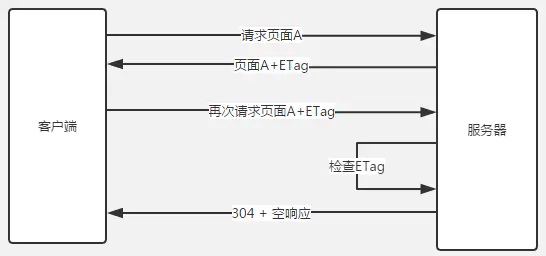

# HTTP 缓存

HTTP 头信息控制缓存大致分为两种：强缓存和协商缓存。强缓存如果命中缓存不需要和服务器端发生交互，而协商缓存不管是否命中都要和服务器端发生交互，强制缓存的优先级高于协商缓存.


## 强缓存

在 Chrome 控制台的 Network 选项中可以看到该请求返回 200 状态码，并且 Size 显示为 from disk cache 或者 from memory cache

Expires 是 HTTP/1.0 的产物，Cache-Control 是 HTTP/1.1 的产物。两者同时存在的时候，Cache-Control 优先级高于 Expires。

### Expires

Expires 指缓存过期的时间，超过了这个时间点就代表资源过期。

### Cache-Control

Cache-Control 可以由多个字段组合而成:

#### max-age

max-age 指定一个时间长度，在这个时间段内缓存是有效的，单位是s

#### s-maxage

s-maxage 同 max-age，覆盖 max-age、Expires，但仅适用于共享缓存，在私有缓存中被忽略。

#### public

表明响应可以被任何对象（发送请求的客户端、代理服务器等等）缓存。

#### private

表明响应只能被单个用户（可能是操作系统用户、浏览器用户）缓存，是非共享的，不能被代理服务器缓存。

#### no-cache

强制所有缓存了该响应的用户，在使用已缓存的数据前，发送带验证器的请求到服务器。不是字面意思上的不缓存。

#### no-store

禁止缓存，每次请求都要向服务器重新获取数据。

## 协商缓存

若命中缓存, 返回 304 和 Not Modified

### Last-modified/If-Modified-Since

Last-modified: 服务器端资源的最后修改时间，响应头部会带上这个标识。

第一次请求之后，浏览器记录这个时间，再次请求时，请求头部带上 If-Modified-Since 即为之前记录下的时间。

服务器端收到带 If-Modified-Since 的请求后会去和资源的最后修改时间对比。

> 如果响应头中有 Last-modified 而没有 Expire 或 Cache-Control 时，浏览器会有自己的算法来推算出一个时间缓存该文件多久，不同浏览器得出的时间不一样，所以 Last-modified 要记得配合 Expires/Cache-Control 使用。

### Etag/If-None-Match

由服务器端上生成的一段 hash 字符串，第一次请求时响应头带上 `ETag: abcd`，之后的请求中带上 `If-None-Match: abcd`，服务器检查 ETag，返回 304 或 200。



### 区别

- 某些服务器不能精确得到资源的最后修改时间，这样就无法通过最后修改时间判断资源是否更新。
- Last-modified 只能精确到秒。
- 一些资源的最后修改时间改变了，但是内容没改变，使用 Last-modified 看不出内容没有改变。
- Etag 的精度比 Last-modified 高，属于强验证，要求资源字节级别的一致，优先级高。如果服务器端有提供 ETag 的话，必须先对 ETag 进行 Conditional Request。

### 生成

Nginx的源码中 ETag 由 last_modified 和 content_length 拼接而成

```
etag->value.len = ngx_sprintf(etag->value.data, "\"%xT-%xO\"",
                                  r->headers_out.last_modified_time,
                                  r->headers_out.content_length_n)
                      - etag->value.data;
                      
```

翻译为以下伪代码 `etag = header.last_modified + "-" + header.content_lenth`

所以: Nginx 中 ETag 由响应头的Last-Modified和Content-Length表示为十六进制组合而成。

## 设置

针对 Nginx 配置

### etag

```
http {
  etag on;
}
```

### 强缓存

```
server {
  location ~* \.(html)$ {
    access_log off;
    add_header  Cache-Control  max-age=no-cache;
  }
 
  location ~* \.(css|js|png|jpg|jpeg|gif|gz|svg|mp4|ogg|ogv|webm|htc|xml|woff)$ {
    access_log off;
    add_header    Cache-Control  max-age=360000;
  }
}
```

## 总结

缓存分为 强缓存 和 协商缓存。

强缓存优先于协商缓存进行，若强制缓存生效则直接使用缓存，若不生效则进行协商缓存。

协商缓存由服务器决定是否使用缓存，若协商缓存失效，那么该请求的缓存失效，返回 200，重新返回资源和缓存标识，再存入浏览器中；生效则返回 304，继续使用缓存。

如果强缓存和协商缓存都没有设置，那么浏览器会采用启发式的算法，通常会取响应头中的 Date 减去 Last-Modified 的值的 10% 作为缓存时间。

参考:

- https://zhuanlan.zhihu.com/p/29750583
