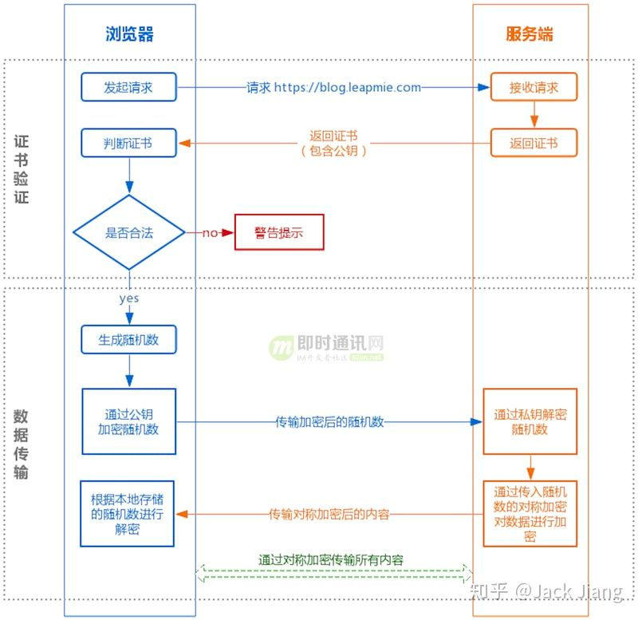

# https 与加密
先说结论:  
HTTPS 在内容传输的加密上使用的是对称加密，非对称加密只作用在证书验证阶段。

1. 为什么数据传输是用对称加密的？

首先：非对称加密的加解密效率是非常低的，而 http 的应用场景中通常端与端之间存在大量的交互，非对称加密的效率是无法接受的。

另外：在 HTTPS 的场景中只有服务端保存了私钥，一对公私钥只能实现单向的加解密，所以HTTPS 中内容传输加密采取的是对称加密，而不是非对称加密

2. 为什么需要CA机构颁发证书？

防止”中间人“攻击，同时可以为网站提供身份证明。

3. 使用https会被抓包吗？

会被抓包，HTTPS 只防止用户在不知情的情况下通信被监听，如果用户主动授信，是可以构建“中间人”网络，代理软件可以对传输内容进行解密。

4. 中间人攻击

中间人的确无法得到浏览器生成的密钥B，这个密钥本身被公钥A加密了，只有服务器才有私钥A’解开拿到它呀！然而中间人却完全不需要拿到密钥A’就能干坏事了。请看：

1.  某网站拥有用于非对称加密的公钥A、私钥A’。
2.  浏览器向网站服务器请求，服务器把公钥A明文给传输浏览器。
3.  **中间人劫持到公钥A，保存下来，把数据包中的公钥A替换成自己伪造的公钥B（它当然也拥有公钥B对应的私钥B’）**。
4.  浏览器随机生成一个用于对称加密的密钥X，用**公钥B**（浏览器不知道公钥被替换了）加密后传给服务器。
5.  **中间人劫持后用私钥B’解密得到密钥X，再用公钥A加密后传给服务器**。
6.  服务器拿到后用私钥A’解密得到密钥X。

这样在双方都不会发现异常的情况下，中间人得到了密钥B。**根本原因是浏览器无法确认自己收到的公钥是不是网站自己的**。那么下一步就是解决下面这个问题：

参考:
https://www.cnblogs.com/lfri/p/12593232.html
