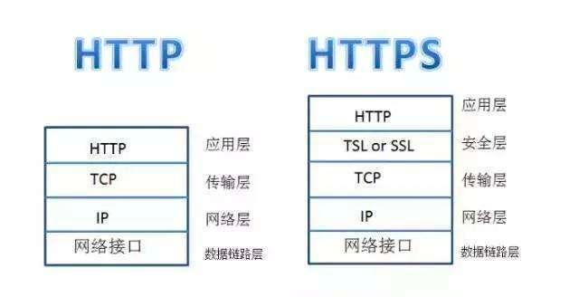
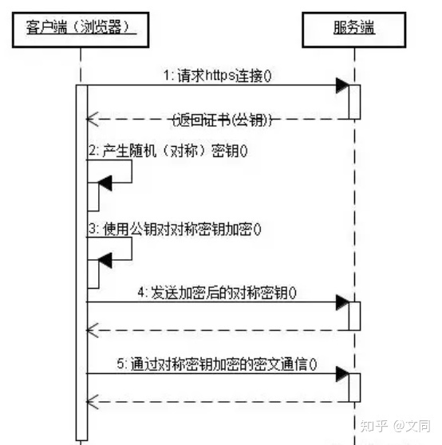

## 区别

1.安全性不同

https://前缀表明是用SSL (安全套接字)或TSL加密的，你的电脑与服务器之间收发的信息传输将更加安全。当你使用浏览器访问一个HTTP网站的时候，你会发现浏览器会对该HTTP网站显示“不安全”的安全警告，提示用户当前所访问的网站可能会存在风险。

2.网站申请流程不同

https协议需要到CA申请证书，一般免费证书很少，需要交费，Web服务器启用SSL需要获得一个服务器证书并将该证书与要使用SSL的服务器绑定。

3.默认端口不同

http和https使用的是完全不同的连接方式，同时使用的端口也不同，http使用的是80端口，https使用的是443端口。在网络模型中，HTTP工作于应用层，而HTTPS工作在传输层。

4.对搜索排名的提升

这也是很多站长所关注的地方。百度和谷歌两大搜索引擎都已经明确表示，HTTPS网站将会作为搜索排名的一个重要权重指标。也就是说HTTPS网站比起HTTP网站在搜索排名中更有优势。

## https 请求流程

*   首先客户端通过URL访问服务器建立SSL连接。
*   服务端收到客户端请求后，会将网站支持的证书信息（证书中包含公钥）传送一份给客户端。
*   客户端的服务器开始协商SSL连接的安全等级，也就是信息加密的等级。
*   客户端的浏览器根据双方同意的安全等级，建立会话密钥，然后利用网站的公钥将会话密钥加密，并传送给网站。
*   服务器利用自己的私钥解密出会话密钥。
*   服务器利用会话密钥加密与客户端之间的通信。

## 缺点

*   HTTPS协议多次握手，导致页面的加载时间延长近50%；
*   HTTPS连接缓存不如HTTP高效，会增加数据开销和功耗；
*   申请SSL证书需要钱，功能越强大的证书费用越高。
*   SSL涉及到的安全算法会消耗 CPU 资源，对服务器资源消耗较大。

参考
- https://zhuanlan.zhihu.com/p/151764515
- https://zhuanlan.zhihu.com/p/72616216
