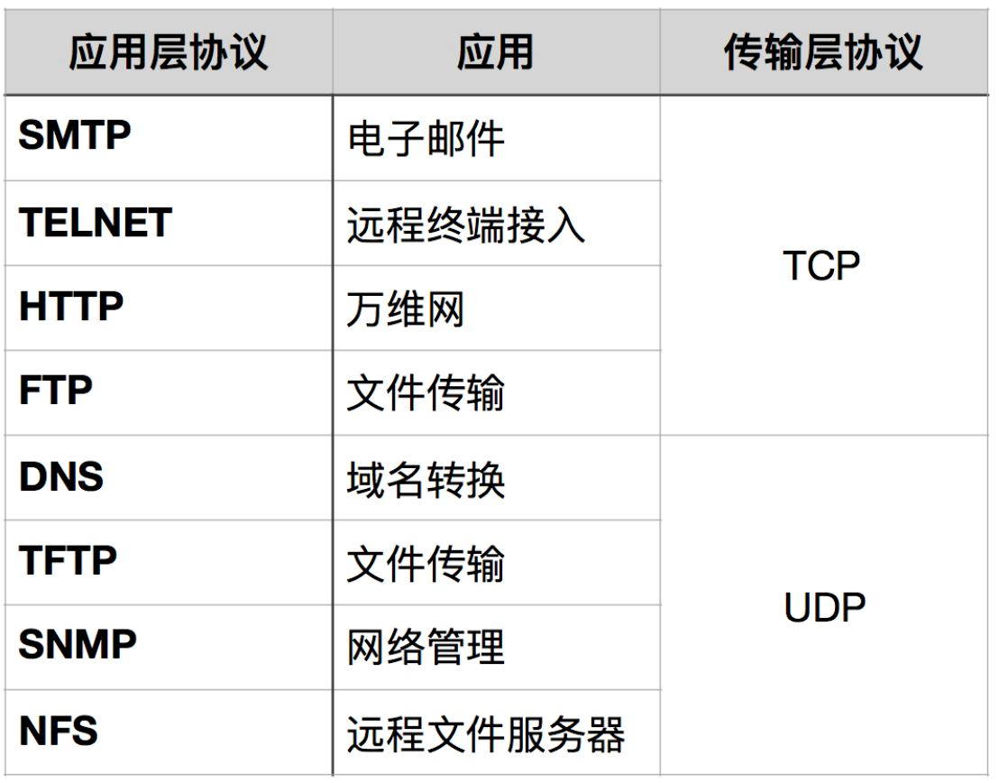

# TCP 和 UDP

## TCP
TCP 是面向连接的、可靠的流协议。流就是指不间断的数据结构，当应用程序采用 TCP 发送消息时，虽然可以保证发送的顺序，但还是犹如没有任何间隔的数据流发送给接收端。TCP是面向面向字节流，虽然应用程序和TCP的交互是一次一个数据块（大小不等），但TCP把应用程序看成是一连串的无结构的字节流。TCP有一个缓冲，当应用程序传送的数据块太长，TCP就可以把它划分短一些再传送。

TCP建立连接要进行3次握手，而断开连接要进行4次

具体查看 [点击](./TCP%20%E6%8F%A1%E6%89%8B%E5%92%8C%E6%8C%A5%E6%89%8B.md)

TCP 为提供可靠性传输，实行“顺序控制”或“重发控制”机制。此外还具备“流控制（流量控制）”、“拥塞控制”、提高网络利用率等众多功能。

*   TCP充分地实现了数据传输时各种控制功能，可以进行丢包时的重发控制，还可以对次序乱掉的分包进行顺序控制。
    而这些在 UDP 中都没有。
*   此外，TCP 作为一种面向有连接的协议，只有在确认通信对端存在时才会发送数据，从而可以控制通信流量的浪费。
*   根据 TCP 的这些机制，在 IP 这种无连接的网络上也能够实现高可靠性的通信（ **主要通过检验和、序列号、确认应答、重发控制、连接管理以及窗口控制**等机制实现）。

## UDP
UDP（User Data Protocol，用户数据报协议）

1、UDP是一个非连接的协议，传输数据之前源端和终端不建立连接， 当它想传送时就简单地去抓取来自应用程序的数据，并尽可能快地把它扔到网络上。 在发送端，UDP传送数据的速度仅仅是受应用程序生成数据的速度、 计算机的能力和传输带宽的限制； 在接收端，UDP把每个消息段放在队列中，应用程序每次从队列中读一个消息段。

2、 由于传输数据不建立连接，因此也就不需要维护连接状态，包括收发状态等， 因此一台服务机可同时向多个客户机传输相同的消息。

3、UDP信息包的标题很短，只有8个字节，相对于TCP的20个字节信息包的额外开销很小。

4、吞吐量不受拥挤控制算法的调节，只受应用软件生成数据的速率、传输带宽、 源端和终端主机性能的限制。

5、UDP使用尽最大努力交付，即不保证可靠交付， 因此主机不需要维持复杂的链接状态表（这里面有许多参数）。

6、UDP是面向报文的。发送方的UDP对应用程序交下来的报文， 在添加首部后就向下交付给IP层。既不拆分，也不合并，而是保留这些报文的边界， 因此，应用程序需要选择合适的报文大小。

## 小结TCP与UDP的区别

1、基于连接与无连接；

2、对系统资源的要求（TCP较多，UDP少）；

3、UDP程序结构较简单；

4、流模式与数据报模式 ；

5、TCP保证数据正确性，UDP可能丢包；

6、TCP保证数据顺序，UDP不保证。

## 应用场景

参考:
- https://zhuanlan.zhihu.com/p/24860273
- https://zhuanlan.zhihu.com/p/108579426
