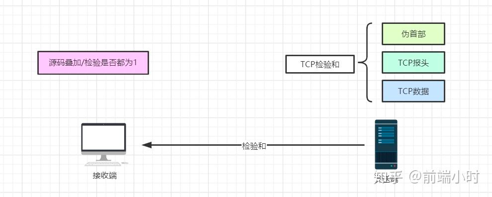
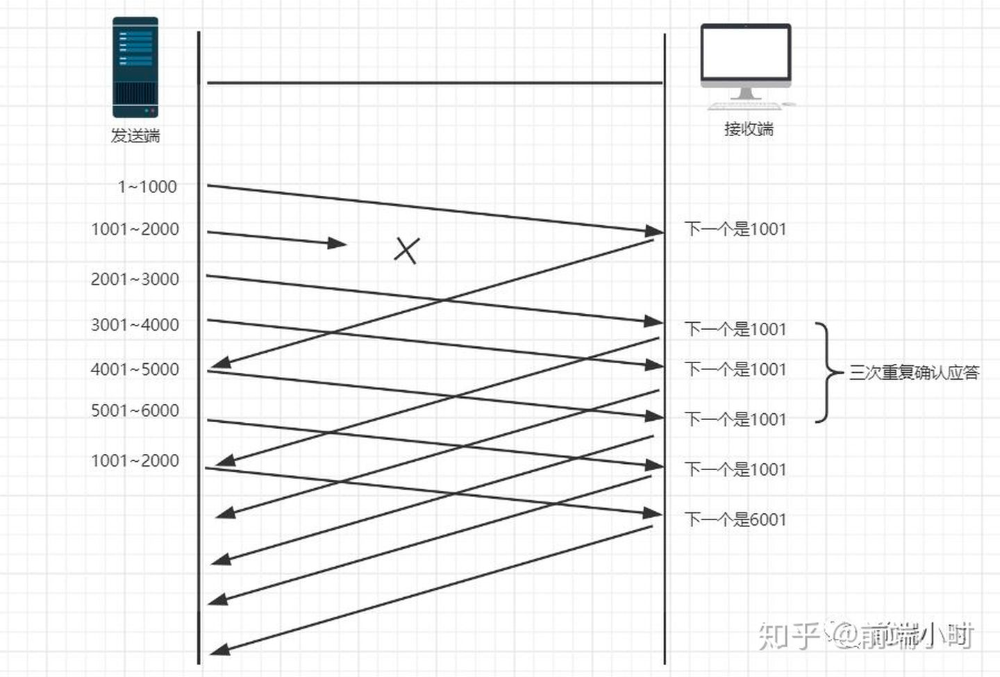

> TCP主要提供了检验和、序列号/确认应答、超时重传、最大消息长度、滑动窗口控制等方法实现了可靠性传输。
> 

### **检验和**

通过检验和的方式，接收端可以检测出来数据是否有差错和异常，假如有差错就会直接丢弃TCP段，重新发送。TCP在计算检验和时，会在TCP首部加上一个12字节的伪首部。检验和总共计算3部分：TCP首部、TCP数据、TCP伪首部

### **序列号/确认应答**

这个机制类似于问答的形式。比如在课堂上老师会问你“明白了吗？”，假如你没有隔一段时间没有回应或者你说不明白，那么老师就会重新讲一遍。其实计算机的确认应答机制也是一样的，发送端发送信息给接收端，接收端会回应一个包，这个包就是应答包。

### **超时重传**

超时重传是指发送出去的数据包到接收到确认包之间的时间，如果超过了这个时间会被认为是丢包了，需要重传。那么我们该如何确认这个时间值呢？

我们知道，一来一回的时间总是差不多的，都会有一个类似于平均值的概念。比如发送一个包到接收端收到这个包一共是0.5s，然后接收端回发一个确认包给发送端也要0.5s，这样的两个时间就是RTT（往返时间）。然后可能由于网络原因的问题，时间会有偏差，称为抖动（方差）。

从上面的介绍来看，超时重传的时间大概是比往返时间+抖动值还要稍大的时间。

### **最大消息长度**

在建立TCP连接的时候，双方约定一个最大的长度（MSS）作为发送的单位，重传的时候也是以这个单位来进行重传。理想的情况下是该长度的数据刚好不被网络层分块。

### **滑动窗口控制**

我们上面提到的超时重传的机制存在效率低下的问题，发送一个包到发送下一个包要经过一段时间才可以。所以我们就想着能不能不用等待确认包就发送下一个数据包呢？这就提出了一个滑动窗口的概念。

窗口的大小就是在无需等待确认包的情况下，发送端还能发送的最大数据量。这个机制的实现就是使用了大量的缓冲区，通过对多个段进行确认应答的功能。通过下一次的确认包可以判断接收端是否已经接收到了数据，如果已经接收了就从缓冲区里面删除数据。

在窗口之外的数据就是还未发送的和对端已经收到的数据。那么发送端是怎么样判断接收端有没有接收到数据呢？或者怎么知道需要重发的数据有哪些呢？通过下面这个图就知道了。

### **拥塞控制**

窗口控制解决了 两台主机之间因传送速率而可能引起的丢包问题，在一方面保证了TCP数据传送的可靠性。然而如果网络非常拥堵，此时再发送数据就会加重网络负担，那么发送的数据段很可能超过了最大生存时间也没有到达接收方，就会产生丢包问题。为此TCP引入慢启动机制，先发出少量数据，就像探路一样，先摸清当前的网络拥堵状态后，再决定按照多大的速度传送数据。

详情参考 [点击](./tcp%20%E6%8B%A5%E5%A1%9E%E6%8E%A7%E5%88%B6%E5%8E%9F%E7%90%86.md)

- https://zhuanlan.zhihu.com/p/112317245
