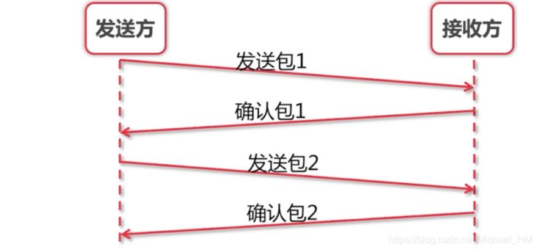
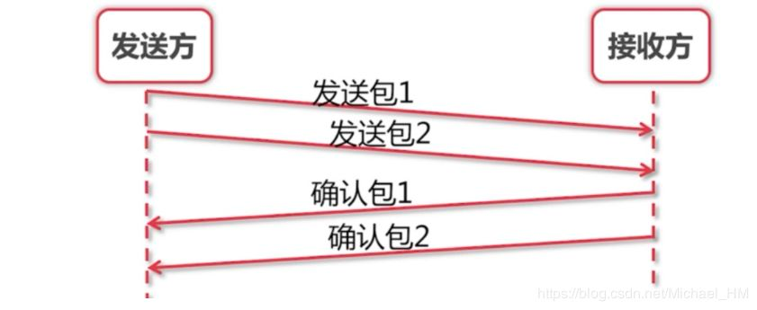
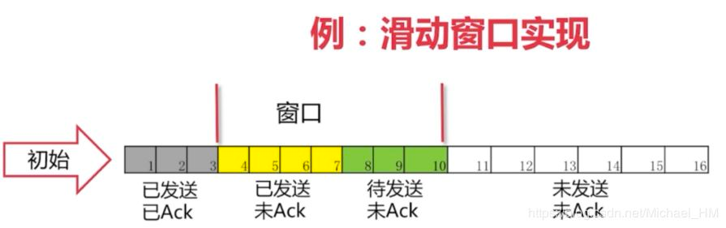
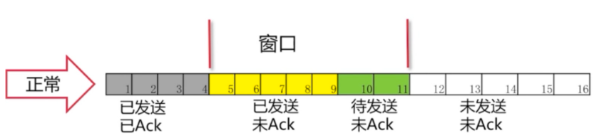
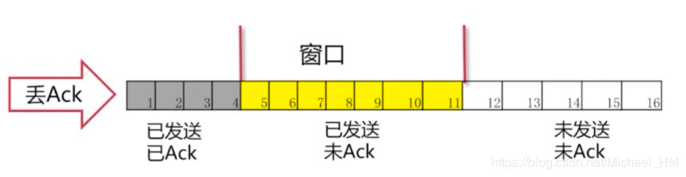
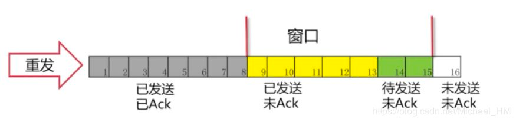

## 问题一：如何保证次序？

> 提出问题：在我们滑动窗口协议之前，我们如何来保证发送方与接收方之间，每个包都能被收到。并且是按次序的呢？

发送方发送一个包1，这时候接收方确认包1。发送包2，确认包2。就这样一直下去，知道把数据完全发送完毕，这样就结束了。那么就解决了丢包，出错，乱序等一些情况！同时也存在一些问题。问题：吞吐量非常的低。我们发完包1，一定要等确认包1.我们才能发送第二个包。

## 问题二：如何提高吞吐量？

> 提出问题：那么我们就不能先连发几个包等他一起确认吗？这样的话，我们的速度会不会更快，吞吐量更高些呢？

## 问题三：如何实现最优解？

> 问题：我们每次需要发多少个包过去呢？发送多少包是最优解呢？

我们能不能把第一个和第二个包发过去后，收到第一个确认包就把第三个包发过去呢？而不是去等到第二个包的确认包才去发第三个包。这样就很自然的产生了我们"滑动窗口"的实现。

在图中，我们可看出灰色1号2号3号包已经发送完毕，并且已经收到Ack。这些包就已经是过去式。4、5、6、7号包是黄色的，表示已经发送了。但是并没有收到对方的Ack，所以也不知道接收方有没有收到。8、9、10号包是绿色的。是我们还没有发送的。这些绿色也就是我们接下来马上要发送的包。 可以看出我们的窗口正好是11格。后面的11-16还没有被读进内存。要等4号-10号包有接下来的动作后，我们的包才会继续往下发送。

### 正常情况

可以看到4号包对方已经被接收到，所以被涂成了灰色。“窗口”就往右移一格，这里只要保证“窗口”是7格的。 我们就把11号包读进了我们的缓存。进入了“待发送”的状态。8、9号包已经变成了黄色，表示已经发送出去了。接下来的操作就是一样的了，确认包后，窗口往后移继续将未发送的包读进缓存，把“待发送“状态的包变为”已发送“。

### 丢包情况

有可能我们包发过去，对方的Ack丢了。也有可能我们的包并没有发送过去。从发送方角度看就是我们没有收到Ack。

发生的情况：一直在等Ack。如果一直等不到的话，我们也会把读进缓存的待发送的包也一起发过去。但是，这个时候我们的窗口已经发满了。所以并不能把12号包读进来，而是始终在等待5号包的Ack。

> 如果我们这个Ack始终不来怎么办呢？

### 超时重发

这时候我们有个解决方法： `超时重传` 这里有一点要说明：这个Ack是要按顺序的。必须要等到5的Ack收到，才会把6-11的Ack发送过去。这样就保证了滑动窗口的一个顺序。

这时候可以看出5号包已经接受到Ack，后面的6、7、8号包也已经发送过去已Ack。窗口便继续向后移动。

参考:

- https://zhuanlan.zhihu.com/p/60893857
