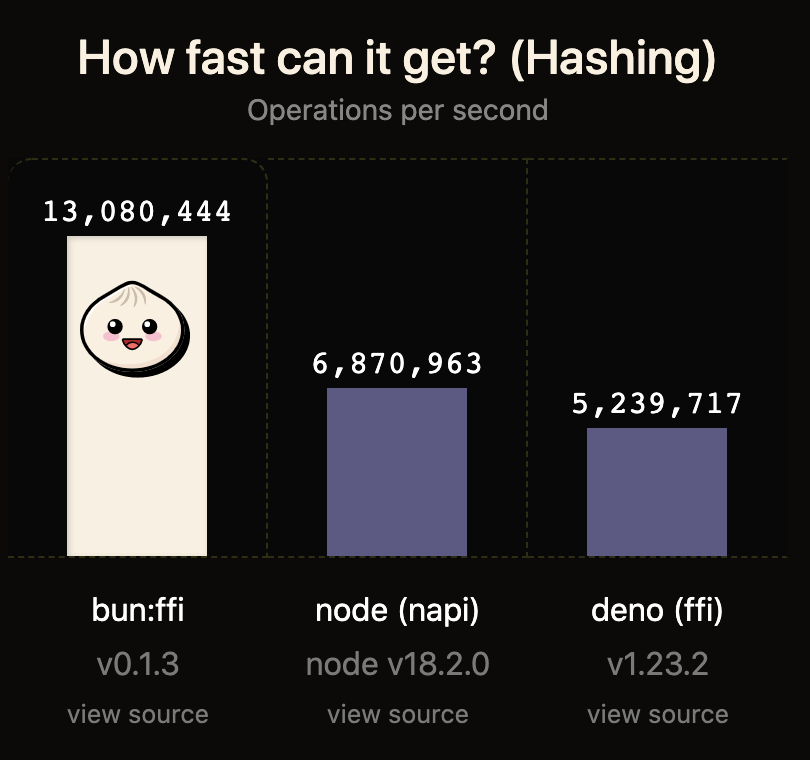
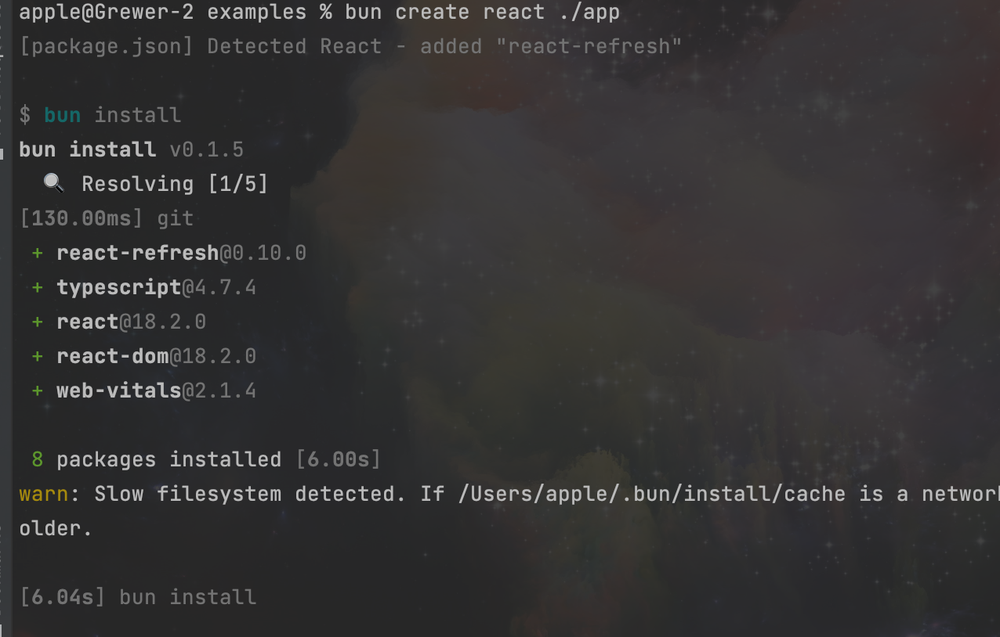
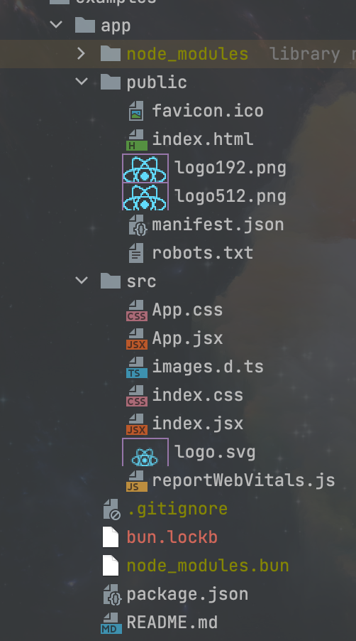

## bun.js  一个新的JavaScript运行环境

## 介绍

[Bun](https://bun.sh/) 是一个现代的JavaScript运行环境，如Node, Deno。主要特性如下:

1. 启动速度快。
2. 更高的性能。
3. 完整的工具（打包器、转码器、包管理）。

下面我们来横向对比下框架所说的性能:

相同电脑下, 不同 js 运行环境的每秒操作数



### 更多具体的优点

- 内置 `fetch`、`WebSocket` 和 `ReadableStream` 等API

- 可以在bun.js中使用npm包。支持ESM和CommonJS，但Bun内部使用ESM。

- 在bun.js中，每个文件都是转译的。TypeScript & JSX就可以使用。

- bun支持 "paths"、"jsxImportSource" 和更多来自tsconfig.json文件的内容。

- 使用 Bun.write 提供的最快的系统调用来写入、复制、管道、发送文件。

- bun.js会自动从.env文件中加载环境变量。不再需要 require("dotenv").config()

- bun内置了一个快速的 SQLite3 客户端 bun:sqlite

- bun.js实现了大部分的Node-API（N-API）。许多Node.js的本地模块都能正常工作。

### 加载器

目前，bun实现了以下加载器:

| Input | Loader | Output |
| --- | --- | --- |
| .js | JSX + JavaScript | .js |
| .jsx | JSX + JavaScript | .js |
| .ts | TypeScript + JavaScript | .js |
| .tsx | TypeScript + JSX + JavaScript | .js |
| .mjs | JavaScript | .js |
| .cjs | JavaScript | .js |
| .mts | TypeScript | .js |
| .cts | TypeScript | .js |
| .toml | TOML | .js |
| .css | CSS | .css |
| .env | Env | N/A |
| .\* | file | string |


### 实现

Bun.js 使用的是 [JavaScriptCore](https://github.com/WebKit/WebKit/tree/main/Source/JavaScriptCore) 引擎,
它的执行速度往往要比 V8 等更传统引擎要快。

而他本身, 是由叫做 [Zig](https://ziglang.org/) 的语言编写而成的, Zig 是一门新的系统级编程语言，相当于加强版 C 语言


## 配置

`bunfig.toml` 是 bun 的配置文件。

这里给出一个例子:

```
# 默认框架
# 默认情况下，bun会寻找一个类似于`bun-framework-${framework}的npm包，然后是`${framework}`。
framework = "next"
logLevel = "debug"

# publicDir = "public"
# external = ["jquery"]

[macros]
# 像这样重新映射的配置:
#     import {graphql} from 'react-relay';
# To:
#     import {graphql} from 'macro:bun-macro-relay';
react-relay = { "graphql" = "bun-macro-relay" }

[bundle]
saveTo = "node_modules.bun"
# Don't need this if `framework` is set, but showing it here as an example anyway
entryPoints = ["./app/index.ts"]

[bundle.packages]
# 如果设置了`framework'，就不需要这个了，在这里作为一个例子展示一下。
"@bigapp/design-system" = true

[dev]
# dev 的启动端口 3000-5000
port = 5000

[define]
# 环境变量
"process.env.bagel" = "'lox'"

[loaders]
# 如果文件后缀是 .bagel 则使用 JS 的解析器
".bagel" = "js"

[debug]
# 当导航到blob:或src:链接时，在你的编辑器中打开该文件
# 如果没有，它会尝试用$EDITOR或$VISUAL
# 如果仍然失败，它会尝试Visual Studio Code，然后是Sublime Text，然后是其他一些编辑器
# 这是由Bun.openInEditor()使用的
editor = "code"

# List of editors:
# - "subl", "sublime"
# - "vscode", "code"
# - "textmate", "mate"
# - "idea"
# - "webstorm"
# - "nvim", "neovim"
# - "vim","vi"
# - "emacs"
# - "atom"
```

## 使用

首先我们下载 cli

在终端执行如下指令即可进行下载:
```
curl https://bun.sh/install | bash
```

### 启用服务

先尝试实现类似于 node 的相关功能:

新建文件 http.js
```js
export default {
  port: 3000,
  fetch(request) {
    return new Response("Welcome to Bun!");
  },
};
```
之后在终端执行:

```shell
bun run http.js
```
之后打开浏览器地址 `http://localhost:3000/` 即可查看到对应页面的返回 `Welcome to Bun!`

如果运行中有错误处理, 可以这样判断:

```js
export default {
  fetch(req) {
    // if(...)
    throw new Error("woops!");
  },
  error(error: Error) {
    // 类似与 catch 到fetch 抛出的错误
    return new Response("Uh oh!!\n" + error.toString(), { status: 500 });
  },
}
```

### 创建项目

我们先尝试使用它默认的 react 模板项目来创建:
```shell
bun create react ./app
```

运行指令之后的终端部分输出:



之后便出现如下目录:



在项目中, 通过指令 `bun dev` 即可运行

这就是他的官方 react 项目模板, 当然他还可以扩展:

```shell
bun create github-user/repo-name destination
bun create local-example-or-remote-example destination
bun create /absolute/path/to-template-folder destination
bun create https://github.com/github-user/repo-name destination
bun create github.com/github-user/repo-name destination
```
通过初始化本地路径, github 地址, gitlab 地址来初始化项目

### bun create 工作流程

当我们运行 `bun create ${template} ${destination}` 的时候会出现以下判断

1. 判断远程模板 
   1. 请求 `registry.npmjs.org` 相关路径, 下载tgz
   2. 解压缩, 提取文件
2. 如果是 GitHub
   1. 通过 GitHub API 下载
   2. 解析并提取文件
3. 如果是本地模板
   1. 打开本地文件夹
   2. 清空已有名称的文件
   3. 递归复制文件
   4. 解析 package, 执行 hook, 下载依赖, 初始化 git

### 包管理

bun 有他自己的包公里工具: `bun install`, 可以在 `bunfig.toml`配置文件中对其进行 `registry`, `dev`, `cache` 等配置

`bun install` 对等依赖的处理方式与 `yarn` 类似。不会自动安装对等依赖，会尝试选择一个现有的依赖。


### lock 文件

`bun.lockb` 是 `bun` 的二进制 lock 文件格式, 至于为什么选择二进制, 直接的原因就是为了性能, 和更多的存储

#### 快速的原因

它对所有数据使用线性数组。包是由一个自动递增的整数 ID 或者包名的哈希值引用的。超过8个字符的字符串会被去掉。
在保存在磁盘之前，lock 文件通过 garbage collection (GC)和遍历包的树形结构确定顺序 ，再按依赖关系下载包。

### 脚本运行器

`bun run`是一个快速的 `package.json` 脚本运行器


`bun run ${script-name}` 运行相当于 `npm run script-name` 的内容。例如，`bun run dev` 运行 `package.json` 中的 `dev` 脚本。

bun 运行会自动从 `.env` 中加载环境变量到 `shell/task` 中。`.env `文件的加载优先级与 `bun` 的其他部分相同:

1. .env.local 最先加载
2.  if ($NODE_ENV === "production") .env.production else .env.development
3.  .env

如果有什么问题，你可以运行 `bun run env` 来得到一个环境变量的列表。

## 问题

目前存在的问题

### Zig 的问题

Zig 是一个较新(2016 年)的语言, 他的生态,安全性值得考虑  

同时如果底层出现什么问题, 会这门语言的人是非常少的, 就很容易卡主, 过于被动

### Issue 的问题

目前存在了 284 个 Issue(2022.07.27), 有一些是特别重要且影响性能的

### 生态问题
很多常用的, 较为重要的功能还未支持, 例如: 
- treeShaking
- Source maps
- Code splitting
- CSS 压缩

具体可查看 [此处](https://github.com/oven-sh/bun/issues/159)

## 总结
