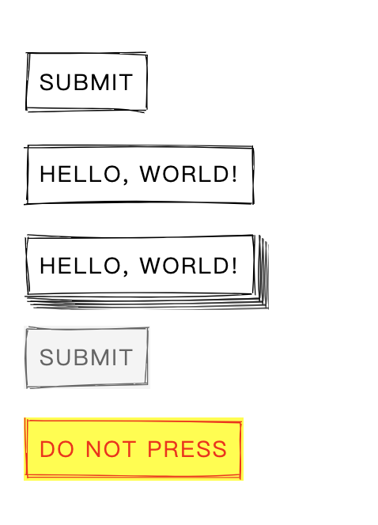

## 像素风格

https://nostalgic-css.github.io/NES.css/

## 90 年代的游戏卡带风

https://github.com/RonenNess/RPGUI

## 手写风格 1

https://www.getpapercss.com/docs/

## 手写风格 2

https://wiredjs.com/showcase.html

## 复古程序风

https://github.com/metakirby5/yorha